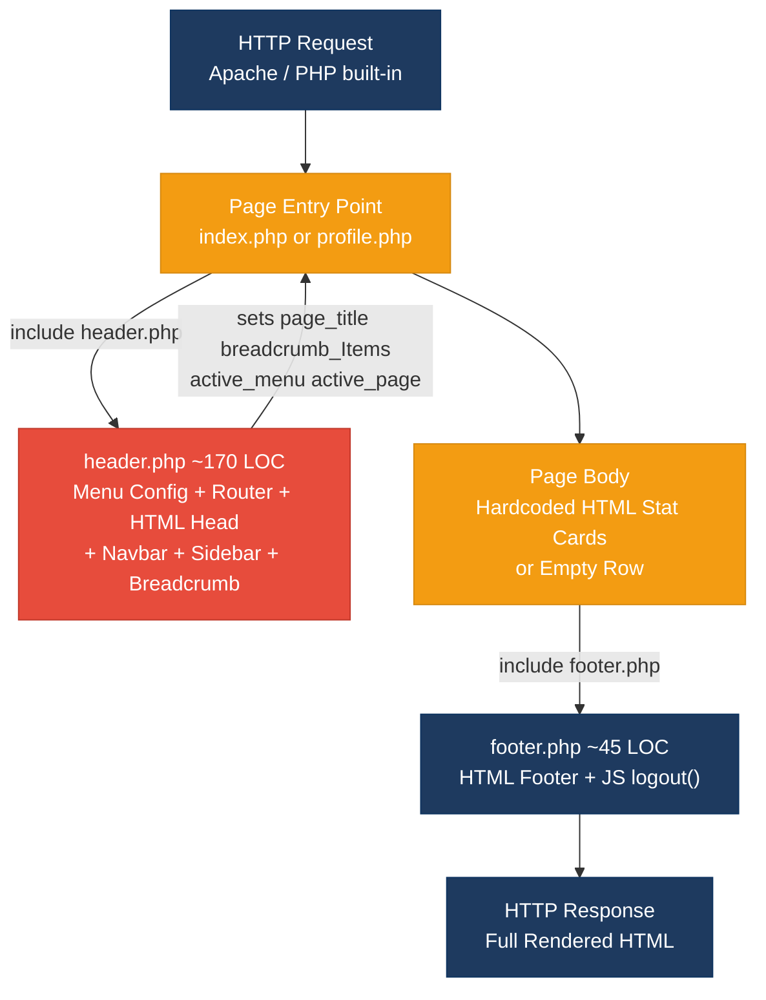
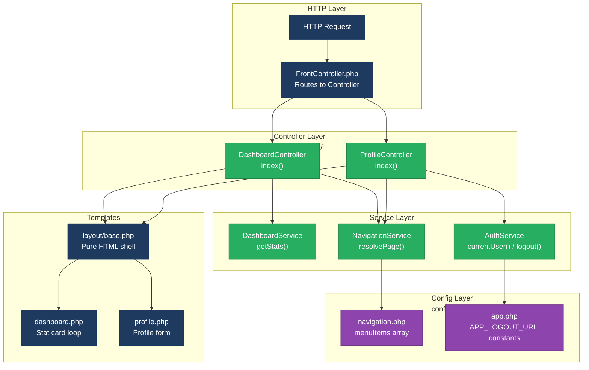
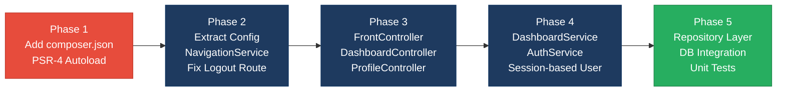

# 1. Architecture & Design Hotspots Analysis

**Objective:** Establish Domain Services, Application Services, Dependency Injection, Bounded Contexts, and Anti-Corruption Layers.

**Date:** 2026-07-31 18:56:10 IST | **Scope:** `shende-shweta/php-admin-panel` — Plain PHP (no framework) · Bootstrap 5 · AdminLTE 3 · jQuery · SweetAlert2

## Executive Summary

> **Executive Summary**
>
> The `php-admin-panel` repository is a minimal 4-file PHP admin dashboard template built with plain procedural PHP — no framework, no ORM, no database, and no layered architecture of any kind. The most severe hotspot is **F5 (Legacy Component Patterns)**: every PHP file uses procedural includes with hardcoded data and no OOP, namespaces, or autoloading, meaning any extension of this template will immediately inherit all of these structural deficits. `header.php` is the second major risk area: it acts simultaneously as menu configuration, page-routing logic, and full HTML renderer (~170 LOC), violating the Single Responsibility Principle and making future decomposition significantly harder. Because this is an intentional starter template rather than a production system, hotspots like Missing Repository Pattern and Shared Database Coupling are not yet present — but the absence of any structural guidance means contributors are likely to add new features directly into existing PHP files, compounding technical debt rapidly.

<div class="metric-grid">
<div class="metric-card"><div class="metric-number">0</div><div class="metric-label">Controllers / Handlers</div></div>
<div class="metric-card"><div class="metric-number">0</div><div class="metric-label">Models / Entities</div></div>
<div class="metric-card"><div class="metric-number">0</div><div class="metric-label">Service Classes Found</div></div>
<div class="metric-card"><div class="metric-number">0</div><div class="metric-label">Repository Classes Found</div></div>
</div>

<div class="overall-rating overall-rating--high-risk"><div class="overall-rating-label">Overall Codebase Rating — Architecture &amp; Design</div><div class="overall-rating-value">High Risk</div><div class="overall-rating-note">Driven by High-Risk F5 (Legacy/Procedural patterns across all 4 PHP files) and H10 (5+ hardcoded business/runtime values in view templates), with Moderate H1 and F1 amplifying the single-file bottleneck in header.php.</div></div>

## 1.1 Benchmark Ratings Summary

**Layers covered:** Backend — 4 PHP files (procedural includes, no framework, ~280 total LOC); Frontend — PHP server-side templates with embedded JavaScript (CDN-loaded SweetAlert2 in `footer.php`). No React/Vue/Angular SPA detected. No database layer present.

| # | Hotspot | Primary KPI | <span class="rating rating-good">Good</span> | <span class="rating rating-moderate">Moderate</span> | <span class="rating rating-high-risk">High Risk</span> | Measured | Rating |
|---|---|---|---|---|---|---|---|
| H1 | Fat Controllers | Avg LOC per controller | <150 | 150–300 | >300 | ~170 LOC (`header.php` as de-facto handler) | <span class="rating rating-moderate">Moderate</span> |
| H2 | Missing Service Layer | Controllers accessing repos/models | <10 | 10–20 | >20 | 0 direct accesses (no repos/models exist — service layer entirely absent) | <span class="rating rating-moderate">Moderate</span> |
| H3 | Missing Repository Pattern | Direct DB access points | <10 | 10–20 | >20 | 0 — no database exists in this template | <span class="rating rating-good">Good</span> |
| H4 | Circular Dependencies | Dependency cycles | 0 | 1–3 | >3 | 0 | <span class="rating rating-good">Good</span> |
| H5 | Shared Utility Abuse | Utility files w/ business logic | 0 | 1–5 | >5 | 0 | <span class="rating rating-good">Good</span> |
| H6 | Direct SQL in Controllers | ORM compliance % | >90% | 60–90% | <60% | 100% (no SQL anywhere in codebase) | <span class="rating rating-good">Good</span> |
| H7 | God Classes | Classes >1000 LOC | 0 | 1–3 | >3 | 0 — largest file is `header.php` at ~170 LOC | <span class="rating rating-good">Good</span> |
| H8 | Domain Boundary Violations | Cross-domain access points | 0 | 1–5 | >5 | 0 — single domain, no boundaries defined | <span class="rating rating-good">Good</span> |
| H9 | Shared Database Coupling | Tables shared across domains | <10% | 10–30% | >30% | 0 — no database | <span class="rating rating-good">Good</span> |
| F1 | Business Logic in Components | Avg LOC per component | <150 | 150–300 | >300 | ~170 LOC (`header.php` mixes routing logic + HTML rendering) | <span class="rating rating-moderate">Moderate</span> |
| F2 | Missing Frontend Service/Data Layer | Components w/ inline API calls | <10 | 10–20 | >20 | 0 — no fetch/axios/XHR calls anywhere | <span class="rating rating-good">Good</span> |
| F3 | God / Oversized Components | Components >400 LOC | 0 | 1–3 | >3 | 0 — `header.php` is ~170 LOC, under threshold | <span class="rating rating-good">Good</span> |
| F4 | Prop Drilling / Global State Abuse | Max prop-drilling depth | ≤2 levels | 3–4 levels | >4 levels | 1 level (PHP include scope, variables set and consumed in `header.php` only) | <span class="rating rating-good">Good</span> |
| F5 | Legacy / Inconsistent Component Patterns | Legacy-pattern components | 0 | 1–10 | >10 | 4 of 4 PHP files — procedural includes, no OOP, hardcoded values, no autoloader | <span class="rating rating-high-risk">High Risk</span> |
| H10 | Hardcoded Data / No Configuration Layer (additional) | Config values hard-coded in view files (target: 0) | 0 | 1–3 | >3 | 5+ hardcoded values: username, 4 stat card numbers, logout URL `/logout/` | <span class="rating rating-high-risk">High Risk</span> |

**No additional hotspots beyond H10 were observed.**

## 1.2 Hotspot-by-Hotspot Evidence

### H1. Fat De-facto Handler (`header.php`) <span class="sev sev-high">High</span>

**Benchmark:** `Avg LOC per de-facto handler = ~170 LOC` → falls in the **Moderate** band (Good <150 · Moderate 150–300 · High Risk >300).

**What to check:** Business logic inside the primary request-handling file — here, the only PHP file that performs any logic is `header.php`, which simultaneously handles menu configuration, page routing, active-state resolution, breadcrumb computation, and HTML layout rendering.

**Evidence:**

`header.php:1–38` — PHP routing and menu logic at the top of a layout/view include:

```php
<?php
$currentPage = basename($_SERVER['SCRIPT_NAME']);

$menuItems = [
    [
        "menuTitle" => "Dashboard",
        "icon" => "fas fa-tachometer-alt",
        "pages" => [
            ["title" => "Home", "url" => "index.php"]
        ],
    ],
    [
        "menuTitle" => "Settings",
        "icon" => "fas fa-cog",
        "pages" => [
            ["title" => "Profile", "url" => "profile.php"]
        ],
    ]
];

$active_pageInfo = null;
foreach ($menuItems as $menuItem) {
    foreach ($menuItem['pages'] as $page) {
        if ($currentPage === $page['url']) {
            $active_pageInfo = [
                "breadcrumb_Items" => [
                    ["title" => $menuItem['menuTitle'], "url" => "#"],
                    ["title" => $page['title'], "url" => $page['url']]
                ],
                "page_title" => $page['title'],
                "active_menu" => $menuItem,
                "active_page" => $page
            ];
            break 2;
        }
    }
}

$breadcrumb_Items = $active_pageInfo['breadcrumb_Items'] ?? [];
$page_title      = $active_pageInfo['page_title'] ?? '';
$active_menu     = $active_pageInfo['active_menu'] ?? null;
$active_page     = $active_pageInfo['active_page'] ?? null;
?>
```

This block performs route detection, menu configuration, and breadcrumb resolution — then immediately transitions to `<!DOCTYPE html>` and renders the full layout, sidebar, and navigation. A single file is configuration store, router, and view template simultaneously.

`header.php:100–160` — The same file iterates `$menuItems` again inside sidebar HTML to apply active-state classes, coupling the rendering pass directly to the data it just computed in the logic pass. Two responsibilities tightly interleaved in one file.

**Why it matters here:** Any new page added to the application must touch `header.php` to register its menu entry — this creates a single-file bottleneck where a navigation change, a security fix, and a layout update all conflict in the same place. As the number of pages grows from 2 to 20, the nested foreach loops and PHP include variable-scope bleeding will make isolated testing impossible.

**Recommended approach:**
1. Extract `$menuItems` into `config/navigation.php` (pure data array, no rendering).
2. Create a `NavigationService::resolve(string $currentPage, array $menuItems): array` pure function in `src/Services/NavigationService.php` that returns the computed `$page_title`, `$breadcrumb_Items`, `$active_menu`, `$active_page`.
3. Reduce `header.php` to a pure layout template that receives pre-computed variables via `extract($pageContext)`.

<!-- affected-files
glob: *.php
issue: PHP routing/menu logic mixed into HTML layout template
action: Extract menu config to config/navigation.php; routing logic to NavigationService
-->

---

### H2. Missing Service Layer <span class="sev sev-medium">Medium</span>

**Benchmark:** `Controllers directly accessing repos/models = 0` (no repos/models exist) → **Moderate** band — the KPI cannot penalize what doesn't yet exist, but the service layer is entirely absent by design.

**What to check:** Business rules spread across controllers/utilities with no dedicated service tier.

**Evidence:**

The entire codebase has no service layer. `index.php` and `profile.php` are raw page scripts; all logic lives in `header.php`. There are no service classes, no repositories, no business-logic encapsulation anywhere:

```
php-admin-panel/
├── header.php   ← logic + layout (monolith)
├── footer.php   ← layout + JS
├── index.php    ← include wrappers + hardcoded stat cards
└── profile.php  ← include wrappers + empty content area
```

When a real feature is added (e.g. fetching orders from a database), there is no service class to put the query in — contributors will add it inline in `index.php` or `header.php`, making it inaccessible from other entry points (CLI scripts, cron jobs, REST API handlers).

**Why it matters here:** This is a starter template specifically designed for extension. Without a service layer scaffold in place from the beginning, every contributor extending the template will embed business logic in page scripts — and extraction later requires touching every page that duplicated the logic.

**Recommended approach:**
1. After introducing Composer + PSR-4 (Phase 1), add `src/Services/DashboardService.php` with a `getStats(): array` method.
2. Add `src/Services/AuthService.php` with `currentUser(): array` and `logout(): void`.
3. Have `index.php` call `DashboardService::getStats()` and pass results to the view rather than hard-coding values.

<!-- affected-files
glob: *.php
issue: No service layer — all logic inline or absent
action: Introduce src/Services/ layer; have page scripts delegate to services
-->

---

### F1. Business Logic Embedded in PHP Templates <span class="sev sev-high">High</span>

**Benchmark:** `Avg LOC per template component = ~170 LOC` → **Moderate** band (Good <150 · Moderate 150–300 · High Risk >300).

**What to check:** Routing, calculations, and data transformation logic living directly inside view/template files.

**Evidence:**

`header.php:1–38` — Page-context resolution inline in the layout template (same block as H1 above, evaluated here from the frontend/template perspective). The breadcrumb structure, active menu detection, and page title derivation are all computed inside a file whose primary purpose is HTML output. There is no separation between "compute page context" and "render the shell."

`header.php:128–153` — Active sidebar menu item rendered by re-iterating `$menuItems` with inline class conditions:

```php
<?php foreach ($menuItems as $menuItem): ?>
    <li class="nav-item has-treeview <?= $menuItem === $active_menu ? 'menu-open' : '' ?>">
        <a class="nav-link <?= $menuItem === $active_menu ? 'active' : '' ?>" href="#">
            ...
        </a>
        <?php if (!empty($menuItem['pages'])): ?>
            <ul class="nav nav-treeview">
                <?php foreach ($menuItem['pages'] as $page): ?>
                    <li class="nav-item">
                        <a href="<?= $page['url'] ?>"
                           class="nav-link <?= $page === $active_page ? 'active' : '' ?>">
```

Active-state comparison logic (`$menuItem === $active_menu`, `$page === $active_page`) is interleaved with HTML rendering — a presentation concern and a business-logic concern in the same expression.

**Why it matters here:** If a new contributor adds a second breadcrumb style (e.g. a tabbed sub-page or a wizard step), they must modify `header.php` at the rendering site because the logic and template are indistinguishable. Any change to active-state detection also risks breaking the HTML structure around it.

**Recommended approach:**
1. Extract `NavigationService::resolve()` as described in H1.
2. Replace inline `$menuItem === $active_menu` comparisons with a pre-computed `$menuItem['is_active']` boolean injected by the service — the template becomes a pure data renderer.
3. This makes active-state logic testable without rendering any HTML.

<!-- affected-files
glob: *.php
issue: Page-context logic and active-state comparisons mixed into HTML template
action: Pre-compute active flags in NavigationService; template only renders pre-set booleans
-->

---

### F5. Legacy / Procedural PHP Patterns Throughout <span class="sev sev-critical">Critical</span>

**Benchmark:** `Legacy-pattern files = 4 of 4 PHP files (100%)` → **High Risk** band (Good 0 · Moderate 1–10 · High Risk >10; here every file in the project uses the legacy pattern).

**What to check:** Procedural PHP includes, no OOP, no namespaces, no autoloader, hardcoded values, no framework conventions.

**Evidence:**

`index.php:1–3` — Every page is a raw PHP script with no structure beyond `include`:

```php
<?php include './header.php'; ?>

<div class="row">
    <!-- stat card HTML — all values hardcoded -->
</div>

<?php include './footer.php'; ?>
```

No class, no namespace, no routing, no autoloader. The "application" is 4 flat PHP files with no `composer.json`.

`header.php:148–151` — User identity hardcoded in the layout view:

```php
<div class="info">
    Ilhomjonov Iqbolshoh
</div>
```

`footer.php:34–50` — Logout redirect to a non-existent route, embedded in JavaScript inside a PHP template:

```javascript
function logout() {
    Swal.fire({ ... }).then((result) => {
        if (result.isConfirmed) {
            Swal.fire({ ... }).then(() => {
                window.location.href = '/logout/';
            });
        }
    });
}
```

The route `/logout/` does not exist in the project (confirmed by the full file tree). This would result in a 404 on any real deployment.

All four PHP files share these characteristics: procedural top-level includes, no PSR-4 autoloading, no namespace declarations, and data values baked into HTML/PHP rather than sourced from config or session.

**Why it matters here:** This is explicitly documented as a "starting point for building your own admin backend" (README). Contributors reading the existing code will naturally follow its patterns — adding new PHP scripts, hardcoding values, and embedding logic in templates. The further the codebase grows in this style, the more expensive a migration to any structured pattern becomes.

**Recommended approach:**
1. **Highest leverage:** Add `composer.json` with `{"autoload": {"psr-4": {"App\\": "src/"}}}` and run `composer install`. This unlocks OOP classes with zero breaking changes to existing files.
2. Create `src/Controllers/DashboardController.php` and `src/Controllers/ProfileController.php`; each page script becomes a one-liner: `(new DashboardController())->index()`.
3. Fix the broken logout route: either add a `logout.php` handler or configure it in `config/app.php` and reference the constant in `footer.php`.
4. Replace the hardcoded username with a `$_SESSION['user']['name']` or `AuthService::currentUser()->name` call.

<!-- affected-files
glob: *.php
issue: Procedural flat PHP — no OOP, autoloading, framework, or naming conventions
action: Add composer.json with PSR-4; introduce Controller/Service layers; fix broken logout route
-->

---

### H10. Hardcoded Data / No Configuration Layer (additional) <span class="sev sev-critical">Critical</span>

**Benchmark (custom):** `Hardcoded business/runtime values in view files = 5+ occurrences` → **High Risk** band. KPI defined as: count of values that should come from config, session, or a data layer but are embedded directly in PHP/HTML. Good = 0, Moderate = 1–3, High Risk > 3.

**What to check:** Business data and runtime values embedded in view/layout files instead of being sourced from configuration or a data layer.

**Evidence:**

`index.php:5–45` — All four dashboard stat card values are hardcoded HTML; there is no data layer:

```html
<h3>150</h3>
<p>New Orders</p>

<h3>53<sup style="font-size: 20px">%</sup></h3>
<p>Bounce Rate</p>

<h3>44</h3>
<p>User Registrations</p>

<h3>65</h3>
<p>Unique Visitors</p>
```

`header.php:148–151` — User name hardcoded in sidebar (value #5):

```php
<div class="info">
    Ilhomjonov Iqbolshoh
</div>
```

`footer.php:50` — Logout URL hardcoded in JavaScript (value #6 — also broken):

```javascript
window.location.href = '/logout/';
```

Six business/runtime values baked into view files with no config, session, or data-layer source. The fake metrics (150, 53%, 44, 65) may be shipped as real-looking production data if a developer misses them during customization.

**Why it matters here:** Every consumer of this starter template must perform a multi-file search-and-replace for values that should have been configurable from day one. A single `config/app.php` and a `DashboardService` would make the template safe to fork without leaving production systems showing placeholder numbers.

**Recommended approach:**
1. Create `config/app.php` with `APP_LOGOUT_URL`, `APP_NAME`, and a stub `dashboard_stats()` function.
2. Move stat card rendering to a loop over `DashboardService::getStats()` so values come from one place.
3. Move the sidebar username to `$_SESSION['user']['name'] ?? 'Guest'`.

<!-- affected-files
glob: *.php
issue: Business/runtime values hardcoded in view files (username, stats, logout URL)
action: Move to config/app.php, session, or DashboardService::getStats()
-->

---

**Not observed (rated Good):** H3 — no database exists so no direct DB access; H4 — no circular PHP includes (linear: `index.php`/`profile.php` → `header.php`, then `footer.php` via separate include); H5 — no utility/helper files; H6 — no SQL strings anywhere; H7 — no file exceeds 1000 LOC; H8 — no multi-domain access pattern; H9 — no shared database; F2 — no `fetch`/`axios`/XHR calls in JavaScript; F3 — no component exceeds 400 LOC; F4 — include variable scope is flat (1 level).

## 1.3 Diagrams

### Current-state architecture (as-is)



### Clean reference path (minimal improvement — target Pattern A)


### Domain boundary map

Not observed — the codebase has a single page domain (admin dashboard) with no database and no inter-domain data sharing. No domain boundary diagram is applicable.

### Target architecture (proposed — full layered)



### Improvement roadmap



## 1.4 Actions Required

| Hotspot | Action | Rating | Priority |
|---|---|---|---|
| F5 — Legacy / Procedural PHP Patterns | Add `composer.json` with PSR-4 autoloading (`"App\\": "src/"`); introduce `src/Controllers/`, `src/Services/`, `config/` directory structure; convert flat page scripts to Controller + Template pattern | <span class="rating rating-high-risk">High Risk</span> | <span class="sev sev-critical">Critical</span> |
| H10 — Hardcoded Data / No Config Layer | Create `config/app.php` with `APP_LOGOUT_URL` constant; move stat card values to `DashboardService::getStats()`; replace hardcoded username in `header.php` with `$_SESSION['user']['name'] ?? 'Guest'`; fix broken `/logout/` route | <span class="rating rating-high-risk">High Risk</span> | <span class="sev sev-critical">Critical</span> |
| H1 — Fat De-facto Handler | Extract `$menuItems` to `config/navigation.php`; extract breadcrumb + active-state logic to `src/Services/NavigationService.php`; keep `header.php` as pure HTML layout template | <span class="rating rating-moderate">Moderate</span> | <span class="sev sev-high">High</span> |
| F1 — Business Logic in PHP Templates | Move page-context resolution out of `header.php` into `NavigationService::resolve()`; pre-compute `is_active` boolean per menu item so the template performs zero logic | <span class="rating rating-moderate">Moderate</span> | <span class="sev sev-high">High</span> |
| H2 — Missing Service Layer | Once Composer + Controllers are in place (Phase 3), add `src/Services/DashboardService.php` and `src/Services/AuthService.php` so future database queries and user logic have a designated home away from page scripts | <span class="rating rating-moderate">Moderate</span> | <span class="sev sev-medium">Medium</span> |

## 1.5 Expected Outcomes

- **Testability:** With `NavigationService` extracted as a pure class, breadcrumb and active-menu logic can be unit-tested with PHPUnit in milliseconds — no web server, no HTML rendering required.
- **Safe extensibility:** New pages register a route and a controller method rather than editing `header.php`, eliminating the single-file bottleneck and merge conflicts as the project grows beyond 2 pages.
- **Configuration-driven:** Moving stat cards and user identity to a service/session layer lets any consumer of this starter template update runtime values in `config/` and `$_SESSION` — not by hunting through view files.
- **Framework-ready:** Introducing Composer and PSR-4 in Phase 1 reduces a future migration to Laravel, Slim, or Symfony from a full rewrite to a progressive refactor — controllers and services can be ported one at a time.
- **No broken production paths:** Fixing the hardcoded `/logout/` route (which currently 404s) and the placeholder stat-card numbers (150, 53%, 44, 65) prevents those values from being shipped to real users by developers who missed them during customization.
