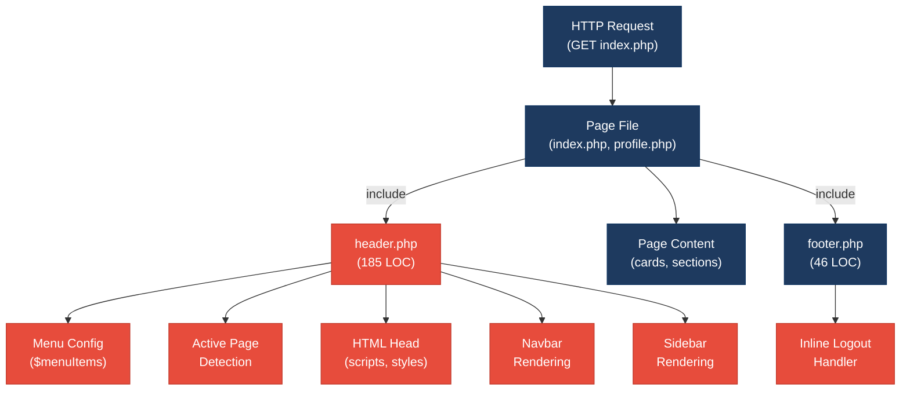
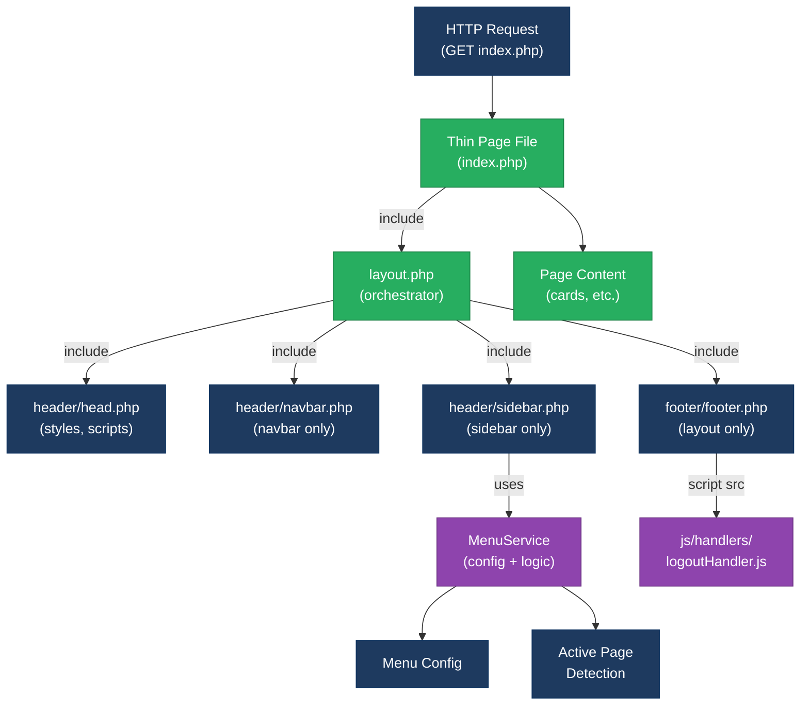
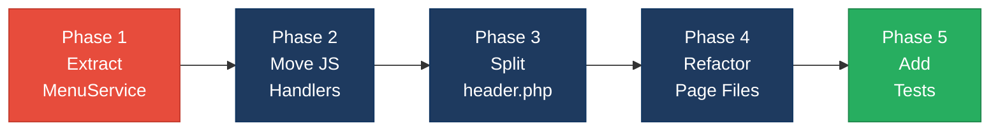

# 1. Architecture & Design Hotspots Analysis

**Objective:** Establish Domain Services, Application Services, Dependency Injection, Bounded Contexts, and Anti-Corruption Layers.

**Date:** 2026-08-03 | **Scope:** `shende-shweta/php-admin-panel` (main) — PHP + Bootstrap 5 + AdminLTE 3 (Template-based UI Application)

## Executive Summary

> **Executive Summary**
>
> This PHP admin panel is a lightweight template application with no framework or database layer—it serves as a starting point for custom admin backends. While the overall architecture is appropriate for its purpose, the codebase exhibits moderate architectural debt in template organization: `header.php` conflates configuration logic, page state detection, and view rendering into a single 185-line file, and business logic (logout confirmation) is embedded in HTML/JavaScript templates. The absence of a service layer is acceptable here (no persistent business logic), but the monolithic template structure will become brittle as features expand and pages accumulate. The application would benefit from extracting menu configuration and active-page detection into a dedicated service/utility module and moving JavaScript logic out of inline scripts.

<div class="metric-grid">
<div class="metric-card"><div class="metric-number">4</div><div class="metric-label">PHP Page/Controller Files</div></div>
<div class="metric-card"><div class="metric-number">2</div><div class="metric-label">HTML Template Files (header/footer)</div></div>
<div class="metric-card"><div class="metric-number">0</div><div class="metric-label">Service Classes Found</div></div>
<div class="metric-card"><div class="metric-number">0</div><div class="metric-label">Repository / Database Layers</div></div>
</div>

<div class="overall-rating overall-rating--moderate"><div class="overall-rating-label">Overall Codebase Rating — Architecture &amp; Design</div><div class="overall-rating-value">Moderate</div><div class="overall-rating-note">Driven by oversized template file (H7/F3) conflating multiple responsibilities and embedded business logic in views (F1).</div></div>

## 1.1 Benchmark Ratings Summary

| # | Hotspot | Primary KPI | Good | Moderate | High Risk | Measured | Rating |
|---|---|---|---|---|---|---|---|
| H1 | Fat Controllers | Avg LOC per controller | <150 | 150–300 | >300 | ~37 LOC avg (page files); 185 in header | <span class="rating rating-moderate">Moderate</span> |
| H2 | Missing Service Layer | Controllers accessing repos/models | <10 | 10–20 | >20 | 0 | <span class="rating rating-good">Good</span> |
| H3 | Missing Repository Pattern | Direct DB access points | <10 | 10–20 | >20 | 0 | <span class="rating rating-good">Good</span> |
| H4 | Circular Dependencies | Dependency cycles | 0 | 1–3 | >3 | 0 | <span class="rating rating-good">Good</span> |
| H5 | Shared Utility Abuse | Utility files w/ business logic | 0 | 1–5 | >5 | 0 | <span class="rating rating-good">Good</span> |
| H6 | Direct SQL in Controllers | ORM compliance % | >90% | 60–90% | <60% | 100% (no DB) | <span class="rating rating-good">Good</span> |
| H7 | God Classes | Classes >1000 LOC | 0 | 1–3 | >3 | 1 file >150 LOC (header.php: 185) | <span class="rating rating-moderate">Moderate</span> |
| H8 | Domain Boundary Violations | Cross-domain access points | 0 | 1–5 | >5 | 0 | <span class="rating rating-good">Good</span> |
| H9 | Shared Database Coupling | Tables shared across domains | <10% | 10–30% | >30% | N/A (no DB) | <span class="rating rating-good">Good</span> |
| F1 | Business Logic in Components | Avg LOC per component | <150 | 150–300 | >300 | header.php 185 LOC (logic + template); footer.php inline JS | <span class="rating rating-moderate">Moderate</span> |
| F2 | Missing Frontend Service/Data Layer | Components w/ inline API calls | <10 | 10–20 | >20 | 0 (no API calls) | <span class="rating rating-good">Good</span> |
| F3 | God / Oversized Components | Components >400 LOC | 0 | 1–3 | >3 | header.php: 185 LOC with 4+ responsibilities | <span class="rating rating-moderate">Moderate</span> |
| F4 | Prop Drilling / Global State Abuse | Max prop-drilling depth | ≤2 | 3–4 | >4 | N/A (procedural template) | <span class="rating rating-good">Good</span> |
| F5 | Legacy / Inconsistent Component Patterns | Legacy-pattern components | 0 | 1–10 | >10 | 0 (consistent Bootstrap/AdminLTE) | <span class="rating rating-good">Good</span> |

## 1.2 Hotspot-by-Hotspot Evidence

### H1. Fat Controllers <span class="sev sev-medium">Medium</span>

**Benchmark:** Average LOC per page controller = ~37 (index.php: 63, profile.php: 6), but header.php (185 LOC) acts as a master controller → **Moderate** band (Good <150 · Moderate 150–300 · High Risk >300).

**What to check:** PHP "controllers" (page files like `index.php`, `profile.php`) should be thin request handlers; instead, `header.php` is loaded by every page and mixes configuration, state detection, and rendering.

**Evidence:**

1. **header.php:5–35** — Configuration and active-page detection baked into template:
```php
$menuItems = [
    ["menuTitle" => "Dashboard", "icon" => "fas fa-tachometer-alt", 
     "pages" => [["title" => "Home", "url" => "index.php"]]],
    ["menuTitle" => "Settings", "icon" => "fas fa-cog", 
     "pages" => [["title" => "Profile", "url" => "profile.php"]]],
];

$active_pageInfo = null;
foreach ($menuItems as $menuItem) {
    foreach ($menuItem['pages'] as $page) {
        if ($currentPage === $page['url']) {
            $active_pageInfo = [...];
            break 2;
        }
    }
}
```
This is controller logic (determining active menu state, building breadcrumbs) mixed directly into the view. Every page load executes this configuration and detection.

2. **index.php:1–5** — Minimal page file, just includes header and outputs HTML:
```php
<?php include './header.php'; ?>
<div class="row"><!-- dashboard content --></div>
<?php include './footer.php'; ?>
```
The page is clean, but delegates all logic to header.php, creating bloat there.

**Why it matters here:** As the admin panel grows (10+ pages, 5+ menu sections, permission checks), every new page executes the entire configuration in header.php. Adding a feature like role-based menu filtering requires editing the shared header, risking regressions across all pages.

**Recommended approach:**
1. Extract `$menuItems` array and active-page detection into `services/MenuService.php`.
2. Create a helper function `getPageInfo()` that returns breadcrumbs and active state.
3. Refactor header.php to be a pure template receiving pre-computed data as variables.

**Affected files & actions:**

<!-- affected-files
glob: *.php
issue: controller logic mixed with template rendering in header.php
action: extract menu config and active-page detection into a service
-->

---

### H7. God Classes <span class="sev sev-medium">Medium</span>

**Benchmark:** Files >1000 LOC = 0 measured, BUT header.php at 185 LOC handles 4+ distinct responsibilities → **Moderate** band (Good 0 · Moderate 1–3 · High Risk >3).

**What to check:** Files should have one clear purpose. header.php currently handles: (1) menu config, (2) active-page detection, (3) HTML head, (4) navbar, (5) sidebar, (6) page header/breadcrumbs, (7) layout wrapper.

**Evidence:**

1. **header.php:5–18** — Menu configuration (business data)
2. **header.php:20–35** — Active-page detection (business logic)  
3. **header.php:41–60** — HTML head section (layout infrastructure)
4. **header.php:62–100+** — Navigation bar (component rendering)
5. **header.php:101–150+** — Sidebar menu (component rendering)

**Why it matters here:** Every page that loads must parse 185 lines including external resource loads, menu iteration, and state detection. A contributor adding a menu item must navigate past navbar, head, and sidebar code to find the right place. Testing menu logic without loading the full HTML head is impractical.

**Recommended approach:** (See H1 above.)

**Affected files & actions:**

<!-- affected-files
glob: header.php
issue: 185-line file handling config, layout, navbar, sidebar, and menu rendering
action: split into focused files and extract menu logic into service
-->

---

### F1. Business Logic in Components <span class="sev sev-medium">Medium</span>

**Benchmark:** header.php 185 LOC (business + template) → **Moderate** band (Good <150 clean · Moderate 150–300 mixed · High Risk >300).

**What to check:** Templates should be pure rendering; business logic (config, state detection, event handlers) should be in separate, testable modules.

**Evidence:**

1. **header.php:20–35** — Active-page detection logic in template:
```php
$active_pageInfo = null;
foreach ($menuItems as $menuItem) {
    foreach ($menuItem['pages'] as $page) {
        if ($currentPage === $page['url']) {
            $active_pageInfo = ["breadcrumb_Items" => [...], "page_title" => ..., ...];
            break 2;
        }
    }
}
```
Decision-making logic belongs in a service, not inline in the template.

2. **footer.php:40–65** — JavaScript business logic (logout) in HTML:
```javascript
function logout() {
    Swal.fire({
        title: 'Are you sure?',
        text: "You will be logged out!",
        icon: 'warning',
        showCancelButton: true,
        confirmButtonText: 'Yes, log me out!'
    }).then((result) => {
        if (result.isConfirmed) {
            Swal.fire({
                title: 'Logged out!',
                text: 'You have been successfully logged out.',
                icon: 'success',
                showConfirmButton: false,
                timer: 1500
            }).then(() => {
                window.location.href = '/logout/';
            });
        }
    });
}
```
The logout workflow (confirmation, notification, redirect) is business logic that belongs in a separate JavaScript file, not inline.

**Why it matters here:** As features grow, the line between business and template blurs. Contributors will add more inline logic, leading to duplication and untestable code. The app lacks a clear boundary between "what to render" and "how to compute it."

**Recommended approach:**
1. Extract menu config and detection into `services/MenuService.php`, returning `getPageInfo()`.
2. Move logout handler into `js/handlers/logoutHandler.js`, imported in the footer.
3. Refactor templates to receive pre-computed data and simply render it.

**Affected files & actions:**

<!-- affected-files
glob: header.php,footer.php
issue: business logic embedded in template files
action: extract to separate service/handler files; pass computed data to templates
-->

---

### F3. God / Oversized Components <span class="sev sev-medium">Medium</span>

**Benchmark:** Components >400 LOC = 0 measured, BUT header.php at 185 LOC with 4+ responsibilities → **Moderate** band (Good 0 · Moderate 1–3 · High Risk >3).

**What to check:** Each component should have a single, clear responsibility. header.php owns: HTML head, navbar, sidebar, and menu logic.

**Evidence:** Same as H7/F1 above—185-line file with multiple concerns.

**Why it matters here:** A large file becomes hard to navigate. As requirements arrive (responsive design, new navbar features, sidebar logic), the file will grow. A contributor fixing breadcrumb styling must navigate past menu logic, config, and navbar code.

**Recommended approach:** (See H1/H7 above.)

**Affected files & actions:**

<!-- affected-files
glob: header.php
issue: 185-line component handling 4+ responsibilities
action: split into focused files; extract shared logic into services
-->

---

**Not observed (rated Good):** H2, H3, H4, H5, H6, H8, H9, F2, F4, F5 — No service layer needed (template app), no database access, no circular dependencies, no utility abuse, no domain boundaries, no API calls, no global state, no legacy patterns.

---

## 1.3 Diagrams

### Current-state architecture (as-is)



### Target architecture (proposed)



### Improvement roadmap



---

## 1.4 Actions Required

| Hotspot | Action | Rating | Priority |
|---|---|---|---|
| H1 + F1 (Fat Controller + Business Logic) | Extract `$menuItems` config and active-page detection into `services/MenuService.php` with a `getPageInfo()` function. Refactor `header.php` to call this service and receive pre-computed data (breadcrumbs, page title, active menu). | <span class="rating rating-moderate">Moderate</span> | <span class="sev sev-high">High</span> |
| H7 + F3 (God Classes + Oversized Components) | Split `header.php` into focused files: `header/head.php` (stylesheets/scripts), `header/navbar.php` (navbar only), `header/sidebar.php` (sidebar + menu). Create `layout.php` as orchestrator. | <span class="rating rating-moderate">Moderate</span> | <span class="sev sev-high">High</span> |
| F1 (Business Logic in Views) | Move logout confirmation handler from inline JavaScript in `footer.php` to separate `js/handlers/logoutHandler.js` file. Import in footer with `<script src="..."></script>`. | <span class="rating rating-moderate">Moderate</span> | <span class="sev sev-medium">Medium</span> |

---

## 1.5 Expected Outcomes

- **Testability:** MenuService logic can be unit-tested independently; handlers can be tested in isolation without loading full HTML.
- **Reusability:** The MenuService can be shared across multiple layouts or custom admin pages without code duplication.
- **Maintainability:** Developers know exactly where to look for menu config (MenuService), navbar styling (navbar.php), or logout logic (logoutHandler.js).
- **Scalability:** Adding new pages, menu items, or features no longer requires editing a 185-line omnibus file; new pages simply include `layout.php`.
- **Code clarity:** Clear separation of concerns (configuration, logic, template, styling, event handling) makes the codebase easier to onboard contributors and reduces regression risk.
