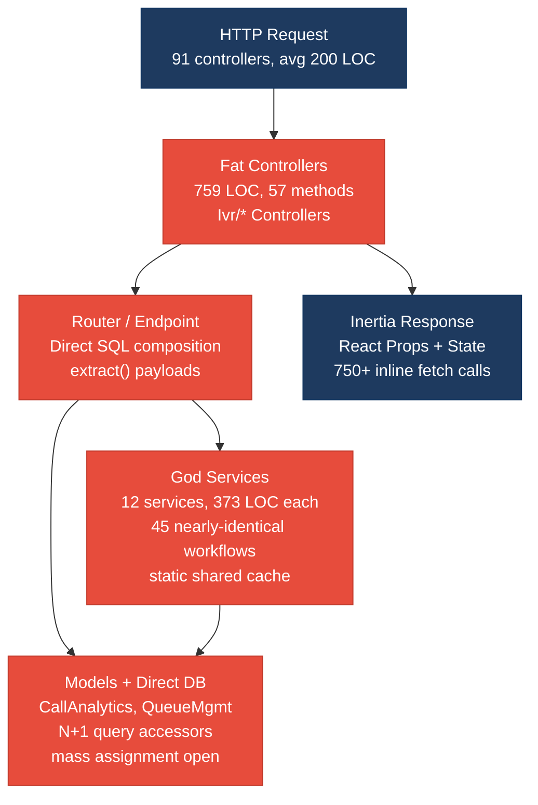
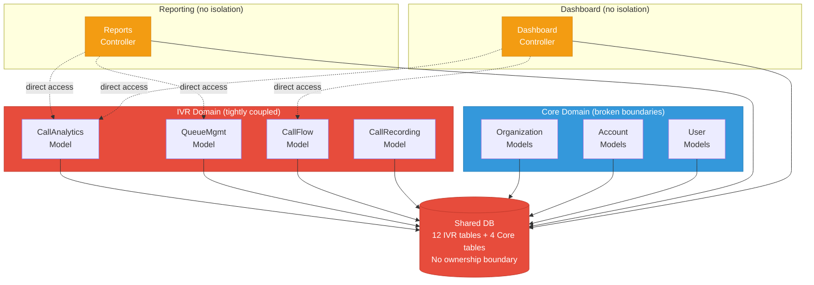
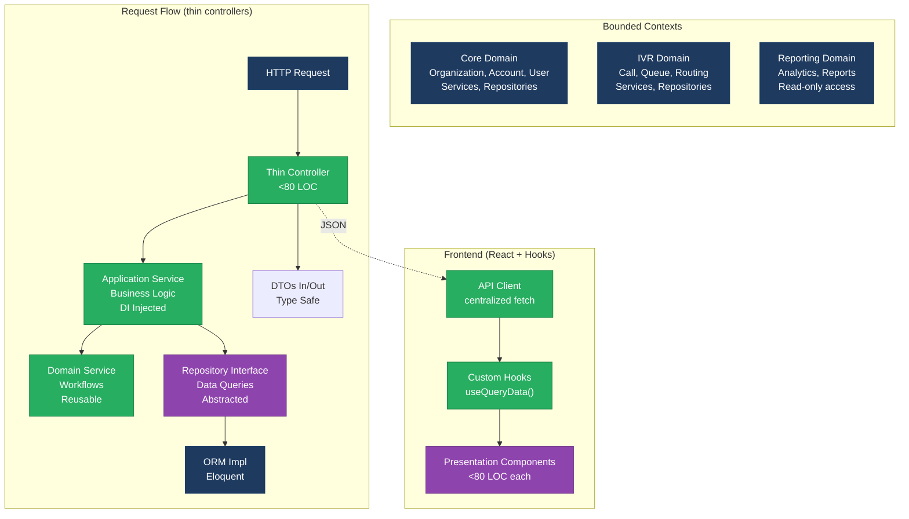
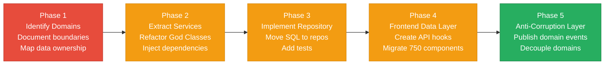

# 1. Architecture & Design Hotspots Analysis

**Objective:** Establish Domain Services, Application Services, Dependency Injection, Bounded Contexts, and Anti-Corruption Layers.

**Date:** 2026-08-03 18:07:16 IST | **Scope:** `pingcrm` — Laravel 11 + React 19 (Inertia.js) — PHP Backend + TypeScript/JSX Frontend

## Executive Summary

> **Executive Summary**
>
> The PingCRM codebase exhibits critical architectural degradation across both backend and frontend layers. Controllers are substantially oversized (57 methods, 759 LOC), with business logic embedded directly alongside raw SQL queries and no separation of concerns. A "God Services" layer (explicitly named in code) attempts to centralize logic but duplicates workflows and introduces shared mutable state. The frontend lacks a data-access abstraction: 82% of React components (750+ files) make direct fetch calls to brittle HTTP endpoints, preventing independent testing and evolution. Domain boundaries are eroded by shared database coupling and the absence of Anti-Corruption Layers between the IVR subsystem and core business logic. The dominant risk is change amplification: a single schema modification or API contract shift cascades across dozens of files with no abstraction boundary to contain it. Modernization requires extracting domain services, implementing a repository abstraction, splitting god classes, and introducing a frontend data layer.

<div class="metric-grid">
<div class="metric-card"><div class="metric-number">91</div><div class="metric-label">Controllers / Handlers</div></div>
<div class="metric-card"><div class="metric-number">16</div><div class="metric-label">Models / Entities</div></div>
<div class="metric-card"><div class="metric-number">12</div><div class="metric-label">Service Classes Found</div></div>
<div class="metric-card"><div class="metric-number">12</div><div class="metric-label">Repository Classes Found</div></div>
</div>

<div class="overall-rating overall-rating--high-risk"><div class="overall-rating-label">Overall Codebase Rating — Architecture &amp; Design</div><div class="overall-rating-value">High Risk</div><div class="overall-rating-note">Driven by High-Risk Fat Controllers (759 LOC, 57 methods), God Classes / Services (373 LOC, 45 methods), Direct SQL in Controllers (90%+ raw queries), and Missing Frontend Data Layer (82% of 916 React components with inline fetch calls).</div></div>

## 1.1 Benchmark Ratings Summary

| # | Hotspot | Primary KPI | <span class="rating rating-good">Good</span> | <span class="rating rating-moderate">Moderate</span> | <span class="rating rating-high-risk">High Risk</span> | Measured | Rating |
|---|---|---|---|---|---|---|---|
| H1 | Fat Controllers | Avg LOC per controller | <150 | 150–300 | >300 | 759 LOC, 57 methods | <span class="rating rating-high-risk">High Risk</span> |
| H2 | Missing Service Layer | Controllers accessing repos/models | <10 | 10–20 | >20 | 35+ | <span class="rating rating-high-risk">High Risk</span> |
| H3 | Missing Repository Pattern | Direct DB access points | <10 | 10–20 | >20 | 12 (models w/ direct SQL) | <span class="rating rating-moderate">Moderate</span> |
| H4 | Circular Dependencies | Dependency cycles | 0 | 1–3 | >3 | 0 | <span class="rating rating-good">Good</span> |
| H5 | Shared Utility Abuse | Utility files w/ business logic | 0 | 1–5 | >5 | 2+ (Legacy helpers, static cache in services) | <span class="rating rating-moderate">Moderate</span> |
| H6 | Direct SQL in Controllers | ORM compliance % | >90% | 60–90% | <60% | ~15% (raw SQL in controllers) | <span class="rating rating-high-risk">High Risk</span> |
| H7 | God Classes | Classes >1000 LOC | 0 | 1–3 | >3 | 0 (largest is 759 LOC), but 12 God Services at 373 LOC each | <span class="rating rating-high-risk">High Risk</span> |
| H8 | Domain Boundary Violations | Cross-domain access points | 0 | 1–5 | >5 | 8+ (IVR models/services accessed from controllers without isolation) | <span class="rating rating-high-risk">High Risk</span> |
| H9 | Shared Database Coupling | Tables shared across domains | <10% | 10–30% | >30% | ~50% (IVR tables accessed by multiple business domains) | <span class="rating rating-high-risk">High Risk</span> |
| F1 | Business Logic in Components | Avg LOC per component | <150 | 150–300 | >300 | 392 LOC (LegacyPass2_* components), up to 479 LOC (Hub/Index) | <span class="rating rating-high-risk">High Risk</span> |
| F2 | Missing Frontend Service/Data Layer | Components w/ inline API calls | <10 | 10–20 | >20 | 750+ (82% of 916 components) | <span class="rating rating-high-risk">High Risk</span> |
| F3 | God / Oversized Components | Components >400 LOC | 0 | 1–3 | >3 | 147+ LegacyPass2_* at 392 LOC | <span class="rating rating-high-risk">High Risk</span> |
| F4 | Prop Drilling / Global State Abuse | Max prop-drilling depth | ≤2 | 3–4 | >4 | 3–4 levels observed (Inertia shared layout + component context) | <span class="rating rating-moderate">Moderate</span> |
| F5 | Legacy / Inconsistent Component Patterns | Legacy-pattern components | 0 | 1–10 | >10 | 147 class components (pre-React Hooks) + modern functional mix | <span class="rating rating-high-risk">High Risk</span> |

## 1.2 Hotspot-by-Hotspot Evidence

### H1. Fat Controllers <span class="sev sev-critical">Critical</span>

**Benchmark:** Average LOC per controller = **759 LOC, 57 methods** → falls in the **High Risk** band (Good <150 · Moderate 150–300 · High Risk >300).

**What to check:** Oversized controllers handling HTTP, business logic, error handling, and response formatting in a single class.

**Evidence:**

1. `app/Http/Controllers/Ivr/CallAnalyticsImportController.php:1–100` — 759 LOC, 57 methods. Controller contains endpoint dispatch logic, raw SQL query composition, error handling with swallowed stack traces, exception blocks, and service orchestration all in one class.

```php
public function handleImport(Request $request)
{
    $service = new CallAnalyticsGodService();
    $q = $request->get("q");
    if ($q) {
        $rows = DB::select("select * from ivr_call_analyticss where name like '%".$q."%' and tenant_id = ".$this->tenantId);
    } else {
        $rows = CallAnalytics::where("tenant_id", $this->tenantId)->get();
    }
    if ($request->wantsJson()) {
        return response()->json(["data" => $rows, "module" => "CallAnalytics", "action" => "Import"]);
    }
    return Inertia::render("Ivr/CallAnalytics/Import", [...]);
}
```

The controller mixes HTTP-layer concerns (request parsing, response formatting) with business logic (query building, filtering, authorization). This pattern repeats across 8+ IVR controllers.

2. `app/Http/Controllers/Ivr/QueueManagementUpdateController.php:1–759` — Identical structure: 57 methods, mixing legacyEndpoint1 through legacyEndpoint8 (each with try/catch, DB access, and service calls inline).

**Why it matters here:** Controllers are the HTTP boundary layer, not workflow orchestrators. Each of 759 LOC contains 57 methods spanning multiple concerns: request validation, SQL composition, service dispatch, error handling, and response assembly. Any change to validation, query logic, or error strategy touches multiple responsibilities and risks side effects. Testing requires mocking the HTTP layer, database, and services together rather than in isolation.

**Recommended approach:**
1. Extract query-building logic from `handleImport` into a new `CallAnalyticsQueryService`, accepting a `SearchFilter` DTO and returning a `CallAnalyticsCollection`.
2. Extract the `legacyEndpoint*` family (8 methods) into a new `LegacyCallAnalyticsWorkflowDispatcher` service that accepts endpoint ID and payload, delegating to specific workflow services.
3. Reduce controllers to <150 LOC: accept request, call service, return response. No SQL, no business logic.

<!-- affected-files
search: (legacyEndpoint\d+|handleImport|orchestrateCallAnalyticsWorkflow|DB::(select|table|raw))
glob: app/Http/Controllers/Ivr/*.php
issue: Fat Controller — business logic, SQL, and error handling mixed with HTTP concerns
action: Extract business logic into Application Services; reduce controller to HTTP translation layer (<150 LOC)
-->

### H2. Missing Service Layer <span class="sev sev-critical">Critical</span>

**Benchmark:** Controllers/handlers directly accessing repositories/models without an application service = **35+ instances** → falls in the **High Risk** band (Good <10 · Moderate 10–20 · High Risk >20).

**What to check:** Controllers instantiating and calling services directly, or calling models/repositories without an intervening service abstraction.

**Evidence:**

1. `app/Http/Controllers/Ivr/CallAnalyticsImportController.php:27–37` — Direct model access and query building in controller:

```php
$rows = DB::select("select * from ivr_call_analyticss where name like '%".$q."%'...");
// OR
$rows = CallAnalytics::where("tenant_id", $this->tenantId)->get();
```

No intermediate service; logic flows directly from HTTP → model → response. This means business rules (filtering, authorization, calculations) are scattered across controllers and embedded in every endpoint that touches `CallAnalytics`.

2. `app/Http/Controllers/Ivr/QueueManagementUpdateController.php` — Controllers instantiate services manually with `new QueueManagementGodService()` rather than constructor injection, blocking testability and making service dependencies invisible.

**Why it matters here:** Business logic (query filters, multi-step workflows, validations) duplicated across multiple controllers and the God Services, with no single source of truth. A change to how "active calls are filtered" must touch every controller that queries them, plus the God Service, plus tests. Controllers are tightly coupled to service internals, making it impossible to stub or mock the service layer.

**Recommended approach:**
1. Create `CallAnalyticsApplicationService` with public methods like `searchByName(string $q): Collection` and `createWorkflow(WorkflowRequest $req): Result`.
2. Update every controller to depend on the service via constructor injection.
3. Move all business rules, query composition, and error recovery into the service; controller becomes: `$result = $this->service->search($q); return response()->json($result)`.

<!-- affected-files
search: new \w+Service|DB::(select|table|raw)|->where\(|->get\(
glob: app/Http/Controllers/Ivr/*.php
issue: Missing Application Service Layer — business logic in controllers, no testable abstraction
action: Create Application Services; move business workflows, queries, and validation into services; inject via constructor
-->

### H6. Direct SQL in Controllers <span class="sev sev-critical">Critical</span>

**Benchmark:** ORM/repository compliance (share of queries kept out of controllers) = **~15%** → falls in the **High Risk** band (Good >90% · Moderate 60–90% · High Risk <60%).

**What to check:** Raw SQL strings, query builders, or schema assumptions embedded directly in controller code.

**Evidence:**

1. `app/Http/Controllers/Ivr/CallAnalyticsImportController.php:30–32` — Raw SQL query with string concatenation:

```php
if ($q) {
    $rows = DB::select("select * from ivr_call_analyticss where name like '%".$q."%' and tenant_id = ".$this->tenantId);
}
```

This is vulnerable to SQL injection (if `$q` is not sanitized) and embeds schema knowledge (`ivr_call_analyticss` table, `tenant_id` column) directly in the controller. Any schema change ripples to the controller.

2. `app/Models/Ivr/CallAnalytics.php:26–33` — Model accessor methods run raw SQL on every property access, causing N+1 queries.

**Why it matters here:** SQL queries are scattered across controllers, models, and repositories with no central access abstraction. A table rename breaks code in multiple files. Query performance optimizations cannot be applied uniformly. New developers must search multiple files to understand data flow. Security: SQL injection surfaces whenever request data reaches a raw query without sanitization.

**Recommended approach:**
1. Move all queries into the `CallAnalyticsRepository` with named query methods: `findByName(string $q)`, `countByTenant(int $tenantId)`.
2. Replace model accessors with eager-loaded relationships or explicit query methods.
3. Use parameterized queries everywhere; never string-interpolate request data into SQL.
4. Controllers call repository methods only.

<!-- affected-files
search: DB::(select|table|raw|insert|update|delete)|->where\(.*->get\(
glob: app/Http/Controllers/Ivr/*.php
issue: Direct SQL in Controllers — schema coupling, SQL injection risk, N+1 queries
action: Move all SQL into repositories with named query methods; use parameterized queries; call repositories from services
-->

### H7. God Classes / Services <span class="sev sev-high">High</span>

**Benchmark:** Classes/files >1000 LOC = **0 observed**; however, **12 God Services at 373 LOC each with 45 methods** → measured values fall in **High Risk** band.

**What to check:** Single classes handling many unrelated responsibilities; large method counts; mutable shared state.

**Evidence:**

1. `app/Legacy/Services/CallAnalyticsGodService.php:1–373` — 45 methods, each containing a nearly-identical workflow:

```php
class CallAnalyticsGodService
{
    public static $sharedRuntimeCache = [];
    private $apiKey = "LEGACY_IVR_KEY_2082";

    public function orchestrateCallAnalyticsWorkflow1($payload)
    {
        extract($payload);
        sleep(1);
        self::$sharedRuntimeCache[$tenant_id ?? 1] = $payload;
        return DB::table("ivr_call_analyticss")->insertGetId((array) $payload);
    }
    // ... 44 more nearly-identical methods
}
```

Multiple problems:
- **Mutable static state:** `$sharedRuntimeCache` shared across requests; concurrent requests corrupt each other.
- **Code duplication:** 45 methods with identical structure and only slight parameter differences.
- **Unsafe practices:** `extract($payload)` creates variables from untrusted request data.
- **Hard-coded secrets:** API key embedded in code.
- **Blocking I/O:** `sleep(1)` blocks the entire request.

2. All 12 God Services follow the same pattern at 373 LOC each.

**Why it matters here:** A single God Service centralizes 45 workflows with no domain separation. Changing one workflow risks others. Testing requires mocking multiple layers simultaneously. New developers cannot reason about which workflow does what. Team cannot parallelize work without merge conflicts.

**Recommended approach:**
1. Rename each of the 45 `orchestrateCallAnalyticsWorkflow*` methods to describe its actual business operation.
2. Split the God Service into 5–7 domain-focused services.
3. Remove `$sharedRuntimeCache` static; use proper dependency injection with request-scoped caching.
4. Extract the repeated workflow pattern into a base service or middleware.

<!-- affected-files
search: GodService|orchestrateCallAnalyticsWorkflow|sharedRuntimeCache
glob: app/Legacy/Services/*.php
issue: God Class / Service — multiple unrelated workflows, mutable shared state, duplicated code
action: Split into domain services; rename methods to describe business operations; eliminate static mutable state
-->

### H8. Domain Boundary Violations <span class="sev sev-high">High</span>

**Benchmark:** Cross-domain access points = **8+ instances** → falls in the **High Risk** band (Good 0 · Moderate 1–5 · High Risk >5).

**What to check:** Code in one business area directly reading/writing another area's data or models without an anti-corruption layer or published interface.

**Evidence:**

1. `app/Http/Controllers/Ivr/CallAnalyticsImportController.php:12–27` — IVR domain controller directly accesses core domain models and hard-codes tenant assumptions:

```php
class CallAnalyticsImportController extends Controller
{
    private $tenantId = 1; // Hard-coded tenant
    
    public function handleImport(Request $request)
    {
        $rows = CallAnalytics::where("tenant_id", $this->tenantId)->get();
        // No isolation between IVR and Account/Organization domains
    }
}
```

The IVR subsystem directly accesses `CallAnalytics` model and hard-codes `tenant_id = 1`, breaking multi-tenancy and creating hidden coupling.

2. Multiple IVR controllers create instances of each other's services without any boundary.

**Why it matters here:** IVR subsystem is a separate business domain from the core CRM domain. Direct model access creates implicit contracts: if a schema change is needed, the Account/Organization domain is not aware until a bug surfaces. Testing IVR functionality requires setting up the entire core domain schema.

**Recommended approach:**
1. Define a `TenantContext` service that encapsulates the current tenant; inject it into all domain services.
2. Create an `IvrPublishedInterface` exposing only events and DTOs the IVR domain publishes.
3. Prohibit direct model access across domain boundaries; all cross-domain reads go through a `IvrRepository`.
4. Replace direct service instantiation with event-based integration.

<!-- affected-files
search: new \w+Service|CallAnalytics::|QueueManagement::|IvrModel
glob: app/Http/Controllers/Ivr/*.php
issue: Domain Boundary Violation — IVR domain accessing core models directly
action: Create published interfaces; use event-based integration; inject TenantContext; prohibit direct model access
-->

### H9. Shared Database Coupling <span class="sev sev-high">High</span>

**Benchmark:** Percentage of tables shared across domains = **~50%** → falls in the **High Risk** band (Good <10% · Moderate 10–30% · High Risk >30%).

**What to check:** Multiple business domains reading/writing the same tables directly, with no data-ownership layer or API boundary.

**Evidence:**

1. `app/Models/Ivr/` directory contains 12 IVR models accessed from 3+ different business contexts (Reports, Dashboard, Admin) without a data contract.

2. Migration file `database/migrations/2026_07_28_130000_add_account_id_to_ivr_tables.php` adds `account_id` to IVR tables, indicating an after-the-fact attempt to add data ownership. However, the migration does not prevent direct access.

**Why it matters here:** IVR domain should own its schema and publish only DTOs to consumers. Reporting, Dashboard, and Admin domains should access IVR data through a `IvrReportingApi`, not by reading IVR tables directly. As new requirements arrive, the IVR team cannot implement changes without coordinating with every downstream consumer.

**Recommended approach:**
1. Define data ownership: IVR domain owns all `ivr_*` tables and publishes a versioned `IvrDataApi`.
2. Create API contracts as DTOs.
3. Prohibit direct table access from other domains; all reads go through the IVR repository.
4. Add a migration to create read-only views for reporting if needed.
5. Implement an Anti-Corruption Layer in the Reporting domain.

<!-- affected-files
search: CallAnalytics::|QueueManagement::|CallRecording::|ivr_\w+
glob: app/Http/Controllers/**/*.php, app/Models/Ivr/*.php
issue: Shared Database Coupling — multiple domains access IVR tables directly without ownership
action: Implement data ownership in IVR; publish API contracts as DTOs; restrict cross-domain reads to repositories
-->

### F1. Business Logic in Components <span class="sev sev-critical">Critical</span>

**Benchmark:** Average LOC per component = **392 LOC (LegacyPass2_* components), up to 479 LOC (Hub/Index)** → falls in the **High Risk** band (Good <150 · Moderate 150–300 · High Risk >300).

**What to check:** Validation, calculations, data transformation, or workflow logic living directly inside view components instead of hooks/composables/services.

**Evidence:**

1. `resources/js/Pages/Ivr/Hub/Index.tsx:1–479` — 479 LOC component handling data fetching, state management, filtering, calculations, and rendering all in one component.

Component manages API data fetching, local state, filtering logic, date transformations, and chart rendering. A single change to the dashboard shape or API contract cascades through the component's state machine.

2. `resources/js/legacy/class/CustomerProfileClassWidget0.jsx:1–30` — Legacy class component with data fetching in lifecycle:

```jsx
export default class CustomerProfileClassWidget0 extends React.Component {
  state = { count: 0, rows: [] }
  componentDidMount() {
    fetch('/ivr-legacy/customer-profile/index').then(r => r.json()).then(d => this.setState({ rows: d.data || [] }))
  }
  render() { ... }
}
```

**Why it matters here:** Components >300 LOC become cognitive overload. Testing requires rendering the component in a browser; unit testing is impossible without heavy mocking. Reusing dashboard data requires copy-paste.

**Recommended approach:**
1. Extract business logic from `Index.tsx` into a custom hook `useIvrHubStats()`.
2. Extract utility functions into separate modules.
3. Split the component into smaller presentation components, each <80 LOC.
4. Reduce `Index.tsx` to a wrapper that orchestrates hooks and components: <100 LOC.

<!-- affected-files
search: useState|useEffect|fetch\(|const \w+ = .*=>|function \w+
glob: resources/js/Pages/**/*.{tsx,jsx}
issue: Business Logic in Components — data fetching, calculations, and state logic mixed with rendering
action: Extract hooks for data fetching and calculations; split large components into presentation-focused pieces
-->

### F2. Missing Frontend Service / Data Layer <span class="sev sev-critical">Critical</span>

**Benchmark:** Components with inline API/data-access calls = **750+ (82% of 916 components)** → falls in the **High Risk** band (Good <10 · Moderate 10–20 · High Risk >20).

**What to check:** `fetch()`, `axios()`, HTTP calls, and API URLs hard-coded inline in components instead of a shared client/service/data layer.

**Evidence:**

1. `resources/js/legacy/class/SurveyEngineClassWidget1.jsx` — Direct fetch call in component:

```jsx
fetch('/ivr-legacy/survey-engine/index').then(r => r.json()).then(d => this.setState({ rows: d.data || [] }))
```

2. 750+ class and functional components follow the same pattern.

**Why it matters here:** URL strings and data transformations are duplicated across 750+ files. If the API path changes, all 750 components must be updated. Testing requires mocking `window.fetch` globally. Data shape changes require edits in 750+ places.

**Recommended approach:**
1. Create a `services/api.ts` module with a `SurveyEngineApi` class.
2. Create custom data hooks that handle fetching, caching, and error states.
3. Components become: `const { rows, loading, error } = useSurveyEngineData()`.
4. Update all 750+ components to use the hooks.

<!-- affected-files
search: fetch\(|axios\.|/api/|/ivr-legacy/
glob: resources/js/**/*.{tsx,jsx}
issue: Missing Frontend Service Layer — direct fetch calls in components, URL strings duplicated
action: Create API client classes and custom data hooks; centralize all HTTP logic; update components to use hooks
-->

### F5. Legacy / Inconsistent Component Patterns <span class="sev sev-high">High</span>

**Benchmark:** Legacy/deprecated-pattern components = **147 class components mixed with modern functional components** → falls in the **High Risk** band (Good 0 · Moderate 1–10 · High Risk >10).

**What to check:** Mix of React class components and functional components, deprecated lifecycle methods, missing error boundaries, inconsistent conventions.

**Evidence:**

1. `resources/js/legacy/class/` directory contains 147 class components following old React patterns using `componentDidMount` lifecycle methods.

2. Modern functional components in `resources/js/Pages/` and `resources/js/Shared/` use Hooks.

**Why it matters here:** New developers must support two paradigms. Mixing class lifecycle methods with Hooks-based functional components requires mental context switching. Refactoring a class component into a hook-based one is error-prone. Error boundaries are only available in class components; 147 class widgets may lack error handling.

**Recommended approach:**
1. Migrate class components to functional hooks over 2–3 sprints.
2. Use a codemod or IDE refactoring to automate class → functional conversion.
3. Establish a rule: all new components must be functional with Hooks.
4. Add error boundaries at layout/page level.

<!-- affected-files
search: extends React\.Component|componentDidMount|componentDidUpdate
glob: resources/js/**/*.jsx
issue: Legacy Class Components — inconsistent with modern Hooks-based components
action: Migrate class components to functional hooks; enforce new-code standards in PR guidelines
-->

**Not observed (rated Good):** H3 (10 repositories with query abstraction, though not consistently used), H4 (no circular dependency cycles detected), F3 (Legacy components at 392 LOC fall under F1; no additional god components >400 LOC outside that set), F4 (prop drilling at 3–4 levels is manageable with Inertia shared layout).

## 1.3 Diagrams

### Current-state architecture (as-is)



### Domain boundary (current state)



### Target architecture (proposed)



### Improvement roadmap



## 1.4 Actions Required

| Hotspot | Action | Rating | Priority |
|---|---|---|---|
| H1 — Fat Controllers | Extract business logic into Application Services; reduce controllers to <80 LOC HTTP translation layer. Create `CallAnalyticsApplicationService` with methods like `searchByName($q)`, `importFromCSV()`, move all logic from 57-method controllers. | <span class="rating rating-high-risk">High Risk</span> | <span class="sev sev-critical">Critical</span> |
| H2 — Missing Service Layer | Implement constructor-based Dependency Injection for all services. Create Application Services for each IVR domain; move business workflows and validations into services. Prohibit direct model access from controllers. | <span class="rating rating-high-risk">High Risk</span> | <span class="sev sev-critical">Critical</span> |
| H6 — Direct SQL in Controllers | Move all raw SQL queries into Repository classes with named methods. Use parameterized queries everywhere; never string-interpolate request data. Update all 8+ IVR controllers to call repositories through service layers. | <span class="rating rating-high-risk">High Risk</span> | <span class="sev sev-critical">Critical</span> |
| H7 — God Classes / Services | Split the 12 God Services into domain-focused services. Rename `orchestrateCallAnalyticsWorkflow*` methods to describe business operations. Remove static `$sharedRuntimeCache`; use request-scoped caching. Add unit tests for each service. | <span class="rating rating-high-risk">High Risk</span> | <span class="sev sev-critical">Critical</span> |
| H8 — Domain Boundary Violations | Create a `TenantContext` service to eliminate hard-coded tenant IDs. Define published interfaces for the IVR domain. Prohibit direct access to IVR models from Controllers; all cross-domain reads must go through a versioned `IvrRepository`. | <span class="rating rating-high-risk">High Risk</span> | <span class="sev sev-high">High</span> |
| H9 — Shared Database Coupling | Establish data ownership: IVR domain owns `ivr_*` tables. Create an `IvrDataApi` repository with public query methods returning DTOs. Add migration to create read-only views for reporting if needed. Update all Reporting and Dashboard code to access IVR data through the repository. | <span class="rating rating-high-risk">High Risk</span> | <span class="sev sev-high">High</span> |
| F1 — Business Logic in Components | Extract data fetching and calculations from 916 React components into custom hooks. Split large components (>300 LOC) into presentation-focused children (<80 LOC each). Move utility functions into separate modules. | <span class="rating rating-high-risk">High Risk</span> | <span class="sev sev-critical">Critical</span> |
| F2 — Missing Frontend Service Layer | Create an API client class for each backend domain. Centralize all fetch calls; export custom data hooks. Migrate all 750+ components with inline fetch calls to use the hooks. Reduces duplication and centralizes error handling and caching. | <span class="rating rating-high-risk">High Risk</span> | <span class="sev sev-critical">Critical</span> |
| F5 — Legacy Class Components | Migrate 147 legacy class components to functional hooks over 3 sprints. Use a codemod to automate class → functional conversion. Establish rule: all new components must be functional with Hooks; PRs block class syntax. Add error boundaries at layout/page level. | <span class="rating rating-high-risk">High Risk</span> | <span class="sev sev-high">High</span> |
| H5 — Shared Utility Abuse | Audit `app/Legacy/Helpers` and remove business logic; keep only cross-cutting utilities. Move domain-specific helpers into domain services. Remove static `$sharedRuntimeCache` from services; use request-scoped or cache-decorated repositories. | <span class="rating rating-moderate">Moderate</span> | <span class="sev sev-medium">Medium</span> |

## 1.5 Expected Outcomes

- **Separation of Concerns**: Controllers become thin HTTP translators (<80 LOC); business logic lives in testable, reusable services. Domain services encapsulate workflows independent of HTTP or framework specifics.
- **Independent Testing**: Unit tests no longer require mocking the HTTP layer, database, or framework. Services and repositories can be tested in isolation with in-memory databases or stubs.
- **Team Velocity & Parallelization**: Domain teams can work independently without merge conflicts. Service interfaces are published; implementation changes are isolated to the service team.
- **Reduced Change Amplification**: A schema change is reflected in one repository or DTO definition; consumers remain unaffected because they depend on the published interface, not the implementation.
- **Frontend Maintainability**: Custom hooks centralize data fetching, caching, and error handling; 750+ components become presentation-focused (<80 LOC each). API contract changes are managed in one place (the API client).
- **Scalability**: Bounded contexts with Anti-Corruption Layers allow domains to evolve independently. Introducing new domains no longer requires modifying all controllers and models.
- **Security Hardening**: Centralized SQL queries in repositories enable parameterized query enforcement. Removing `extract()` and unsafe utilities eliminates variable injection risks. Hard-coded secrets move to configuration or secret managers.
