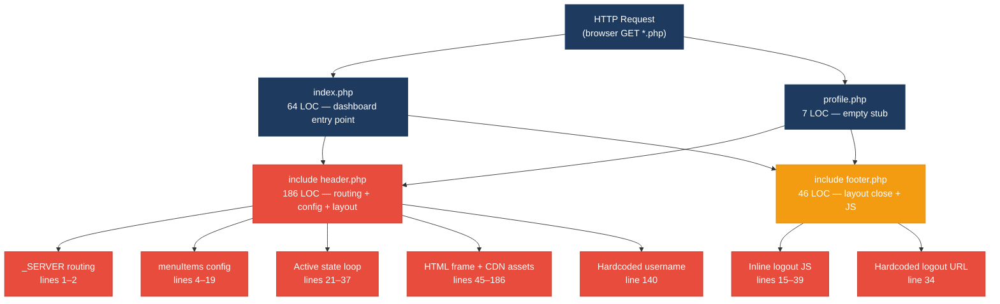
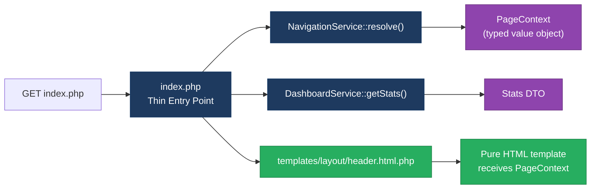
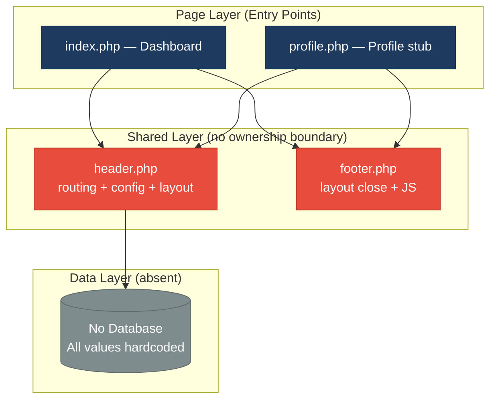
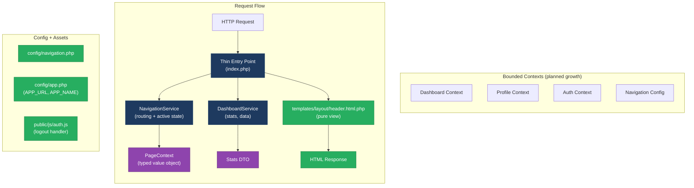

# 1. Architecture & Design Hotspots Analysis

**Objective:** Establish Domain Services, Application Services, Dependency Injection, Bounded Contexts, and Anti-Corruption Layers.

**Date:** 2026-08-03 11:31:29 IST | **Scope:** `shende-shweta/php-admin-panel` — Pure PHP (no framework), server-rendered templates; AdminLTE 3.2 / Bootstrap 5.3 / jQuery 3.7 / SweetAlert2 via CDN

---

## Executive Summary

> **Executive Summary**
>
> The `php-admin-panel` codebase is a minimal, frameworkless PHP dashboard (4 source files, ~303 total LOC) built with a flat include-based architecture that contains zero controllers, zero service classes, zero repositories, and zero domain boundaries. The critical structural risk is that `header.php` simultaneously owns HTTP routing (reading `$_SERVER['SCRIPT_NAME']`), navigation menu configuration, active-state computation, breadcrumb calculation, and rendering the entire page frame — collapsing six architectural responsibilities into one shared include. Every page is coupled to this monolith by a single `include` line. The frontend layer is 100% procedural PHP with HTML mixing: statistics, user names, and logout URLs are all hardcoded directly in source with no data binding or configuration layer. While the project's current scale limits immediate blast radius, any growth in page count or data sourcing will require wholesale architectural reconstruction rather than incremental refactoring. The dominant risk is **change amplification**: altering navigation structure, routing logic, or page layout forces changes to the single shared `header.php` upon which every page depends.

<div class="metric-grid">
<div class="metric-card"><div class="metric-number">2</div><div class="metric-label">Page Entry Points</div></div>
<div class="metric-card"><div class="metric-number">0</div><div class="metric-label">Models / Entities</div></div>
<div class="metric-card"><div class="metric-number">0</div><div class="metric-label">Service Classes Found</div></div>
<div class="metric-card"><div class="metric-number">0</div><div class="metric-label">Repository Classes Found</div></div>
</div>

<div class="overall-rating overall-rating--high-risk"><div class="overall-rating-label">Overall Codebase Rating — Architecture &amp; Design</div><div class="overall-rating-value">High Risk</div><div class="overall-rating-note">Driven by F5 Legacy/Inconsistent Component Patterns (High Risk) and H10 Hardcoded Application Data (High Risk), compounded by Moderate ratings across H1 Fat Controllers, H2 Missing Service Layer, H5 Shared Utility Abuse, F1 Business Logic in Templates, and F4 Global State Abuse.</div></div>

---

## 1.1 Benchmark Ratings Summary

| # | Hotspot | Primary KPI | <span class="rating rating-good">Good</span> | <span class="rating rating-moderate">Moderate</span> | <span class="rating rating-high-risk">High Risk</span> | Measured | Rating |
|---|---|---|---|---|---|---|---|
| H1 | Fat Controllers | Avg LOC per controller | <150 | 150–300 | >300 | `header.php` ~186 LOC (de-facto shared controller mixing routing + layout) | <span class="rating rating-moderate">Moderate</span> |
| H2 | Missing Service Layer | Controllers accessing repos/models directly | <10 | 10–20 | >20 | 0 service classes; 2 page files embed all app logic via `header.php` include; no service tier | <span class="rating rating-moderate">Moderate</span> |
| H3 | Missing Repository Pattern | Direct DB/ORM access outside repositories | <10 | 10–20 | >20 | Not observed — no database, ORM, or SQL anywhere | <span class="rating rating-good">Good</span> |
| H4 | Circular Dependencies | Dependency cycles | 0 | 1–3 | >3 | 0 cycles — one-way include chain (`page → header.php`, `page → footer.php`) | <span class="rating rating-good">Good</span> |
| H5 | Shared Utility Abuse | Utility files holding business logic | 0 | 1–5 | >5 | 1 file (`header.php`) — routing, menu config, active-state, breadcrumbs, CDN assets, layout | <span class="rating rating-moderate">Moderate</span> |
| H6 | Direct SQL in Controllers | ORM compliance % | >90% | 60–90% | <60% | Not observed — no SQL or database access in codebase | <span class="rating rating-good">Good</span> |
| H7 | God Classes | Files/classes >1000 LOC | 0 | 1–3 | >3 | 0 — largest file is `header.php` at ~186 LOC | <span class="rating rating-good">Good</span> |
| H8 | Domain Boundary Violations | Cross-domain access points | 0 | 1–5 | >5 | Not observed — no business domains defined; single-domain flat structure | <span class="rating rating-good">Good</span> |
| H9 | Shared Database Coupling | Tables shared across domains | <10% | 10–30% | >30% | Not observed — no database | <span class="rating rating-good">Good</span> |
| F1 | Business Logic in Components | Avg LOC per template/component | <150 | 150–300 | >300 | `header.php` ~186 LOC mixing routing logic + PHP state + full HTML layout | <span class="rating rating-moderate">Moderate</span> |
| F2 | Missing Frontend Service/Data Layer | Components with inline API/data calls | <10 | 10–20 | >20 | 0 — no AJAX, fetch, or API calls; JS only issues a browser redirect | <span class="rating rating-good">Good</span> |
| F3 | God / Oversized Components | Components >400 LOC | 0 | 1–3 | >3 | 0 — `header.php` at ~186 LOC is the largest file | <span class="rating rating-good">Good</span> |
| F4 | Prop Drilling / Global State Abuse | Global PHP vars shared via include scope | ≤2 | 3–4 | >4 | 7 PHP variables set in `header.php` scope, consumed globally across all page includes | <span class="rating rating-moderate">Moderate</span> |
| F5 | Legacy / Inconsistent Component Patterns | Legacy anti-pattern instances across codebase | 0 | 1–10 | >10 | 12+ instances: PHP/HTML mixing, hardcoded data, inline JS, onclick attributes, unescaped output, no error handling, AdminLTE/Bootstrap version mismatch | <span class="rating rating-high-risk">High Risk</span> |
| H10 | Hardcoded Application Data (additional) — KPI: static values embedded in source (target: 0); Good: 0; Moderate: 1–5; High Risk: >5 | Static values embedded in source | 0 | 1–5 | >5 | 6 hardcoded values: username, 4 dashboard stats, logout URL — no config or data layer | <span class="rating rating-high-risk">High Risk</span> |

**No additional hotspots beyond H10 were observed.**

---

## 1.2 Hotspot-by-Hotspot Evidence

### H1. Fat Controllers / Shared Request Handler <span class="sev sev-high">High</span>

**Benchmark:** `LOC per de-facto controller = ~186 LOC` (`header.php` acting as the shared request handler) → falls in the **Moderate** band (Good <150 · Moderate 150–300 · High Risk >300).

**What to check:** Business logic, routing, and rendering co-located in the same file that handles every request.

**Evidence:**

`header.php:1–43` — HTTP routing logic and navigation state management embedded at the top of a layout template:

```php
<?php
$currentPage = basename($_SERVER['SCRIPT_NAME']);   // HTTP routing: reading server vars directly

$menuItems = [                                       // Navigation config: business data in template
    ["menuTitle" => "Dashboard", "icon" => "fas fa-tachometer-alt",
        "pages" => [["title" => "Home", "url" => "index.php"]]],
    ["menuTitle" => "Settings", "icon" => "fas fa-cog",
        "pages" => [["title" => "Profile", "url" => "profile.php"]]]
];

$active_pageInfo = null;
foreach ($menuItems as $menuItem) {               // State computation: O(n×m) scan
    foreach ($menuItem['pages'] as $page) {
        if ($currentPage === $page['url']) {
            $active_pageInfo = [
                "breadcrumb_Items" => [           // Breadcrumb construction inline
                    ["title" => $menuItem['menuTitle'], "url" => "#"],
                    ["title" => $page['title'], "url" => $page['url']]
                ],
                "page_title" => $page['title'],
                "active_menu" => $menuItem,
                "active_page" => $page
            ];
            break 2;
        }
    }
}
// 4 more variable assignments follow, then 143 lines of HTML output
```

`header.php:126–179` — The same file then renders a full sidebar with the computed routing state embedded in PHP loops:

```php
<aside class="main-sidebar sidebar-dark-primary elevation-4">
    <nav class="mt-2">
        <ul class="nav nav-pills nav-sidebar flex-column" data-widget="treeview" role="menu">
            <?php foreach ($menuItems as $menuItem): ?>
                <li class="nav-item has-treeview <?= $menuItem === $active_menu ? 'menu-open' : '' ?>">
                    <a class="nav-link <?= $menuItem === $active_menu ? 'active' : '' ?>" href="#">
                        <!-- computed routing state directly drives CSS classes -->
```

**Why it matters here:** Because every page file (`index.php`, `profile.php`, and any future page) does `include './header.php'` as its first line, any change to routing logic, navigation items, or breadcrumb structure also modifies the HTML `<head>` tag, CDN script order, and layout markup for every page simultaneously. Adding a third page or a second menu group means touching routing code, menu config, and HTML layout in one file — the definition of change amplification in a shared controller.

**Recommended approach:**
1. Extract `$menuItems` configuration into `config/navigation.php` — the navigation definition must not live inside the layout renderer.
2. Move `$currentPage` detection and active-state computation into `services/NavigationService.php`: `NavigationService::resolve($_SERVER['SCRIPT_NAME'], $menuItems)` returning a typed `PageContext`.
3. Split `header.php` into a pure layout template (`templates/layout/header.html.php`) that receives `$pageTitle`, `$breadcrumbs`, `$menuItems`, and `$activeMenu` as injected parameters.
4. Each page file calls `NavigationService::resolve(...)` and passes the result to the template — the entry point becomes three lines instead of an opaque `include`.

<!-- affected-files
glob: header.php
issue: Mixed routing logic, navigation config, and HTML layout in single shared include
action: Split into NavigationService (routing), config/navigation.php (menu data), and templates/layout/header.html.php (pure view)
-->

---

### H2. Missing Service Layer <span class="sev sev-high">High</span>

**Benchmark:** `Service classes found = 0; all application logic in shared template includes` → falls in the **Moderate** band (no DB repos exist to count direct accesses, but zero service classes means the service tier is completely absent).

**What to check:** Is any application business logic separated from request entry points into a reusable service class?

**Evidence:**

`index.php:1` and `profile.php:1` — Both page entry points delegate all work to the shared template:

```php
<?php include './header.php'; ?>
```

There is no service call, no business object instantiation, and no data fetch between the `include` and the start of HTML output. All application logic (routing resolution, menu state, breadcrumb computation) lives inside `header.php` itself.

`index.php:3–62` — Dashboard statistics are hard-wired into view markup with no service providing them:

```php
<div class="small-box bg-info">
    <div class="inner">
        <h3>150</h3>         <!-- hardcoded stat: no service, no model, no fetch -->
        <p>New Orders</p>
    </div>
</div>
<!-- ...3 more stat boxes: 53%, 44, 65 — all hardcoded -->
```

**Why it matters here:** When a database is added (the natural next step for any admin panel), every statistic will need a query. With no service layer, those queries go directly into `index.php` next to the HTML, creating the Fat View anti-pattern. Adding authentication, user profile loading, or audit logging will have no clean insertion point and will accumulate inline in the page files or in `header.php`.

**Recommended approach:**
1. Create `services/DashboardService.php` with `getStats(): array` returning `['orders' => ..., 'bounce_rate' => ..., ...]`.
2. Create `services/NavigationService.php` with `resolve(string $script, array $menu): PageContext` — extracting the `foreach` loop from `header.php`.
3. Page entry points become: `$stats = (new DashboardService())->getStats(); include 'templates/dashboard.html.php';`.
4. When a database arrives, `DashboardService` is the only file that changes — page templates stay untouched.

<!-- affected-files
glob: *.php
issue: No service layer; all business logic in shared template includes or hardcoded in page files
action: Introduce services/ directory; create DashboardService and NavigationService
-->

---

### H5. Shared Utility Abuse <span class="sev sev-medium">Medium</span>

**Benchmark:** `Utility files holding business logic = 1` (`header.php`) → falls in the **Moderate** band (Good 0 · Moderate 1–5 · High Risk >5).

**What to check:** Large shared includes that accumulate business logic because they are required everywhere.

**Evidence:**

`header.php:1–186` — The file simultaneously owns six distinct concerns:

| Concern | Lines | Evidence |
|---|---|---|
| HTTP routing | 1–2 | `$currentPage = basename($_SERVER['SCRIPT_NAME'])` |
| Navigation config | 4–19 | `$menuItems = [...]` hardcoded menu structure |
| Active-state computation | 21–37 | Nested `foreach` scanning pages |
| Breadcrumb construction | 25–29 | Builds `breadcrumb_Items` array inline |
| HTML document frame + CDN assets | 45–64 | `<!DOCTYPE html>` through `</head>` with 8 CDN links |
| Sidebar rendering loop | 126–179 | `<aside>` with dynamic PHP foreach loops |

All six concerns are included by every page via a single `include './header.php'` — making `header.php` the unowned dumping ground predicted by the Shared Utility Abuse pattern.

**Why it matters here:** When the next developer adds role-based menu visibility they will reach for `header.php` because "that's where the menu is." The file will accumulate authentication checks, permission logic, and conditional rendering alongside existing routing and layout code. Each addition makes the file harder to test in isolation and riskier to change.

**Recommended approach:**
1. Decompose by concern: `config/navigation.php` (menu data), `services/NavigationService.php` (routing + active state), `templates/layout/header.html.php` (pure layout).
2. Extract the JavaScript logout handler from `footer.php` into `public/js/auth.js`.
3. Apply the rule "each include does one thing": a template include renders, a config include defines data, a service include provides logic.

<!-- affected-files
glob: header.php
issue: Single shared utility owns routing, config, breadcrumbs, CDN assets, and full HTML layout
action: Decompose into config/navigation.php, NavigationService, and templates/layout/header.html.php
-->

---

### F1. Business Logic in Templates <span class="sev sev-high">High</span>

**Benchmark:** `Average LOC per template = ~186 LOC` (`header.php`) → falls in the **Moderate** band (Good <150 · Moderate 150–300 · High Risk >300).

**What to check:** PHP business logic (routing, state computation) co-located with HTML rendering in template files.

**Evidence:**

`header.php:1–43` — 43 lines of pure PHP business computation precede the HTML output. The same file then outputs 143 lines of HTML. Both halves are one file with no separation.

`header.php:114–120` — Breadcrumb rendering embeds a PHP ternary that constructs raw HTML strings — mixing logic, escaping risk, and output in one expression:

```php
<ol class="breadcrumb float-sm-right">
    <?php foreach ($breadcrumb_Items as $item): ?>
        <li class="breadcrumb-item <?= $item['url'] === '#' ? 'active' : '' ?>">
            <?= $item['url'] === '#'
                ? $item['title']
                : "<a href='{$item['url']}'>{$item['title']}</a>" ?>
        </li>
    <?php endforeach; ?>
</ol>
```

The string construction on the last `<?=` line interpolates `$item['url']` and `$item['title']` without `htmlspecialchars` — a reflected XSS vector if these values ever become data-driven.

**Why it matters here:** Logic and rendering being co-located means the security concern above cannot be fixed in one place without also touching layout code. Adding even simple conditional rendering (e.g., hide breadcrumbs on the home page) requires editing the same 186-line file that also owns the `<head>` block and CDN loading.

**Recommended approach:**
1. Move all PHP logic above `?>` (lines 1–43 of `header.php`) into `NavigationService::resolve()` before the template is included.
2. Templates receive only pre-computed, pre-escaped variables: `$pageTitle`, `$breadcrumbs`, `$menuItems`, `$activeMenu`, `$activePage`.
3. Introduce a `e()` helper: `function e(string $s): string { return htmlspecialchars($s, ENT_QUOTES, 'UTF-8'); }` — apply to every echo in templates.

<!-- affected-files
glob: *.php
issue: Business logic (routing, state management, breadcrumb construction) co-located with HTML rendering
action: Separate PHP computation from HTML rendering; pass pre-computed escaped variables to templates
-->

---

### F4. Global State Abuse via PHP Include Scope <span class="sev sev-medium">Medium</span>

**Benchmark:** `Global PHP variables shared implicitly across all includes = 7` → falls in the **Moderate** band (≤2 Good · 3–4 Moderate · >4 High Risk — 7 shared globals collapses 3–4 abstraction levels into flat scope).

**What to check:** Variables set in one include and consumed globally by all other files with no explicit contract.

**Evidence:**

`header.php:39–42` — Seven variables set in global scope, consumed by every page file that includes `header.php`:

```php
$breadcrumb_Items = $active_pageInfo['breadcrumb_Items'] ?? [];
$page_title       = $active_pageInfo['page_title'] ?? '';
$active_menu      = $active_pageInfo['active_menu'] ?? null;
$active_page      = $active_pageInfo['active_page'] ?? null;
// plus $currentPage (line 2), $menuItems (line 4), $active_pageInfo (line 21)
```

`header.php:111` — These globals are consumed inline in the HTML body without any explicit parameter passing:

```php
<h1 class="m-0 text-dark"><?= $page_title ?></h1>
```

Page files (`index.php`, `profile.php`) implicitly depend on all seven variables being set by the include, with no documented contract — a rename from `$page_title` to `$title` in `header.php` silently produces blank output.

**Why it matters here:** When authentication state is added (`$currentUser`, `$userRole`, `$permissions`) it will join the same global pool. Testing any page in isolation becomes impossible without bootstrapping the full `header.php` include chain. Any typo in a variable name produces a silent `null` with no error at the call site.

**Recommended approach:**
1. Encapsulate the seven variables in a `PageContext` value object with typed public properties.
2. Page files receive `$context` as a single typed value: `$context = NavigationService::resolve(...); require 'templates/layout/header.html.php';`.
3. Templates reference `$context->pageTitle` — renaming is a compile-time check, not a silent bug.

<!-- affected-files
glob: *.php
issue: 7 PHP variables set as implicit global scope in header.php and consumed silently by all page files
action: Encapsulate into a PageContext value object; inject explicitly into templates
-->

---

### F5. Legacy / Inconsistent Component Patterns <span class="sev sev-critical">Critical</span>

**Benchmark:** `Legacy anti-pattern instances = 12+` → falls in the **High Risk** band (Good 0 · Moderate 1–10 · High Risk >10).

**What to check:** Mixed paradigms, missing error handling, deprecated patterns, hardcoded data, inline JavaScript, and no component conventions.

**Evidence:**

**Instance 1 — Hardcoded username** (`header.php:140`):
```php
<div class="info">
    Ilhomjonov Iqbolshoh   <!-- hardcoded; no session, no auth, no config -->
</div>
```

**Instance 2–5 — Hardcoded dashboard statistics** (`index.php:7,22,37,52`):
```php
<h3>150</h3>   <!-- New Orders — static value, no DB, no service -->
<h3>53<sup style="font-size: 20px">%</sup></h3>   <!-- Bounce Rate — hardcoded -->
<h3>44</h3>    <!-- User Registrations — hardcoded -->
<h3>65</h3>    <!-- Unique Visitors — hardcoded -->
```

**Instance 6 — Inline onclick handler** (`header.php:170`):
```php
<li class="nav-item" onclick="logout()">
```
Inline event handlers are deprecated practice and incompatible with Content Security Policy `script-src`.

**Instance 7 — Inline JavaScript in template** (`footer.php:15–39`):
```javascript
<script>
    function logout() {
        Swal.fire({ title: 'Are you sure?', ... }).then((result) => {
            if (result.isConfirmed) {
                Swal.fire({ title: 'Logged out!', ... }).then(() => {
                    window.location.href = '/logout/';  // hardcoded URL
                });
            }
        });
    }
</script>
```
JavaScript business logic embedded in the PHP footer template; logout URL hardcoded.

**Instance 8 — Unescaped HTML construction** (`header.php:117`):
```php
<?= $item['url'] === '#' ? $item['title'] : "<a href='{$item['url']}'>{$item['title']}</a>" ?>
```
`$item['title']` and `$item['url']` interpolated without `htmlspecialchars` — XSS vector once values become data-driven.

**Instance 9 — Unhandled search form** (`header.php:82–91`):
```html
<form class="form-inline ml-3">
    <input ... type="search" placeholder="Search" name="search">
    <button class="btn btn-navbar" type="submit">...</button>
</form>
```
Form has no `action` attribute and no backend handler — submits to the current page with no effect; misleads users.

**Instance 10 — `include` without error handling** (all page files):
```php
<?php include './header.php'; ?>  <!-- silently renders blank page if file missing -->
```
`include` (not `require_once`) means a missing `header.php` produces no error, only blank output.

**Instance 11 — AdminLTE 3 + Bootstrap 5 version mismatch** (`header.php:55–56`):
```html
<link href=".../bootstrap@5.3.3/dist/css/bootstrap.min.css" rel="stylesheet">
<link href=".../admin-lte@3.2/dist/css/adminlte.min.css" rel="stylesheet">
```
AdminLTE 3.x targets Bootstrap 4; loading Bootstrap 5.3 silently breaks AdminLTE UI components.

**Instance 12 — No component conventions or error boundaries** (all files): `profile.php` body is `<!-- -->` — a stub with no convention on how to implement pages. No CONTRIBUTING file, no template guide, and no `try/catch` around any include or data access.

**Why it matters here:** The 12 anti-pattern instances across 4 files means the pattern density is already 3 anti-patterns per file. Any new page added by copying `index.php` will inherit all of them. The AdminLTE/Bootstrap version mismatch means AdminLTE-specific widgets (info-boxes, progress bars, tree-view) may already be broken in the running panel without any console error that traces back to the CDN version conflict.

**Recommended approach:**
1. Externalise all JavaScript to `public/js/auth.js`; replace `onclick="logout()"` with `data-action="logout"` and event-delegation listener.
2. Add `APP_URL` to `config/app.php`; replace `'/logout/'` with `APP_URL . '/logout'`.
3. Introduce `function e(string $s): string { return htmlspecialchars($s, ENT_QUOTES, 'UTF-8'); }` in a template helper and apply to every `<?=` in `header.php`.
4. Replace all `include` with `require_once` for critical template files.
5. Align versions: either upgrade to AdminLTE 4 (Bootstrap 5 compatible) or downgrade Bootstrap to 4.x.
6. Wire the search form to a `search.php` handler or remove the submit button.

<!-- affected-files
glob: *.php
issue: 12+ legacy anti-pattern instances including hardcoded data, inline JS, unescaped output, onclick attributes, missing error handling, AdminLTE/Bootstrap version mismatch
action: Externalise JS, escape all output, fix dependency versions, use require_once, add APP_URL config
-->

---

### H10. Hardcoded Application Data (additional) <span class="sev sev-critical">Critical</span>

**Benchmark:** `Static values embedded in source = 6` → falls in the **High Risk** band (Good 0 · Moderate 1–5 · High Risk >5). KPI: count of distinct values that belong in config/session/database but are hardcoded as PHP/HTML literals.

**What to check:** Values that will change at runtime — user identity, live metrics, environment URLs — embedded as source code literals.

**Evidence:**

| File | Line | Hardcoded Value | Should Come From |
|---|---|---|---|
| `header.php` | 140 | `"Ilhomjonov Iqbolshoh"` (username) | `$_SESSION['user_name']` / auth service |
| `index.php` | 7 | `150` (New Orders) | Database query / DashboardService |
| `index.php` | 22 | `53%` (Bounce Rate) | Analytics service |
| `index.php` | 37 | `44` (User Registrations) | Database query / DashboardService |
| `index.php` | 52 | `65` (Unique Visitors) | Analytics service / DB |
| `footer.php` | 34 | `'/logout/'` (redirect URL) | `config/app.php` APP_URL constant |

**Why it matters here:** This panel is described as a reusable starter for "small to medium projects." Every project adopting it must grep-and-replace hardcoded values rather than editing a config file. More critically, the dashboard statistics are presented as live metrics in a real-looking admin panel UI but are static HTML — any user viewing the panel sees perpetually stale numbers (150 orders, 44 registrations) with no indication they are placeholder data.

**Recommended approach:**
1. Create `config/app.php` defining `APP_URL` and `APP_NAME` constants.
2. Create `services/DashboardService.php` with `getStats(): array` — initially returning the same values but structured for database replacement.
3. In `header.php` replace the hardcoded name with `$_SESSION['user_name'] ?? 'Guest'`.
4. In `footer.php` replace `'/logout/'` with `APP_URL . '/logout'`.
5. In `index.php` replace the four stat literals with `<?= $stats['orders'] ?>` etc., fed by `DashboardService`.

<!-- affected-files
search: (150|53|44|65|Ilhomjonov|\/logout\/)
glob: *.php
issue: Static values (username, metric counts, logout URL) hardcoded as source literals
action: Move to config/app.php and DashboardService; bind username to session
-->

---

**Not observed (rated Good):** H3 — no database, PDO, mysqli, or SQL anywhere in the codebase; H4 — include chain is strictly one-directional, 0 circular cycles; H6 — no SQL statements in any file; H7 — no file exceeds 1000 LOC (largest is `header.php` at ~186 LOC); H8 — no business domain boundaries defined or violated; H9 — no database schema; F2 — no AJAX, fetch, or API calls in any template (footer JS only issues a browser redirect, no HTTP request); F3 — no component exceeds 400 LOC.

---

## 1.3 Diagrams

### Current-state architecture (as-is)



### Clean reference path (target pattern — not present in codebase today)



### Domain boundary map (current flat structure — no boundaries defined)



### Target architecture (proposed)



### Improvement roadmap


---

## 1.4 Actions Required

| Hotspot | Action | Rating | Priority |
|---|---|---|---|
| H1 Fat Controllers | Split `header.php` into `NavigationService` (routing logic), `config/navigation.php` (menu data), and `templates/layout/header.html.php` (pure HTML view) | <span class="rating rating-moderate">Moderate</span> | <span class="sev sev-high">High</span> |
| H2 Missing Service Layer | Create `services/DashboardService.php` and `services/NavigationService.php`; page entry points call services and pass typed `PageContext` and `Stats` results to templates | <span class="rating rating-moderate">Moderate</span> | <span class="sev sev-high">High</span> |
| H5 Shared Utility Abuse | Decompose `header.php` by single responsibility: one include for config, one for service logic, one for layout rendering; extract logout JS from `footer.php` to `public/js/auth.js` | <span class="rating rating-moderate">Moderate</span> | <span class="sev sev-medium">Medium</span> |
| F1 Business Logic in Templates | Move all PHP computation from `header.php:1–43` into `NavigationService::resolve()`; templates receive only pre-computed and pre-escaped variables | <span class="rating rating-moderate">Moderate</span> | <span class="sev sev-high">High</span> |
| F4 Global State Abuse | Encapsulate 7 implicit global variables (`$page_title`, `$breadcrumb_Items`, `$menuItems`, `$active_menu`, `$active_page`, `$currentPage`, `$active_pageInfo`) into a typed `PageContext` value object; inject explicitly | <span class="rating rating-moderate">Moderate</span> | <span class="sev sev-medium">Medium</span> |
| F5 Legacy Component Patterns | Externalise JS to `public/js/auth.js`; escape all output via `htmlspecialchars()`; replace `onclick` with event delegation; align AdminLTE + Bootstrap versions; replace `include` with `require_once`; wire or remove the search form | <span class="rating rating-high-risk">High Risk</span> | <span class="sev sev-critical">Critical</span> |
| H10 Hardcoded Application Data | Create `config/app.php` (`APP_URL`, `APP_NAME`); bind username to `$_SESSION['user_name']`; return dashboard stats from `DashboardService::getStats()`; replace `/logout/` literal with `APP_URL . '/logout'` | <span class="rating rating-high-risk">High Risk</span> | <span class="sev sev-critical">Critical</span> |

---

## 1.5 Expected Outcomes

- **Testability**: With `NavigationService` and `DashboardService` in place, routing logic and stat retrieval can be unit-tested independently of any HTTP request or HTML output — currently impossible since all logic is embedded in a template include.
- **Safe extensibility**: Adding a new page requires creating one new entry-point file and one menu entry in `config/navigation.php` — no changes to `header.php`, no risk of breaking existing pages.
- **Security baseline**: Escaping all template output via `htmlspecialchars()` and externalising JavaScript into a CSP-compatible file eliminates the reflected-XSS risk in the breadcrumb renderer and removes the inline `onclick` handler.
- **Live data readiness**: When a database is introduced, only `DashboardService::getStats()` changes — the four dashboard templates, the layout, and the routing logic remain untouched.
- **Version stability**: Aligning AdminLTE and Bootstrap to a compatible version pair (AdminLTE 4 + Bootstrap 5, or AdminLTE 3 + Bootstrap 4) resolves the existing CDN mismatch that silently breaks AdminLTE-specific UI components such as the tree-view sidebar and info-boxes.
