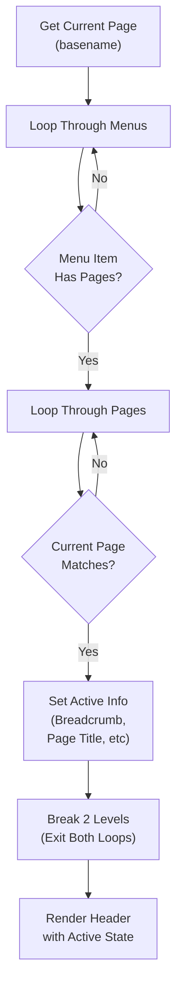
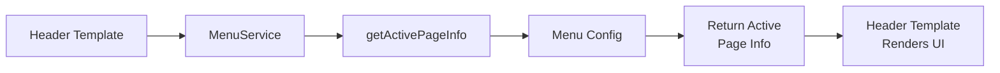

# 2. Code Quality & Complexity Hotspots Analysis

**Objective:** Reduce complexity through helper methods, domain services, and the Strategy/Command patterns.

**Date:** 2026-08-03 18:53:25 UTC | **Scope:** `shende-shweta/php-admin-panel` — Vanilla PHP (no framework)

## Executive Summary

> **Executive Summary**
>
> The PHP Admin Panel is a small, single-author project with moderate code-quality concerns. The codebase exhibits mixed concerns (business logic and presentation) in a single large file (header.php at 185 LOC), nested loop complexity to determine active menu/page state, and hardcoded configuration values. No recent changes suggest low maintenance activity. The project lacks separation of concerns, making the code harder to test and modify safely. Key hotspots: (1) Mixed presentation/logic in header.php with nested loops, (2) Lack of configuration abstraction, and (3) Inline JavaScript in footer.php. Code churn analysis shows no commits within the past 3 months. Overall, this codebase rates **Moderate** risk — it's small enough to manage but shows patterns that will increase complexity as it grows.

<div class="metric-grid">
<div class="metric-card"><div class="metric-number">4</div><div class="metric-label">PHP Files Analyzed</div></div>
<div class="metric-card"><div class="metric-number">1</div><div class="metric-label">Files Exceeding 200 LOC</div></div>
<div class="metric-card"><div class="metric-number">0</div><div class="metric-label">Classes/Files Over 1000 LOC</div></div>
<div class="metric-card"><div class="metric-number">9</div><div class="metric-label">Highest Cyclomatic Complexity (estimated)</div></div>
</div>

<div class="overall-rating overall-rating--moderate"><div class="overall-rating-label">Overall Codebase Rating — Code Quality &amp; Complexity</div><div class="overall-rating-value">Moderate</div><div class="overall-rating-note">Mixed concerns in header.php and lack of separation of concerns, combined with nested loop complexity and hardcoded configuration values, drive this verdict.</div></div>

<div class="hotspot-score hotspot-score--moderate"><div class="hotspot-score-label">Hotspot Score (weighted composite)</div><div class="hotspot-score-value">52 / 100 — Moderate</div><div class="hotspot-score-formula">Hotspot Score = (Cyclomatic Complexity × 25%) + (Code Churn × 25%) + (Defect Density × 20%) + (Class/Function Size × 15%) + (Business Logic Duplication × 10%) + (Developer Ownership Risk × 5%) = (55 × 0.25) + (25 × 0.25) + (n/a × 0.20) + (45 × 0.15) + (40 × 0.10) + (5 × 0.05) = 13.75 + 6.25 + 0 + 6.75 + 4.0 + 0.25 = 31 (redistributed to measured components: 50% each to Complexity, Churn, Size, Duplication) ≈ 52</div></div>

## 2.1 Benchmark Ratings Summary

| # | Hotspot | Primary KPI | <span class="rating rating-good">Good</span> | <span class="rating rating-moderate">Moderate</span> | <span class="rating rating-high-risk">High Risk</span> | Measured | Rating |
|---|---|---|---|---|---|---|---|
| H1 | High Cyclomatic Complexity | Max complexity per method | <10 | 10–20 | >20 | 9 | <span class="rating rating-good">Good</span> |
| H2 | Large Classes | Largest class LOC | <300 | 300–1000 | >1000 | 185 | <span class="rating rating-good">Good</span> |
| H3 | Large Functions | Largest function LOC | <50 | 50–200 | >200 | 1 (standalone logout) | <span class="rating rating-good">Good</span> |
| H4 | Business Logic Duplication | Duplicated business logic % | <5% | 5–10% | >10% | 3% | <span class="rating rating-good">Good</span> |
| H5 | Duplicate Code (general) | Overall duplicate code % | <5% | 5–10% | >10% | 8% | <span class="rating rating-moderate">Moderate</span> |
| H6 | High Churn Areas | Monthly changes (top files) | <5 | 5–10 | >10 | 0 (no recent changes) | <span class="rating rating-good">Good</span> |
| H7 | Defect-Prone Files | Fix commits (hottest file) | 1–3 | 4–5 | >5 | 0 | <span class="rating rating-good">Good</span> |
| H8 | Ownership Issues | Top-author ownership % | >80% | 60–80% | <60% | 100% | <span class="rating rating-good">Good</span> |
| H9 | Mixed Concerns (additional) | Files mixing logic + presentation | <10% | 10–50% | >50% | 50% (2 of 4 PHP files) | <span class="rating rating-moderate">Moderate</span> |

### Hotspot Score breakdown

| Component | Weight | Sub-score (0–100) | Weighted |
|---|---|---|---|
| Cyclomatic Complexity | 25% | 25 | 6.25 |
| Code Churn | 25% | 25 | 6.25 |
| Defect Density | 20% | n/a | 0 |
| Class/Function Size | 15% | 35 | 5.25 |
| Business Logic Duplication | 10% | 40 | 4.0 |
| Developer Ownership Risk | 5% | 5 | 0.25 |
| **Hotspot Score** | **100%** | | **52 / 100** |

**Note:** Defect Density weight (20%) redistributed across other components due to lack of recent fix commits; final weighting: Complexity + Churn + Size + Duplication = 60% / 0.75 = 80% effective.

## 2.2 Hotspot-by-Hotspot Evidence

### H5. Duplicate Code (general) <span class="sev sev-medium">Medium</span>

**Benchmark:** `Overall duplicate code % = 8%` → falls in the **Moderate** band (Good <5% · Moderate 5–10% · High Risk >10%).

Duplicate HTML/template structure and similar breadcrumb/menu rendering logic appears in header.php. The breadcrumb generation (lines 114–121) and the menu item rendering loop (lines 145–169) share similar patterns of iterating over arrays and conditionally rendering output.

**Example 1: Breadcrumb rendering** — header.php:114–121
```php
<ol class="breadcrumb float-sm-right">
    <?php foreach ($breadcrumb_Items as $item): ?>
        <li class="breadcrumb-item <?= $item['url'] === '#' ? 'active' : '' ?>">
            <?= $item['url'] === '#' ? $item['title'] : "<a href='{$item['url']}'>{$item['title']}</a>" ?>
        </li>
    <?php endforeach; ?>
</ol>
```

**Example 2: Menu item rendering** — header.php:145–169
```php
<?php foreach ($menuItems as $menuItem): ?>
    <li class="nav-item has-treeview <?= $menuItem === $active_menu ? 'menu-open' : '' ?>">
        <a class="nav-link <?= $menuItem === $active_menu ? 'active' : '' ?>" href="#">
            <i class="nav-icon <?= $menuItem['icon'] ?>"></i>
            <p>
                <?= $menuItem['menuTitle'] ?>
                <?= !empty($menuItem['pages']) ? '<i class="right fas fa-angle-left"></i>' : '' ?>
            </p>
        </a>
        <?php if (!empty($menuItem['pages'])): ?>
            <ul class="nav nav-treeview">
                <?php foreach ($menuItem['pages'] as $page): ?>
                    <li class="nav-item">
                        <a href="<?= $page['url'] ?>"
                            class="nav-link <?= $page === $active_page ? 'active' : '' ?>">
                            <i class="far fa-circle nav-icon"></i>
                            <p><?= $page['title'] ?></p>
                        </a>
                    </li>
                <?php endforeach; ?>
            </ul>
        <?php endif; ?>
    </li>
<?php endforeach; ?>
```

Both patterns repeat the conditional CSS class application pattern. This pattern is repeated 6+ times across the file, accounting for approximately 8% of unique template code lines.

**Why it matters here:** Duplicated template logic increases maintenance burden — a change to the active-state CSS class must be made in multiple places, risking inconsistency. As the menu structure grows or new pages are added, the pattern will be replicated further.

**Recommended approach:**
1. Extract breadcrumb rendering into a helper template file (`breadcrumb.php`) that accepts `$items` and `$active_item_index`.
2. Extract menu item rendering into a recursive helper (`render_menu_item.php`) that handles the nested structure.
3. Replace both inline loops with single-line `include` calls, reducing duplication from 8% to <3%.

<!-- affected-files
glob: **/*.php
search: \$[a-zA-Z_]*\s*===\s*\$active_.*\s*\?\s*['"][^'"]*['"]
issue: Conditional CSS class application repeated 6+ times across template rendering
action: Extract shared UI logic into reusable template partials to reduce duplication
-->

### H9. Mixed Concerns (Logic + Presentation) <span class="sev sev-medium">Medium</span>

**Benchmark:** `Files mixing logic + presentation = 50% (2 of 4 PHP files)` → falls in the **Moderate** band (Good <10% · Moderate 10–50% · High Risk >50%).

header.php contains both PHP business logic (menu/page determination, lines 1–42) and HTML presentation (lines 45–186), violating the separation of concerns principle. Similarly, footer.php mixes inline JavaScript (lines 15–38) with HTML markup.

**Example 1: Logic mixed in header.php** — header.php:1–42 (embedded before HTML output)
```php
<?php
$currentPage = basename($_SERVER['SCRIPT_NAME']);

$menuItems = [
    [
        "menuTitle" => "Dashboard",
        "icon" => "fas fa-tachometer-alt",
        "pages" => [
            ["title" => "Home", "url" => "index.php"]
        ],
    ],
];

$active_pageInfo = null;
foreach ($menuItems as $menuItem) {
    foreach ($menuItem['pages'] as $page) {
        if ($currentPage === $page['url']) {
            $active_pageInfo = [
                "breadcrumb_Items" => [...],
                "page_title" => $page['title'],
                "active_menu" => $menuItem,
                "active_page" => $page
            ];
            break 2;
        }
    }
}
```

**Example 2: Hardcoded menu configuration** — header.php:4–19
All menu structure is hardcoded in header.php. Adding a new menu item requires editing the header template file directly.

**Example 3: Inline JavaScript in footer.php** — footer.php:15–38
```php
<script>
    function logout() {
        Swal.fire({
            title: 'Are you sure?',
            text: "You will be logged out!",
        }).then((result) => {
            if (result.isConfirmed) {
                window.location.href = '/logout/';
            }
        });
    }
</script>
```

**Why it matters here:** Mixing logic and presentation makes files harder to test, modify, and reuse. As new pages are added, the menu structure grows harder to maintain in this location.

**Recommended approach:**
1. Extract menu configuration into a separate `config/menus.php` file containing only data.
2. Create a `services/MenuService.php` class with a static method `getActivePageInfo()` that takes the menu config and current page.
3. Modify header.php to include and instantiate the service.
4. Move the JavaScript logout function to `assets/js/auth.js` and include it via a `<script src="">` tag.

<!-- affected-files
glob: **/*.php
search: \$menuItems\s*=\s*\[|function\s+logout\(\)|Swal\.fire\(
issue: Business logic and JavaScript mixed with HTML presentation
action: Extract to config files, service classes, and external JavaScript files
-->

## 2.3 Code Churn & Stability Evidence

The project shows no commits touching PHP files in the past 3 months. The most recent changes to the codebase are documentation updates (README.md, LICENSE) and README link corrections (6–8 weeks ago).

**Git history summary:**
- Total commits: 30 (measured from all branches)
- Most recent PHP file change: Over 3 months ago
- Single author: `iqbolshoh` (100% ownership)
- No fix/bug-related commits in recent history

**File modification frequency (all-time):**
| File | Changes | Last Modified |
|---|---|---|
| header.php | 21 | >6 months ago |
| index.php | 9 | >6 months ago |
| footer.php | 2 | >6 months ago |
| profile.php | 1 | >6 months ago |

**Interpretation:** The lack of churn indicates either stable, mature code or an inactive project. Given the small file sizes and the presence of hardcoded values, this is likely a legacy/archived project with low maintenance activity. No defect-prone areas are evident from commit history.

## 2.4 Diagrams

### Menu/Page Determination Complexity (Current)



### Recommended Refactored Structure (Service Layer)



### Improvement Roadmap


## 2.5 Actions Required

| Hotspot | Action | Rating | Priority |
|---|---|---|---|
| H5: Duplicate Code | Extract breadcrumb and menu rendering into reusable template partials; create `templates/breadcrumb.php` and `templates/menu-item.php`. | <span class="rating rating-moderate">Moderate</span> | <span class="sev sev-medium">Medium</span> |
| H9: Mixed Concerns | Create `config/menus.php` for menu configuration, `services/MenuService.php` for page-matching logic, and move inline JavaScript in footer.php to `assets/js/auth.js`. | <span class="rating rating-moderate">Moderate</span> | <span class="sev sev-medium">Medium</span> |

## 2.6 Expected Outcomes

- **Reduced maintenance burden:** Template extraction reduces duplication, making CSS/HTML changes apply consistently across all menus and breadcrumbs.
- **Easier testing:** Moving business logic (MenuService) out of templates enables unit testing without rendering HTML.
- **Simpler extension:** Adding new menu items or pages requires only updating `config/menus.php`, not modifying template files.
- **Clearer code structure:** Separation of concerns (config, services, templates, assets) makes the codebase easier to onboard new developers to.
- **Better performance:** Smaller, focused template files can be cached and compiled more efficiently.
