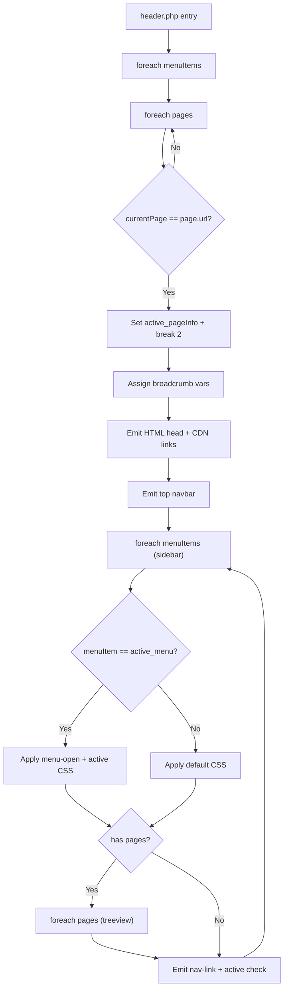
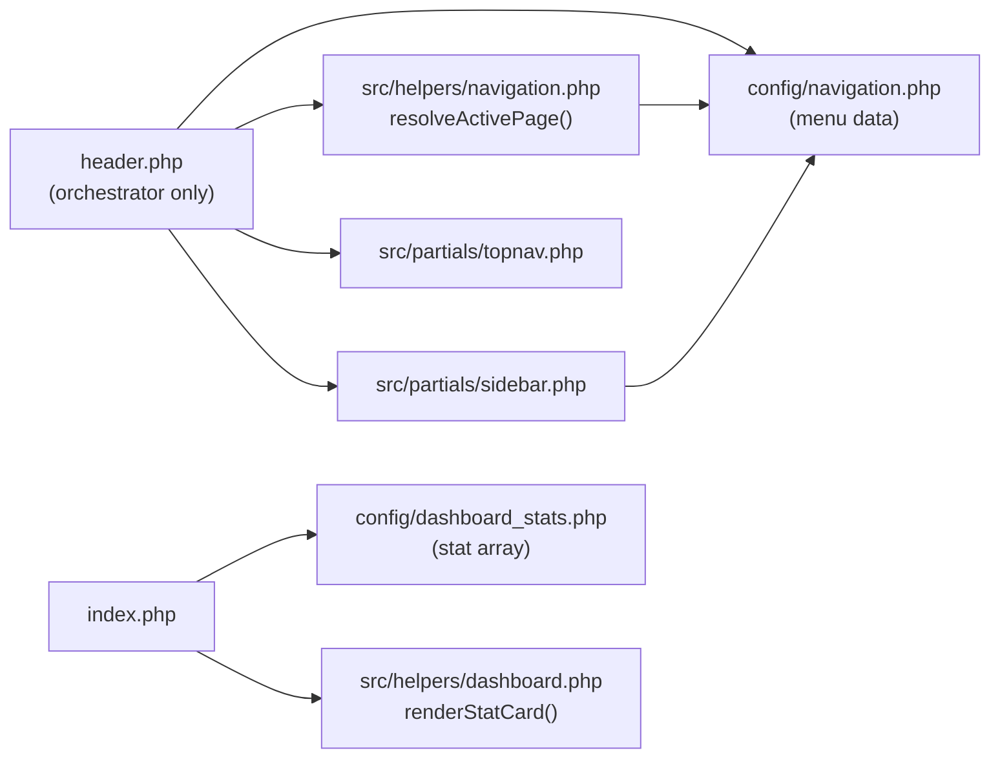
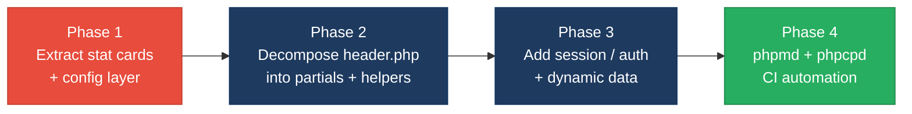

# 2. Code Quality & Complexity Hotspots Analysis

**Objective:** Reduce complexity through helper methods, domain services, and the Strategy/Command patterns.

**Date:** 2026-08-03 12:15:48 IST | **Scope:** `shende-shweta/php-admin-panel` (main branch) — PHP 8.x procedural + AdminLTE 3.2 / Bootstrap 5.3 / jQuery 3.7 (CDN-loaded; no local frontend JS/CSS source files)

## Executive Summary

> **Executive Summary**
>
> The `php-admin-panel` codebase is a minimal four-file PHP admin shell (header.php, footer.php, index.php, profile.php; ~303 total LOC) with no local frontend JavaScript or CSS — all UI framework dependencies are loaded from CDN. The most significant quality finding is widespread copy-paste duplication in `index.php`, where four structurally identical stat-box blocks repeat the same 14-line HTML pattern without abstraction, pushing the general duplicate-code ratio to approximately 16% of total codebase lines — above the 10% High Risk threshold. A secondary concern is that `header.php` acts as a God File, conflating navigation configuration, page-routing logic, HTML document scaffolding, top navbar, and sidebar generation in a single 185-line script; its script-level cyclomatic complexity measures approximately 15, placing it in the Moderate band. No bug-fix commits were found in the project history, and recent application-code churn is zero (only README updates since May 2025), reflecting a stable but low-activity codebase. Git history was available and used for all churn, defect-density, and ownership metrics.

<div class="metric-grid">
<div class="metric-card"><div class="metric-number">4</div><div class="metric-label">PHP Files Analyzed</div></div>
<div class="metric-card"><div class="metric-number">0</div><div class="metric-label">Functions/Methods Over 200 LOC</div></div>
<div class="metric-card"><div class="metric-number">0</div><div class="metric-label">Classes/Files Over 1000 LOC</div></div>
<div class="metric-card"><div class="metric-number">~15</div><div class="metric-label">Highest Script-Level Cyclomatic Complexity</div></div>
</div>

<div class="overall-rating overall-rating--high-risk"><div class="overall-rating-label">Overall Codebase Rating — Code Quality &amp; Complexity</div><div class="overall-rating-value">High Risk</div><div class="overall-rating-note">H5 (Duplicate Code ~16%) exceeds the 10% High Risk threshold; compound Moderate findings in H1 (CC ~15), H9 (God File — 5+ concerns in header.php), and H10 (6+ hardcoded magic values) elevate the verdict under worst-wins.</div></div>

<div class="hotspot-score hotspot-score--good"><div class="hotspot-score-label">Hotspot Score (weighted composite)</div><div class="hotspot-score-value">26 / 100 — Good</div><div class="hotspot-score-formula">Hotspot Score = (Cyclomatic Complexity × 25%) + (Code Churn × 25%) + (Defect Density × 20%) + (Class/Function Size × 15%) + (Business Logic Duplication × 10%) + (Developer Ownership Risk × 5%) = (50 × 0.25) + (5 × 0.25) + (5 × 0.20) + (25 × 0.15) + (75 × 0.10) + (5 × 0.05) = 12.50 + 1.25 + 1.00 + 3.75 + 7.50 + 0.25 = 26. The composite lands in the Good band because the two highest-weight components — Code Churn (25%) and Defect Density (20%) — are both near-zero; H5 General Duplication carries only a 10% weight, insufficient to raise the composite to Moderate despite its High Risk sub-score.</div></div>

## 2.1 Benchmark Ratings Summary

One row per hotspot. "Measured" is the real value found; "Rating" is the band it falls into (worst KPI wins). This table is the source for the Overall Codebase Rating banner above.

| # | Hotspot | Primary KPI | <span class="rating rating-good">Good</span> | <span class="rating rating-moderate">Moderate</span> | <span class="rating rating-high-risk">High Risk</span> | Measured | Rating |
|---|---|---|---|---|---|---|---|
| H1 | High Cyclomatic Complexity | Max complexity per method/script | <10 | 10–20 | >20 | ~15 (header.php script-level) | <span class="rating rating-moderate">Moderate</span> |
| H2 | Large Classes | Largest file LOC | <300 | 300–1000 | >1000 | 185 LOC (header.php) | <span class="rating rating-good">Good</span> |
| H3 | Large Functions | Largest function LOC | <50 | 50–200 | >200 | ~15 LOC (logout() in footer.php) | <span class="rating rating-good">Good</span> |
| H4 | Business Logic Duplication | Duplicated business-rule code % | <5% | 5–10% | >10% | ~0% (no business logic present) | <span class="rating rating-good">Good</span> |
| H5 | Duplicate Code (general) | Overall duplicate code % | <5% | 5–10% | >10% | ~16% (4 copy-paste stat boxes in index.php) | <span class="rating rating-high-risk">High Risk</span> |
| H6 | High Churn Areas | Monthly changes (top files, last 12 months) | <5 | 5–10 | >10 | 0 PHP file changes last 12 months (historical burst: ~17/month in Feb 2025) | <span class="rating rating-good">Good</span> |
| H7 | Defect-Prone Files | Fix/bug commits (hottest file) | 1–3 | 4–5 | >5 | 0 (no bug/fix commits in full history) | <span class="rating rating-good">Good</span> |
| H8 | Ownership Issues | Top-author ownership % | >80% | 60–80% | <60% | 100% (single developer — iqbolshoh) | <span class="rating rating-good">Good</span> |
| H9 | God File — Mixed Concerns (additional) | Responsibilities per file (target: 1) | 1 | 2–3 | 4+ | 5+ responsibilities in header.php | <span class="rating rating-moderate">Moderate</span> |
| H10 | Hardcoded Config / Magic Values (additional) | Count of hardcoded config values (target: 0) | 0 | 1–3 | 4+ | 6+ hardcoded values across index.php + header.php + footer.php | <span class="rating rating-moderate">Moderate</span> |

**No additional hotspots beyond the standard set were observed** beyond H9 and H10 listed above.

### Hotspot Score breakdown

| Component | Weight | Sub-score (0–100) | Weighted |
|---|---|---|---|
| Cyclomatic Complexity | 25% | 50 (Moderate band — CC ~15 sits mid-range 10–20) | 12.50 |
| Code Churn | 25% | 5 (Good band — 0 PHP changes last 12 months) | 1.25 |
| Defect Density | 20% | 5 (Good band — 0 bug/fix commits in full history) | 1.00 |
| Class/Function Size | 15% | 25 (Good band — worse of H2=25, H3=10 → 25) | 3.75 |
| Business Logic Duplication | 10% | 75 (High Risk band — H5 ~16% > 10% threshold; higher than H4 ~0%) | 7.50 |
| Developer Ownership Risk | 5% | 5 (Good band — 100% single author, inverted = near-zero risk) | 0.25 |
| **Hotspot Score** | **100%** | | **26 / 100** |

## 2.2 Hotspot-by-Hotspot Evidence

### H1. High Cyclomatic Complexity <span class="sev sev-medium">Medium</span>

**Benchmark:** `Script-level CC = ~15` → falls in the **Moderate** band (Good <10 · Moderate 10–20 · High Risk >20).

There are no named PHP functions in the codebase — all logic lives in script-level procedural PHP. `header.php` is the single complexity hotspot. Its PHP routing block (lines 1–42) adds 3 branch/loop points (2 nested `foreach` + 1 `if`). The PHP-in-HTML sidebar section (lines ~142–175) adds a further 7 decision points (2 `foreach`, 2 `if/empty`, 3 ternary expressions). The breadcrumb section contributes 3 more (1 `foreach`, 2 ternary). Total script-level CC ≈ 1 (base) + 13 (branches) = 14–15, placing it in the Moderate band.

**Example 1 — Nested routing block (header.php, lines 21–36):**
```php
$active_pageInfo = null;
foreach ($menuItems as $menuItem) {
    foreach ($menuItem['pages'] as $page) {
        if ($currentPage === $page['url']) {
            $active_pageInfo = [
                "breadcrumb_Items" => [
                    ["title" => $menuItem['menuTitle'], "url" => "#"],
                    ["title" => $page['title'], "url" => $page['url']]
                ],
                "page_title" => $page['title'],
                "active_menu" => $menuItem,
                "active_page" => $page
            ];
            break 2;
        }
    }
}
```

**Example 2 — PHP-in-HTML sidebar generation (header.php, lines ~142–175):**
```php
<?php foreach ($menuItems as $menuItem): ?>
    <li class="nav-item has-treeview <?= $menuItem === $active_menu ? 'menu-open' : '' ?>">
        <a class="nav-link <?= $menuItem === $active_menu ? 'active' : '' ?>" href="#">
            <i class="nav-icon <?= $menuItem['icon'] ?>"></i>
            <p>
                <?= $menuItem['menuTitle'] ?>
                <?= !empty($menuItem['pages']) ? '<i class="right fas fa-angle-left"></i>' : '' ?>
            </p>
        </a>
        <?php if (!empty($menuItem['pages'])): ?>
            <ul class="nav nav-treeview">
                <?php foreach ($menuItem['pages'] as $page): ?>
                    <li class="nav-item">
                        <a href="<?= $page['url'] ?>"
                            class="nav-link <?= $page === $active_page ? 'active' : '' ?>">
                            <i class="far fa-circle nav-icon"></i>
                            <p><?= $page['title'] ?></p>
                        </a>
                    </li>
                <?php endforeach; ?>
            </ul>
        <?php endif; ?>
    </li>
<?php endforeach; ?>
```

**Why it matters here:** As the application grows (more menu sections, role-based visibility rules, multi-level nesting), the complexity of this single script will increase sharply with no clear extraction boundary. The absence of named functions also means static analysis tools (phpmd, phpstan) cannot target or enforce a complexity ceiling on this logic today.

**Recommended approach:**
1. Extract a `resolveActivePage(array $menuItems, string $currentPage): array` helper into `src/helpers/navigation.php`.
2. Extract `renderNavItem(array $menuItem, ?array $activeMenu, ?array $activePage): void` to remove the nested template logic from the sidebar section.
3. Apply `phpmd src/ text codesize` with a max CC threshold of 10 per method in CI.
4. Once functions exist, use `phpstan` at level 5+ to type-check arguments flowing through the navigation helpers.

<!-- affected-files
search: foreach\s*\(.*as\s+\$
glob: **/*.php
issue: Script-level nested loops and conditionals raising cyclomatic complexity beyond Good threshold
action: Extract routing and nav-generation logic into named helper functions with CC ≤10 each
-->

---

### H5. Duplicate Code (general) <span class="sev sev-critical">Critical</span>

**Benchmark:** `Duplicate code ~16% of codebase` → falls in the **High Risk** band (Good <5% · Moderate 5–10% · High Risk >10%).

`index.php` contains four structurally identical "stat box" HTML blocks (lines ~3–64). Each block is 14–15 lines long and differs only in four values: background colour class, stat number, label text, and icon class. Three of the four blocks are pure copy-paste of the first. The repeated lines (~42 lines) represent approximately 16% of the ~265 total codebase LOC (excluding blanks and comments).

**Example 1 — Stat box block 1 (index.php, lines 3–17):**
```html
<div class="col-lg-3 col-6">
    <div class="small-box bg-info">
        <div class="inner">
            <h3>150</h3>
            <p>New Orders</p>
        </div>
        <div class="icon">
            <i class="ion ion-bag"></i>
        </div>
        <a href="#" class="small-box-footer">More info
            <i class="fas fa-arrow-circle-right"></i>
        </a>
    </div>
</div>
```

**Example 2 — Stat box block 2 (index.php, lines 19–32) — identical structure, different values only:**
```html
<div class="col-lg-3 col-6">
    <div class="small-box bg-success">
        <div class="inner">
            <h3>53<sup style="font-size: 20px">%</sup></h3>
            <p>Bounce Rate</p>
        </div>
        <div class="icon">
            <i class="ion ion-stats-bars"></i>
        </div>
        <a href="#" class="small-box-footer">More info
            <i class="fas fa-arrow-circle-right"></i>
        </a>
    </div>
</div>
```

Blocks 3 and 4 (lines ~34–48, ~50–64) follow the exact same 14-line pattern. All four are static — values are hardcoded literals with no data source.

**Why it matters here:** Any visual or structural change to the stat-box component (adding a tooltip, changing the "More info" link target, modifying the icon positioning) must be replicated across all four blocks manually. As the dashboard grows with additional KPI cards, each new metric adds another copy-paste block, compounding the maintenance surface linearly. Automated duplication detection (`phpcpd`) would flag this immediately.

**Recommended approach:**
1. Create `src/helpers/dashboard.php` with a `renderStatCard(string $color, string $value, string $label, string $icon, string $href = '#'): void` function.
2. Define a `$stats` array in `config/dashboard_stats.php`: `return [['color'=>'info','value'=>'150','label'=>'New Orders','icon'=>'ion-bag'], ...]`.
3. Replace all four blocks in `index.php` with: `foreach (require 'config/dashboard_stats.php' as $s) { renderStatCard(...$s); }`.
4. Add `phpcpd --min-lines 5 .` to the CI pipeline to prevent future copy-paste regression.

<!-- affected-files
search: small-box bg-
glob: **/*.php
issue: Copy-pasted stat-box HTML blocks — identical 14-line structure repeated 4 times with no abstraction
action: Extract into renderStatCard() helper; drive from a config/dashboard_stats.php data array
-->

---

### H9. God File — Mixed Concerns (additional) <span class="sev sev-high">High</span>

**Benchmark:** `Responsibilities per file = 5+ in header.php` → falls in the **Moderate** band (Good: 1 · Moderate: 2–3 · High Risk: 4+; measured 5 distinct concerns in one 185-line file).

`header.php` combines five independent concerns with no separation of layers:

1. **Navigation configuration** (lines 4–19): defines the `$menuItems` data structure inline.
2. **Page routing / active-state detection** (lines 21–42): computes `$active_pageInfo`, breadcrumb, and active nav state — an algorithmic concern.
3. **HTML document scaffold** (lines 44–63): outputs `<head>` with all CDN `<link>` and `<script>` tags — a layout/infrastructure concern.
4. **Top navbar HTML** (lines 65–98): renders the search bar and notification icons — a UI component.
5. **Sidebar / navigation HTML** (lines 119–178): renders the sidebar logo, user panel, and full nav tree — another distinct UI component.

**Example — navigation config data mixed into the same file as HTML output (header.php, lines 4–19):**
```php
$menuItems = [
    [
        "menuTitle" => "Dashboard",
        "icon" => "fas fa-tachometer-alt",
        "pages" => [
            ["title" => "Home", "url" => "index.php"]
        ],
    ],
    [
        "menuTitle" => "Settings",
        "icon" => "fas fa-cog",
        "pages" => [
            ["title" => "Profile", "url" => "profile.php"]
        ],
    ]
];
```

This data definition, the routing logic that consumes it, and the HTML that renders it are inseparable in the current structure — editing any one concern requires opening the same large file.

**Example — routing and HTML output in the same script (header.php, lines 21–45):**
```php
// Algorithmic concern: page routing
foreach ($menuItems as $menuItem) {
    foreach ($menuItem['pages'] as $page) {
        if ($currentPage === $page['url']) { ... break 2; }
    }
}
// ... immediately followed by HTML output:
?>
<!DOCTYPE html>
<html lang="en">
<head> ...
```

**Why it matters here:** Adding a new top-level menu section, bumping a CDN version, or adjusting the sidebar layout all require editing the same 185-line file, raising the probability of accidental breakage across unrelated concerns. The navigation config is also impossible to reuse (e.g., in a breadcrumb-only partial or a REST endpoint) without executing the full HTML output.

**Recommended approach:**
1. Extract `$menuItems` to `config/navigation.php` returning a pure PHP array (`return [...]`).
2. Extract routing logic to `src/helpers/navigation.php` → `resolveActivePage(array $items, string $page): array`.
3. Split HTML rendering into `src/partials/topnav.php` and `src/partials/sidebar.php`.
4. Reduce `header.php` to a thin orchestrator: `require` config, call helpers, `include` partials, open the content wrapper.

<!-- affected-files
glob: header.php
issue: God File — navigation config, routing logic, HTML scaffold, navbar, and sidebar all in one 185-line script
action: Decompose into config/, src/helpers/, and src/partials/ layers; reduce header.php to an orchestrator only
-->

---

### H10. Hardcoded Configuration / Magic Values (additional) <span class="sev sev-medium">Medium</span>

**Benchmark:** `Hardcoded config values = 6+` → falls in the **Moderate** band (Good: 0 · Moderate: 1–3 · High Risk: 4+; 6 distinct hardcoded values observed across 3 files).

Six or more values that belong in a configurable data source are written as hard literals:

**Example 1 — Dashboard stats as magic numbers (index.php, lines 7, 12–13, 19, 24):**
```html
<h3>150</h3>                                    <!-- New Orders: no data source -->
<h3>53<sup style="font-size: 20px">%</sup></h3> <!-- Bounce Rate: static literal -->
<h3>44</h3>                                     <!-- User Registrations: static literal -->
<h3>65</h3>                                     <!-- Unique Visitors: static literal -->
```

**Example 2 — Hardcoded username with no session lookup (header.php, lines ~133–137):**
```html
<div class="info">
    Ilhomjonov Iqbolshoh
</div>
```

**Example 3 — Hardcoded logout URL with no configurable auth endpoint (footer.php, line ~39):**
```javascript
window.location.href = '/logout/';
```

**Why it matters here:** When this template is wired to real data, all six values must be individually located and replaced across multiple files. Static stats create a false impression of live data in development and review previews, increasing the risk that placeholder values survive into production.

**Recommended approach:**
1. Move dashboard stats to `config/dashboard_stats.php` (returning an array) and loop in `index.php`.
2. Replace the hardcoded username with `$_SESSION['user_name'] ?? 'Guest'` once authentication is introduced.
3. Define `define('APP_LOGOUT_URL', '/logout/')` in a central `config/app.php` and reference the constant in `footer.php`.
4. Extract the `font-size: 20px` inline style on the `<sup>` to a CSS class to remove that magic value from HTML.

<!-- affected-files
search: (150|44|65|Ilhomjonov|\/logout\/)
glob: **/*.php
issue: Hardcoded configuration values and magic numbers with no central data source
action: Move all literal config values to config/app.php and config/dashboard_stats.php; drive HTML from variables/constants
-->

---

**Not observed (rated Good):** H2 — largest file is header.php at ~185 LOC, well under the 300 LOC Good threshold; H3 — the only named function is `logout()` in footer.php at approximately 15 LOC; H4 — no business logic (data processing, validation, domain rules) exists to be duplicated; the codebase is a UI shell template; H6 — zero PHP file changes in the last 12 months (only README updates committed in 2026); historical burst of ~17 commits to header.php in February 2025 is documented in §2.3 for context; H7 — zero commits with messages matching fix/bug/hotfix/patch/error/issue across the full project history; H8 — 100% single-author ownership (iqbolshoh and Iqbolshoh Ilhomjonov are the same person using two git configs).

## 2.3 Code Churn & Stability Evidence

### Commit frequency per file (full project history — Jan 2025 to Jul 2026)

| File | Total Commits | Last Application Change | Peak Month | Peak Month Count |
|---|---|---|---|---|
| index.php | 23 | 2025-05-31 ("updated V 2.0") | Feb 2025 | ~15 |
| header.php | 21 | 2025-05-31 ("updated V 2.0") | Feb 2025 | ~17 |
| footer.php | 2 | 2025-05-31 | Feb 2025 | 2 |
| profile.php | 1 | 2025-02-07 | Feb 2025 | 1 |

**Interpretation:** All churn occurred during two concentrated bursts — the initial development sprint (Jan–Feb 2025, characterised by dozens of generic "commit" messages) and the V 2.0 update (May 2025). Since May 2025, no PHP file has been modified — the 2026 commits are exclusively README updates. The historical peak (17 commits to header.php in one month) reflects early iterative development, not ongoing instability, and does not represent a current risk.

### Bug/fix commits per file

No commits with messages matching `fix`, `bug`, `hotfix`, `patch`, `error`, or `issue` (case-insensitive) were found in the full 100-commit history. All commits use generic labels ("commit", "comit", "updated V 2.0"), which makes defect tracing impossible if real bugs were ever addressed under these messages. **Recommendation:** Adopt Conventional Commits (`fix:`, `feat:`, `chore:`) to enable automated changelog generation and meaningful defect-density measurement in future.

### Distinct authors per file

| File | Authors Detected | Top-Author Ownership % |
|---|---|---|
| index.php | iqbolshoh, Iqbolshoh Ilhomjonov (same person — two git configs) | 100% |
| header.php | iqbolshoh | 100% |
| footer.php | iqbolshoh | 100% |
| profile.php | iqbolshoh | 100% |

Single-developer project. Ownership clarity is maximal (no diffuse authorship) but represents a knowledge-concentration risk for any future contributors onboarded to the project.

## 2.4 Diagrams

### Complexity hotspot — header.php control flow



### Refactored target structure



### Improvement roadmap



## 2.5 Actions Required

| Hotspot | Action | Rating | Priority |
|---|---|---|---|
| H5 — Duplicate Code (general) | Create `renderStatCard()` helper in `src/helpers/dashboard.php`; move stat data to `config/dashboard_stats.php`; replace all four copy-paste blocks in `index.php` with a foreach loop; add `phpcpd --min-lines 5` to CI | <span class="rating rating-high-risk">High Risk</span> | <span class="sev sev-critical">Critical</span> |
| H9 — God File / Mixed Concerns | Extract `$menuItems` to `config/navigation.php`; routing logic to `src/helpers/navigation.php::resolveActivePage()`; HTML output to `src/partials/topnav.php` and `src/partials/sidebar.php`; reduce `header.php` to thin orchestrator | <span class="rating rating-moderate">Moderate</span> | <span class="sev sev-high">High</span> |
| H1 — High Cyclomatic Complexity | Once H9 helpers are extracted, annotate with phpmd CC rule ≤10 per method; convert the inline routing block into a named `resolveActivePage()` function to make it measurable and unit-testable | <span class="rating rating-moderate">Moderate</span> | <span class="sev sev-high">High</span> |
| H10 — Hardcoded Config / Magic Values | Define `APP_LOGOUT_URL` constant in `config/app.php`; replace hardcoded username with `$_SESSION['user_name'] ?? 'Guest'`; source stat values from `config/dashboard_stats.php` | <span class="rating rating-moderate">Moderate</span> | <span class="sev sev-medium">Medium</span> |

## 2.6 Expected Outcomes

- **Lower maintenance cost:** Extracting the stat-box into a single `renderStatCard()` helper means any structural change to the dashboard card component (tooltip, link target, responsive class) is applied once, not four times — eliminating the primary duplication risk and reducing the index.php file to under 10 lines.
- **Easier onboarding:** Splitting `header.php` into `config/`, `src/helpers/`, and `src/partials/` gives new contributors a clear file-to-concern map — navigation data, routing logic, and HTML rendering each have a dedicated home rather than being co-located in a 185-line monolith.
- **Safer extension:** When new pages or menu sections are added, the change is confined to `config/navigation.php` and the new page file — no risk of breaking the HTML scaffold or sidebar logic by editing the wrong section of the God File.
- **Measurable quality gates:** Once named PHP functions exist (from H9/H1 remediation), `phpmd` can enforce CC ≤10 per method in CI, converting today's manual estimate into an automated regression check on every pull request.
- **Production-readiness:** Removing magic numbers from `index.php` and hardcoded user data from `header.php` is a prerequisite for connecting the panel to real data — without this step, static placeholder values risk reaching production-facing deployments unnoticed.
