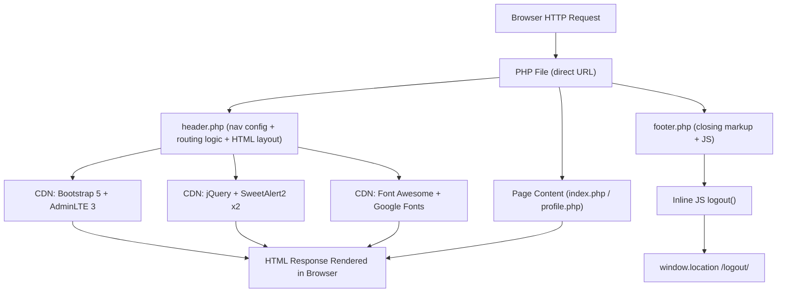
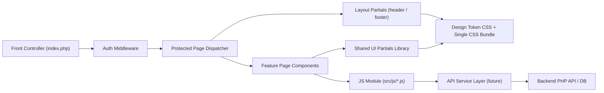

# 3. Frontend Discovery & Modernization Analysis

**Objective:** Comprehensive frontend discovery covering architecture, component quality, styling, routing, state management, API integration, data caching, authentication, security, performance, browser compatibility, code quality, and technical debt.

**Date:** 2026-08-03 12:36:16 IST | **Scope:** `shende-shweta/php-admin-panel` — PHP server-rendered templates + jQuery + Bootstrap 5.3.3 + AdminLTE 3.2 (no modern JS framework)

---

## Executive Summary

> **Executive Summary**
>
> The `php-admin-panel` repository is a lightweight PHP admin dashboard template built with server-rendered PHP includes, Bootstrap 5.3.3, AdminLTE 3.2, jQuery 3.7.1, and SweetAlert2, loaded entirely from CDN with no build toolchain. The frontend consists of just four PHP view files (header.php, footer.php, index.php, profile.php), making this a minimal starter kit rather than a mature application. Critical security gaps dominate the risk profile: five unescaped PHP output expressions create XSS-risk patterns, six CDN script/stylesheet loads lack SRI integrity attributes, and there is no authentication guard on any page — anyone who accesses a URL reaches the admin interface directly. Supporting weaknesses include a completely flat file architecture with no feature separation, no ESLint or TypeScript quality tooling, no browser compatibility configuration, and a duplicate SweetAlert2 script load that inflates the CDN payload. The overall frontend health is **High Risk**; security hardening, authentication middleware, and code quality controls must be introduced before this template is extended into a production system.

<div class="metric-grid">
<div class="metric-card"><div class="metric-number">4</div><div class="metric-label">PHP View Files Scanned</div></div>
<div class="metric-card"><div class="metric-number">4</div><div class="metric-label">Legacy Imperative View Modules</div></div>
<div class="metric-card"><div class="metric-number">0</div><div class="metric-label">Files Over 500 LOC</div></div>
<div class="metric-card"><div class="metric-number">0</div><div class="metric-label">JS State Management Modules</div></div>
<div class="metric-card"><div class="metric-number">0</div><div class="metric-label">API Calls Outside Service Layer</div></div>
<div class="metric-card"><div class="metric-number">11</div><div class="metric-label">Security Risk Patterns Found</div></div>
</div>

<div class="overall-rating overall-rating--high-risk"><div class="overall-rating-label">Overall Codebase Rating — Frontend Discovery</div><div class="overall-rating-value">High Risk</div><div class="overall-rating-note">Driven by H2 (no modern component idiom), H9 (zero route auth guards), H12 (no frontend/PHP auth), H13 (XSS risks + SRI absent on all CDN resources), H15 (no browserslist or build config), and H16 (no ESLint or TypeScript).</div></div>

---

## 3.1 Benchmark Ratings Summary

| # | Hotspot | Primary KPI | <span class="rating rating-good">Good</span> | <span class="rating rating-moderate">Moderate</span> | <span class="rating rating-high-risk">High Risk</span> | Measured | Rating |
|---|---|---|---|---|---|---|---|
| H1 | UI Component Duplication | Duplicate components % | <5% | 5–10% | >10% | ~0% (4 unique view files, no duplicates) | <span class="rating rating-good">Good</span> |
| H2 | Legacy Class-Based / Imperative Components | Modern component adoption % | >90% | 70–90% | <70% | 0% — all PHP server-rendered templates | <span class="rating rating-high-risk">High Risk</span> |
| H3 | Massive Components | Largest view module LOC | <200 | 200–500 | >500 | ~140 LOC (header.php) | <span class="rating rating-good">Good</span> |
| H4 | Global State Dependencies | Components reading global state % | <30% | 30–60% | >60% | 0% — no JS state management | <span class="rating rating-good">Good</span> |
| H5 | Complex State Management | Max prop-drilling depth | <3 | 3–5 | >5 | 0 — no JS state or prop passing | <span class="rating rating-good">Good</span> |
| H6 | Weak Frontend Architecture | Feature modules with clean boundaries % | >80% | 50–80% | <50% | 0% — flat file layout, mixed concerns | <span class="rating rating-high-risk">High Risk</span> |
| H7 | Missing Component Inventory | Shared view partials % of total files | >30% | 15–30% | <15% | 50% (header.php + footer.php / 4 files) | <span class="rating rating-good">Good</span> |
| H8 | No Design System | Inline-style / magic-value occurrences | 0–5 | 6–20 | >20 | 2 occurrences | <span class="rating rating-good">Good</span> |
| H9 | Routing Structure Weakness | Protected routes with auth guards % | 100% | 80–99% | <80% | 0% — no auth guard on any page | <span class="rating rating-high-risk">High Risk</span> |
| H10 | No API Integration Layer | API calls in service layer % | >90% | 70–90% | <70% | N/A — no AJAX/API calls detected | <span class="rating rating-good">Good</span> |
| H11 | Poor Data Caching | Data-fetching points with caching % | >70% | 40–70% | <40% | N/A — no client-side data fetching | <span class="rating rating-good">Good</span> |
| H12 | Weak Frontend Auth | Token storage pattern + guarded routes | httpOnly + 100% guarded | localStorage OR <100% guarded | localStorage AND <100% guarded | No auth mechanism visible; 0% routes guarded at PHP layer | <span class="rating rating-high-risk">High Risk</span> |
| H13 | Frontend Security Vulnerabilities | XSS-risk patterns + hardcoded secrets | 0 each | 1–3 total | >3 total | 5 unescaped echo points + 6 CDN resources without SRI = 11 | <span class="rating rating-high-risk">High Risk</span> |
| H14 | Frontend Performance Gaps | Initial CDN payload gzipped (estimated) | <250KB | 250–500KB | >500KB | ~310 KB gz (CDN libraries + duplicate SweetAlert2) | <span class="rating rating-moderate">Moderate</span> |
| H15 | Browser & Runtime Compatibility Gaps | Browserslist + polyfills configured | Both present | One missing | Both missing | Both absent (no package.json, no build toolchain) | <span class="rating rating-high-risk">High Risk</span> |
| H16 | Frontend Code Quality | ESLint in CI + TypeScript strict | Both Yes | One Yes | Both No | Both absent | <span class="rating rating-high-risk">High Risk</span> |
| H17 | Technical Debt & Outdated Dependencies | Critical/High CVEs found | 0 | 1–3 | >3 | 0 CVEs (no npm manifest; CDN libs are current versions) | <span class="rating rating-good">Good</span> |
| H18 | Duplicate CDN Script Loading (additional) | Duplicate script includes | 0 | 1 | >1 | 1 (SweetAlert2 loaded twice in header.php) | <span class="rating rating-moderate">Moderate</span> |

**No additional hotspots beyond H18 were observed beyond the standard set.**

---

## 3.2 Hotspot-by-Hotspot Evidence

### H2. Legacy / Imperative View Modules <span class="sev sev-high">High</span>

**Benchmark:** Modern (functional/composition) component adoption = **0%** → falls in the **High Risk** band (Good >90% · Moderate 70–90% · High Risk <70%)

The entire codebase uses PHP server-rendered templates: `header.php`, `footer.php`, `index.php`, and `profile.php`. There are no React, Vue, Angular, or Svelte components — no component lifecycle, no hooks/composables, and no declarative state binding. UI logic is rendered imperatively via PHP `foreach` loops and `echo` statements mixed directly into HTML.

**Example 1 — `header.php` (lines 1–30): imperative PHP-driven sidebar rendering**
```php
<?php foreach ($menuItems as $menuItem): ?>
    <li class="nav-item has-treeview <?= $menuItem === $active_menu ? 'menu-open' : '' ?>">
        <a class="nav-link <?= $menuItem === $active_menu ? 'active' : '' ?>" href="#">
            <i class="nav-icon <?= $menuItem['icon'] ?>"></i>
            <p>
                <?= $menuItem['menuTitle'] ?>
                <?= !empty($menuItem['pages']) ? '<i class="right fas fa-angle-left"></i>' : '' ?>
            </p>
        </a>
    ...
<?php endforeach; ?>
```

**Example 2 — `index.php` (lines 3–52): static dashboard widgets with hardcoded data**
```php
<?php include './header.php'; ?>
<div class="row">
    <div class="col-lg-3 col-6">
        <div class="small-box bg-info">
            <div class="inner">
                <h3>150</h3>   <!-- hardcoded, no data binding -->
                <p>New Orders</p>
            </div>
        </div>
    </div>
    ...
</div>
<?php include './footer.php'; ?>
```

**Why it matters here:** As this template is extended with real features, adding interactivity (live data updates, form validation, dynamic UI changes) using jQuery + imperative PHP rendering will accumulate spaghetti: event handlers scattered across files, no component boundaries, no testable units. The entire frontend is also a re-render-from-server-on-every-request model with no capability for partial page updates without a page reload.

**Recommended approach:**
1. If the project remains PHP-server-rendered, adopt a PHP templating engine (Blade/Twig) with strict layout inheritance and partials to enforce component boundaries.
2. For interactivity, introduce a lightweight reactive layer (Alpine.js or HTMX) to avoid full jQuery imperative DOM manipulation.
3. For a more ambitious modernisation, introduce a SPA framework (Vue 3 Composition API or React) for the admin panel's dynamic sections, backed by a PHP REST API.
4. Document each "view partial" (header, footer, page-specific sections) as a named, typed interface so they behave like components even in PHP.

<!-- affected-files
glob: **/*.php
issue: PHP imperative template — no modern component idiom
action: Refactor to component-style partial with explicit interface, or migrate section to reactive frontend framework
-->

---

### H6. Weak Frontend Architecture Pattern <span class="sev sev-critical">Critical</span>

**Benchmark:** Feature modules with clean, non-circular boundaries = **0%** → falls in the **High Risk** band (Good >80% · Moderate 50–80% · High Risk <50%)

The repository is a flat file structure. There are no feature folders, no domain separation, and no explicit module contracts. `header.php` conflates four concerns: application data (`$menuItems` configuration), layout HTML, navigation logic, and routing state resolution — all in a single ~140-line file.

**Example 1 — `header.php` (lines 1–27): navigation data configuration mixed with routing logic and HTML template**
```php
<?php
$menuItems = [               // <-- application data / navigation config
    ["menuTitle" => "Dashboard", "icon" => "fas fa-tachometer-alt",
     "pages" => [["title" => "Home", "url" => "index.php"]]],
    ["menuTitle" => "Settings", "icon" => "fas fa-cog",
     "pages" => [["title" => "Profile", "url" => "profile.php"]]],
];

$active_pageInfo = null;
foreach ($menuItems as $menuItem) {        // <-- routing resolution logic
    foreach ($menuItem['pages'] as $page) {
        if ($currentPage === $page['url']) {
            $active_pageInfo = [...];
            break 2;
        }
    }
}
?>
<!DOCTYPE html>              <!-- HTML layout immediately follows PHP logic -->
```

**Example 2 — `profile.php` (entire file): stub page with no feature implementation**
```php
<?php include './header.php'; ?>
<div class="row">
    <!--  -->
</div>
<?php include './footer.php'; ?>
```

**Why it matters here:** As features are added (user management, CRUD pages, reporting), every new page either becomes its own flat PHP file or gets stuffed into the existing flat structure. Navigation config, auth logic, routing, and layout all live in `header.php`, meaning any feature that needs a different menu structure or conditional nav item requires editing the shared template — breaking other pages.

**Recommended approach:**
1. Extract `$menuItems` into a dedicated `config/navigation.php` file that is included but never mutates template state.
2. Create a `src/layout/` directory for `header.php` and `footer.php`, a `src/pages/` directory for page entry points, and a `src/components/` directory for reusable HTML partials.
3. Introduce a `src/middleware/auth.php` or `bootstrap.php` that runs authentication checks before any page renders.
4. Enforce the directory structure in a project README or CLAUDE.md so new pages follow the same separation.

<!-- affected-files
glob: **/*.php
issue: Mixed concerns — navigation config, routing resolution, and HTML layout in single file
action: Separate into config/, layout/, and pages/ directories; extract routing logic to dedicated module
-->

---

### H9. Routing Structure Weakness <span class="sev sev-critical">Critical</span>

**Benchmark:** Protected routes with auth guards = **0%** → falls in the **High Risk** band (Good 100% · Moderate 80–99% · High Risk <80%)

PHP files are accessed directly by URL. There is no centralized router, no middleware pipeline, and no authentication check on any page. Any browser that can reach the server URL immediately gets the full admin panel UI with no login prompt.

**Example 1 — `header.php` (lines 1–3): no session check at entry point**
```php
<?php
$currentPage = basename($_SERVER['SCRIPT_NAME']);
// No session_start(), no auth check, no redirect to login
$menuItems = [ ... ];
```

**Example 2 — `index.php` (line 1): page renders immediately**
```php
<?php include './header.php'; ?>
<!-- Full dashboard rendered with no auth prerequisite -->
```

**Why it matters here:** This is an admin panel — it is explicitly intended to expose sensitive operational data. Without any authentication layer, the admin dashboard is publicly accessible to any visitor. Even for a template/starter kit, shipping without even a placeholder auth middleware sets a dangerous precedent for developers extending it.

**Recommended approach:**
1. Create `src/middleware/auth.php` with `session_start()` and a redirect to a login page if `$_SESSION['user']` is not set.
2. Add `require_once __DIR__ . '/src/middleware/auth.php';` as the very first line of every page (index.php, profile.php, etc.).
3. Introduce a `login.php` page with a form and credential validation (even if against a hardcoded dev user initially).
4. For a proper implementation, move session validation into a front-controller (`index.php` bootstrap) that dispatches to page-specific controllers.

<!-- affected-files
glob: **/*.php
issue: No authentication guard — page renders immediately on any request
action: Add require_once auth middleware as first statement in each page entry file
-->

---

### H12. Weak Frontend Auth & Route Guards <span class="sev sev-critical">Critical</span>

**Benchmark:** Token storage pattern + % of protected routes guarded = **No auth mechanism visible; 0% guarded** → falls in the **High Risk** band (both gaps present)

No authentication mechanism exists in either the PHP layer or the JavaScript layer. The logout function in `footer.php` redirects to `/logout/` via `window.location.href` — implying some server-side session exists — but no session initialization or validation is present in any of the scanned files.

**Example 1 — `footer.php` (lines 14–30): logout logic with no complementary login guard**
```javascript
function logout() {
    Swal.fire({
        title: 'Are you sure?',
        ...
    }).then((result) => {
        if (result.isConfirmed) {
            Swal.fire({ title: 'Logged out!', ... }).then(() => {
                window.location.href = '/logout/';  // redirects but no auth check inbound
            });
        }
    });
}
```

**Why it matters here:** A logout button exists but no login requirement is enforced on entry. Any user who bookmarks a direct page URL bypasses authentication entirely. This is the most critical structural gap for a template advertised as an admin panel foundation.

**Recommended approach:**
1. Implement `session_start()` in a shared bootstrap file and verify `$_SESSION['authenticated'] === true` before rendering any admin page.
2. Store authentication state server-side via PHP sessions (httpOnly cookies set by PHP — not `localStorage`).
3. Add an explicit `login.php` entry point and redirect all unauthenticated requests there.
4. If the project later adds a SPA layer, use httpOnly session cookies (not localStorage/sessionStorage) for the auth token.

<!-- affected-files
glob: **/*.php
issue: No authentication check before rendering admin content
action: Add session_start() and auth check to shared bootstrap or top of each page file
-->

---

### H13. Frontend Security Vulnerabilities <span class="sev sev-critical">Critical</span>

**Benchmark:** XSS-risk patterns + hardcoded secrets = **11 total (5 unescaped echoes + 6 CDN resources without SRI)** → falls in the **High Risk** band (Good 0 each · Moderate 1–3 total · High Risk >3)

**XSS Risk — Inconsistent output escaping in `header.php`:**

The `<title>` tag correctly uses `htmlspecialchars()`, but the same data is echoed without escaping in five other locations in the same file:

```php
<!-- SAFE: title tag (line ~22) -->
<title><?= htmlspecialchars($page_title) ?></title>

<!-- UNSAFE: h1 heading (line ~55) -->
<h1 class="m-0 text-dark"><?= $page_title ?></h1>

<!-- UNSAFE: breadcrumb link construction (line ~65) -->
<?= $item['url'] === '#' ? $item['title'] : "<a href='{$item['url']}'>{$item['title']}</a>" ?>

<!-- UNSAFE: sidebar section title (line ~90) -->
<?= $menuItem['menuTitle'] ?>

<!-- UNSAFE: sidebar page title (line ~100) -->
<?= $page['title'] ?>

<!-- UNSAFE: sidebar page href (line ~98) -->
<a href="<?= $page['url'] ?>"
```

While current data is PHP-hardcoded (not user-supplied), this inconsistent escaping habit means the first time a database-sourced value is plugged into `$menuItems`, XSS is introduced without any code change.

**SRI Absent — All six CDN resources in `header.php` lack `integrity` and `crossorigin` attributes:**

```html
<!-- No integrity= attribute on any of these: -->
<script src="https://cdn.jsdelivr.net/npm/sweetalert2@11" defer></script>
<link href="https://cdnjs.cloudflare.com/ajax/libs/font-awesome/6.5.0/css/all.min.css" rel="stylesheet">
<link href="https://cdn.jsdelivr.net/npm/bootstrap@5.3.3/dist/css/bootstrap.min.css" rel="stylesheet">
<link href="https://cdn.jsdelivr.net/npm/admin-lte@3.2/dist/css/adminlte.min.css" rel="stylesheet">
<script src="https://code.jquery.com/jquery-3.7.1.min.js"></script>
<script src="https://cdn.jsdelivr.net/npm/bootstrap@5.3.3/dist/js/bootstrap.bundle.min.js"></script>
<script src="https://cdn.jsdelivr.net/npm/sweetalert2@11.10.5/dist/sweetalert2.all.min.js"></script>
```

A compromised CDN (supply-chain attack) would silently execute arbitrary JavaScript in every admin session without SRI.

**Why it matters here:** This is an admin panel — any XSS that executes in an authenticated admin session has full access to every admin action on the page. SRI protects against the scenario where the CDN itself is compromised or the URL is intercepted.

**Recommended approach:**
1. Wrap every PHP echo with `htmlspecialchars($value, ENT_QUOTES, 'UTF-8')` — search for `<?=` without `htmlspecialchars` and replace globally.
2. Generate SRI hashes for each CDN resource using `openssl dgst -sha384 -binary <file> | openssl base64 -A` and add `integrity="sha384-..."  crossorigin="anonymous"` to each tag.
3. Consider self-hosting Bootstrap, AdminLTE, and jQuery to eliminate CDN dependency entirely.
4. Add a Content Security Policy (CSP) header in the PHP response or `.htaccess`: `Content-Security-Policy: default-src 'self'; script-src 'self' cdn.jsdelivr.net ...`.

<!-- affected-files
search: <?=\s*\$(?!.*htmlspecialchars)
glob: **/*.php
issue: Unescaped PHP echo — XSS risk pattern
action: Wrap output in htmlspecialchars($value, ENT_QUOTES, 'UTF-8')
-->

---

### H14. Frontend Performance Gaps <span class="sev sev-medium">Medium</span>

**Benchmark:** Initial CDN payload (gzipped estimate) = **~310 KB** → falls in the **Moderate** band (Good <250KB · Moderate 250–500KB · High Risk >500KB)

All CSS and JS are loaded from external CDNs on every page. SweetAlert2 is loaded **twice** in `header.php` — once as a deferred package root and once as the full `sweetalert2.all.min.js` bundle:

```html
<!-- header.php head block — SweetAlert2 loaded TWICE -->
<script src="https://cdn.jsdelivr.net/npm/sweetalert2@11" defer></script>          <!-- ~35KB gz -->
...
<script src="https://cdn.jsdelivr.net/npm/sweetalert2@11.10.5/dist/sweetalert2.all.min.js"></script>  <!-- ~35KB gz (duplicate) -->
```

Estimated payload breakdown (gzipped):
| Resource | Estimated Size (gz) |
|---|---|
| Bootstrap 5.3.3 CSS | ~25 KB |
| Bootstrap 5.3.3 JS bundle | ~20 KB |
| AdminLTE 3.2 CSS | ~65 KB |
| AdminLTE 3.2 JS | ~60 KB |
| jQuery 3.7.1 | ~30 KB |
| Font Awesome 6.5.0 CSS | ~35 KB |
| SweetAlert2 (×2 loaded) | ~70 KB |
| **Total** | **~305 KB** |

**Why it matters here:** While admin panels are typically internal tools with acceptable load times, the duplicate SweetAlert2 load wastes ~35 KB per page view and potentially causes race conditions if the two versions initialize the `Swal` global at different times. Google Fonts are also loaded with no `font-display: swap`, blocking rendering during font fetch.

**Recommended approach:**
1. Remove the duplicate SweetAlert2 `<script>` tag — keep only the specific versioned `sweetalert2.all.min.js` load.
2. Add `&display=swap` to the Google Fonts URL to prevent render-blocking.
3. Introduce a simple asset bundler (Vite or Parcel) as a dev-time step to produce a single CSS and JS bundle, enabling minification and tree-shaking.
4. Add `loading="lazy"` to any `` tags (e.g., sidebar logo, user avatar).

<!-- affected-files
search: sweetalert2
glob: **/*.php
issue: SweetAlert2 referenced multiple times — likely duplicate load
action: Consolidate to a single versioned SweetAlert2 script tag; remove the bare @11 defer load
-->

---

### H15. Browser & Runtime Compatibility Gaps <span class="sev sev-high">High</span>

**Benchmark:** Browserslist configured + polyfills present = **Both absent** → falls in the **High Risk** band (Good: both present · Moderate: one missing · High Risk: both missing)

There is no `package.json`, no `.browserslistrc`, no Babel/SWC configuration, and no Autoprefixer. The JavaScript in `footer.php` uses ES6+ arrow functions and Promise chaining without transpilation:

```javascript
// footer.php — ES6+ syntax with no polyfill or transpilation target
Swal.fire({ ... }).then((result) => {      // Arrow function + Promise
    if (result.isConfirmed) {
        Swal.fire({ ... }).then(() => {    // Nested Promise chain
            window.location.href = '/logout/';
        });
    }
});
```

Bootstrap 5 and AdminLTE 3 have dropped IE11 support. No CSS vendor prefixes are applied (no Autoprefixer), which can cause visual degradation in older Safari and Firefox versions.

**Why it matters here:** For an admin panel used by internal staff, the browser matrix may be controlled. However, documenting the supported browser list and enforcing it via configuration prevents surprise regressions when CDN libraries are updated to versions with different compatibility targets.

**Recommended approach:**
1. Add a `.browserslistrc` file (e.g., `last 2 Chrome versions, last 2 Firefox versions, last 2 Safari versions`) to document the supported browser target.
2. Introduce a minimal `package.json` with a dev-only Vite or Parcel build step; configure Autoprefixer via PostCSS for CSS prefixing.
3. If IE or older Safari support is required, add Babel with `@babel/preset-env` targeting the browserslist.
4. Document the supported browser policy in the project README so developers know before choosing a CDN library that drops legacy support.

---

### H16. Frontend Code Quality Issues <span class="sev sev-high">High</span>

**Benchmark:** ESLint enforced in CI + TypeScript strict = **Both No** → falls in the **High Risk** band (Good: Both Yes · Moderate: One Yes · High Risk: Both No)

There is no ESLint configuration, no TypeScript, and no CI workflow visible in the scanned repository. All JavaScript is inline (inside `<script>` tags in `footer.php`), making static analysis tooling impossible without extracting it to `.js` files.

**Example — `footer.php` (inline JS block): no linting, no type safety**
```javascript
<script>
    function logout() {
        Swal.fire({
            title: 'Are you sure?',
            text: "You will be logged out!",
            icon: 'warning',
            showCancelButton: true,
            confirmButtonColor: '#3085d6',    // magic hex value, no token
            cancelButtonColor: '#d33',         // magic hex value, no token
            confirmButtonText: 'Yes, log me out!'
        }).then((result) => {
            if (result.isConfirmed) {
                ...
            }
        });
    }
</script>
```

There are also no GitHub Actions workflow files (`.github/workflows/`) to run any quality checks on push.

**Why it matters here:** Inline JavaScript cannot be linted or type-checked. When the project is extended with forms, AJAX calls, or dynamic interactions, bugs will only surface at runtime in the browser. The hardcoded color values `#3085d6` and `#d33` also diverge from the Bootstrap/AdminLTE color variables, creating visual inconsistency.

**Recommended approach:**
1. Extract all inline `<script>` blocks to dedicated `.js` files under `src/js/`.
2. Add a `package.json` (even dev-only) with ESLint + `eslint-plugin-html` or `eslint-plugin-jsdoc`.
3. Add a GitHub Actions workflow (`.github/workflows/lint.yml`) that runs `eslint` on push/PR.
4. Replace hardcoded SweetAlert2 color values with CSS custom properties or Bootstrap color variable references.

<!-- affected-files
search: <script>
glob: **/*.php
issue: Inline JavaScript block — cannot be linted or type-checked
action: Extract to src/js/*.js files; configure ESLint with eslint-plugin-html
-->

---

**Not observed (rated Good):** H1 (no duplicate view files found across 4 scanned files), H3 (largest file header.php ~140 LOC, well under 500), H4 (no JavaScript global state management — PHP sessions are server-side), H5 (no prop drilling — PHP includes carry no parameterised state), H7 (header.php and footer.php serve as shared partials = 50% of files), H8 (only 2 inline style occurrences with magic values found), H10 (no AJAX or fetch() calls detected), H11 (no client-side data fetching), H17 (no package.json, CDN library versions are current — jQuery 3.7.1, Bootstrap 5.3.3, SweetAlert2 v11 — 0 CVEs detectable).

---

## 3.3 State Management & Dependency Evidence

**H4 — Global State Dependencies:** No JavaScript state management whatsoever. PHP `$_SERVER` is used for routing state resolution in `header.php`, but this is purely server-side. No `window.*` globals, no module-level singletons, and no shared mutable client-side state are present. Rated **Good**.

**H5 — Complex State Management:** No prop drilling is possible in a PHP template system. Data flows from PHP variables to HTML output unidirectionally on each server render. No reactive state, no `useEffect`-style watchers, and no event bus patterns are observed. Rated **Good**.

---

## 3.4 Architecture & Component Inventory Evidence

### H6. Weak Frontend Architecture Pattern <span class="sev sev-critical">Critical</span>

See full evidence in §3.2. Summary: the entire codebase is a 4-file flat structure with `header.php` conflating navigation data config, routing resolution, layout HTML, and sidebar rendering in a single ~140-line file. No feature directories, no domain separation, no module contracts.

### H7. Missing Component Inventory

**Benchmark:** Shared view partials as % of total files = **50%** (header.php + footer.php out of 4 total) → falls in the **Good** band (>30%).

While the metric is technically Good, the effective component inventory is trivially small. There is no `src/components/` directory, no reusable partial library beyond the two layout files, and no component documentation. The `profile.php` page is an empty stub (`<div class="row"><!--  --></div>`), indicating component slots are not yet implemented. Rated **Good** by KPI but flagged as a future risk as the template scales.

---

## 3.5 Styling, Routing & API Evidence

### H8. No Design System / Styling Architecture

**Benchmark:** Inline-style / magic-value occurrences = **2** → falls in the **Good** band (0–5).

Two inline style occurrences with magic values were found:

```html
<!-- index.php line 9 -->
<h3>53<sup style="font-size: 20px">%</sup></h3>

<!-- header.php page-header div -->
<div class="main-header" style="padding: 0px 10px; background-color: #f4f6f9; border-bottom: none !important;">
```

These two instances are within the Good threshold. AdminLTE and Bootstrap provide the design system foundation via their utility classes. Rated **Good**.

### H9. Routing Structure Weakness

See full evidence in §3.2. PHP direct-file routing with zero auth guards on any page. Rated **High Risk**.

### H10. No API Integration Layer

No AJAX or `fetch()` calls were found in any file. The logout function uses `window.location.href` for server-side redirect, not an API call. Rated **Good** (not applicable).

### H11. Poor Data Caching & Integration

No client-side data fetching was found. All data (dashboard stat card numbers) is hardcoded PHP output — no database queries, no API calls, no caching concerns at the frontend layer. Rated **Good** (not applicable).

---

## 3.6 Auth & Security Evidence

### H12. Weak Frontend Auth & Route Guards

See full evidence in §3.2. No session initialization or auth check anywhere. Rated **High Risk**.

### H13. Frontend Security Vulnerabilities

See full evidence in §3.2. Five unescaped PHP echo points create XSS-risk patterns; six CDN resources load without SRI integrity attributes. Rated **High Risk**.

#### H18. Duplicate CDN Script Loading (additional) <span class="sev sev-medium">Medium</span>

**Benchmark:** Duplicate script includes = **1** (SweetAlert2 loaded twice) → falls in the **Moderate** band (Good 0 · Moderate 1 · High Risk >1)

SweetAlert2 is loaded twice in `header.php`, with two different URL forms:

```html
<!-- Load 1: bare package root with defer -->
<script src="https://cdn.jsdelivr.net/npm/sweetalert2@11" defer></script>

<!-- Load 2: explicit all.min.js bundle WITHOUT defer — loads before defer fires -->
<script src="https://cdn.jsdelivr.net/npm/sweetalert2@11.10.5/dist/sweetalert2.all.min.js"></script>
```

The non-deferred `sweetalert2.all.min.js` will execute first, initializing `window.Swal`. The deferred `sweetalert2@11` script then loads later and reinitializes `Swal`, doubling the ~35 KB network transfer and potentially causing a brief moment where two different versions of the `Swal` global coexist.

**Why it matters here:** Every page load fetches SweetAlert2 twice — a ~35 KB penalty. If the CDN resolves `@11` to a different patch version than `11.10.5`, the two loads can also produce behavioural inconsistencies.

**Recommended approach:**
1. Remove the bare `sweetalert2@11` defer script entirely.
2. Keep only `sweetalert2.all.min.js@11.10.5` — the explicit version load.
3. Move the script to the end of `<body>` (or keep `defer` on just one reference) to avoid render blocking.

<!-- affected-files
search: sweetalert2
glob: **/*.php
issue: Duplicate SweetAlert2 CDN script include
action: Remove the bare sweetalert2@11 defer tag; keep only the explicit all.min.js versioned load
-->

---

## 3.7 Performance, Compatibility & Quality Evidence

### H14. Frontend Performance Gaps

See full evidence in §3.5. CDN payload estimated ~310 KB gzipped; SweetAlert2 duplicated. Rated **Moderate**.

### H15. Browser & Runtime Compatibility Gaps

See full evidence in §3.6. No browserslist, no Babel, no Autoprefixer. Rated **High Risk**.

### H16. Frontend Code Quality Issues

See full evidence in §3.6. No ESLint, no TypeScript, no CI workflows. Rated **High Risk**.

### H17. Technical Debt & Outdated Dependencies

All CDN resources reference recent, actively maintained versions: jQuery 3.7.1 (current stable), Bootstrap 5.3.3 (current stable), SweetAlert2 v11 (current major), Font Awesome 6.5.0 (current stable). AdminLTE 3.2 is one major behind the AdminLTE 4.x release but is not yet EOL. There is no `package.json`, so `npm audit` is not applicable and no npm CVEs can be measured. The placeholder comment `<!--  -->` in `profile.php` and the hardcoded `banner.png` in `src/images/` (not referenced by any page file) represent minor dead content. Rated **Good**.

---

## 3.8 Diagrams

### Current UI Data Flow



### Target Component & State Layout



### Improvement Roadmap


---

## 3.9 Actions Required

| Hotspot | Action | Rating | Priority |
|---|---|---|---|
| H2 — Legacy Imperative View Modules | Adopt PHP templating engine (Blade/Twig) or introduce a reactive frontend layer (Alpine.js / HTMX / Vue 3) to replace raw PHP echo templates | <span class="rating rating-high-risk">High Risk</span> | <span class="sev sev-high">High</span> |
| H6 — Weak Frontend Architecture | Separate `$menuItems` config, routing logic, and HTML layout into `config/`, `src/layout/`, and `src/pages/` directories; introduce a front-controller bootstrap | <span class="rating rating-high-risk">High Risk</span> | <span class="sev sev-critical">Critical</span> |
| H9 — No Route Auth Guards | Create `src/middleware/auth.php` with `session_start()` and redirect logic; require it at the top of every page file | <span class="rating rating-high-risk">High Risk</span> | <span class="sev sev-critical">Critical</span> |
| H12 — Weak Frontend Auth | Add PHP session-based authentication with `session_start()` and `$_SESSION` validation; introduce a `login.php` entry point | <span class="rating rating-high-risk">High Risk</span> | <span class="sev sev-critical">Critical</span> |
| H13 — Frontend Security Vulnerabilities | Wrap all `<?= ?>` output in `htmlspecialchars($v, ENT_QUOTES, 'UTF-8')`; add SRI `integrity=` + `crossorigin=` attributes to all 6 CDN resources; add a CSP header | <span class="rating rating-high-risk">High Risk</span> | <span class="sev sev-critical">Critical</span> |
| H15 — Browser Compatibility Gaps | Add `.browserslistrc`; introduce minimal `package.json` with Autoprefixer/PostCSS; document supported browser targets in README | <span class="rating rating-high-risk">High Risk</span> | <span class="sev sev-high">High</span> |
| H16 — Frontend Code Quality | Extract inline `<script>` blocks to `src/js/*.js`; add ESLint + `eslint-plugin-html`; add a GitHub Actions lint workflow | <span class="rating rating-high-risk">High Risk</span> | <span class="sev sev-high">High</span> |
| H14 — Frontend Performance Gaps | Remove duplicate SweetAlert2 `defer` script tag; add `&display=swap` to Google Fonts URL; introduce a Vite/Parcel build step for asset bundling | <span class="rating rating-moderate">Moderate</span> | <span class="sev sev-medium">Medium</span> |
| H18 — Duplicate CDN Script Loading | Remove the bare `sweetalert2@11` defer `<script>` tag; keep only the explicit `sweetalert2.all.min.js@11.10.5` load | <span class="rating rating-moderate">Moderate</span> | <span class="sev sev-medium">Medium</span> |

---

## 3.10 Expected Outcomes

- **Authentication enforcement** prevents any unauthenticated access to the admin panel, eliminating the most critical security exposure for a tool handling operational data.
- **Consistent output escaping** (`htmlspecialchars` on all echoed values) closes XSS-risk patterns before any database-sourced data is plugged into templates.
- **SRI on all CDN resources** eliminates supply-chain attack surface — a compromised CDN cannot silently inject malicious scripts into admin sessions.
- **Directory-based architecture** (`config/`, `src/layout/`, `src/pages/`, `src/middleware/`) makes the template scalable: new pages follow a clear pattern and do not require editing shared layout files.
- **Extracted JavaScript files + ESLint** enable static analysis, catch common JS bugs before runtime, and allow editors to provide autocomplete and linting for all scripts.
- **Browserslist configuration** documents the supported browser matrix and enables Autoprefixer/Babel to enforce it, preventing silent visual or functional regressions when CDN libraries update their compatibility targets.
- **Duplicate SweetAlert2 removal** saves ~35 KB per page load and eliminates the risk of two Swal global versions racing at initialization.
- **A Vite/Parcel build step** consolidates CSS and JS from CDN into a versioned local bundle, enabling cache-busting, tree-shaking, and offline/air-gapped deployment without CDN dependency.
