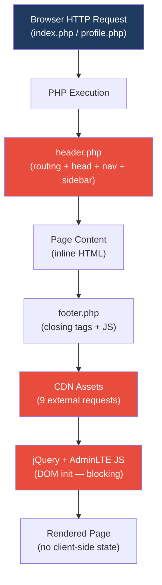
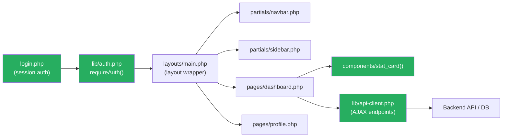
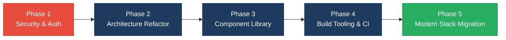

# 3. Frontend Discovery & Modernization Analysis

**Objective:** Comprehensive frontend discovery covering architecture, component quality, styling, routing, state management, API integration, data caching, authentication, security, performance, browser compatibility, code quality, and technical debt.

**Date:** 2026-08-27 11:48:36 IST | **Scope:** `.` — PHP 8 server-rendered templates + Bootstrap 5.3.3 + AdminLTE 3.2 + jQuery 3.7.1 (no SPA framework detected)

## Executive Summary

> **Executive Summary**
>
> The `php-admin-panel` repository is a minimal PHP server-rendered admin dashboard template composed of just four view files (`header.php`, `footer.php`, `index.php`, `profile.php`) and a static assets directory. No modern JavaScript framework (React, Vue, Angular, Svelte) or build toolchain is present; the frontend is built on PHP includes, Bootstrap 5, AdminLTE 3, and jQuery loaded entirely from third-party CDNs. The most severe gaps are a complete absence of authentication guards (any visitor can reach any page by URL), five unescaped PHP echo statements that introduce XSS risk, and nine external CDN resources loaded without Subresource Integrity (SRI) attributes. The architecture is a flat root-level set of files with no feature boundaries, no reusable UI component library, no ESLint or TypeScript tooling, and no browser-compatibility configuration — which is expected for a starter template but leaves significant work before the codebase is production-ready. The overall codebase rating is **High Risk**, driven primarily by missing authentication, security vulnerabilities, lack of code-quality tooling, and an absent design/component architecture suitable for scaling.

<div class="metric-grid">
<div class="metric-card"><div class="metric-number">4</div><div class="metric-label">PHP View Files Scanned</div></div>
<div class="metric-card"><div class="metric-number">4</div><div class="metric-label">Legacy Imperative View Files</div></div>
<div class="metric-card"><div class="metric-number">0</div><div class="metric-label">Files Over 500 LOC</div></div>
<div class="metric-card"><div class="metric-number">1</div><div class="metric-label">Global State Module (header.php)</div></div>
<div class="metric-card"><div class="metric-number">0</div><div class="metric-label">AJAX / API Calls in Frontend</div></div>
<div class="metric-card"><div class="metric-number">14</div><div class="metric-label">Security Risk Patterns Found</div></div>
</div>

<div class="overall-rating overall-rating--high-risk"><div class="overall-rating-label">Overall Codebase Rating — Frontend Discovery</div><div class="overall-rating-value">High Risk</div><div class="overall-rating-note">Driven by missing auth guards (H9, H12), XSS-risk outputs and absent SRI (H13), legacy imperative architecture (H2, H6, H7), and absent code-quality tooling (H15, H16).</div></div>

## 3.1 Benchmark Ratings Summary

One row per hotspot. "Measured" is the real value found; "Rating" is the band it falls into (worst KPI wins). This table is the source for the Overall Codebase Rating banner above.

| # | Hotspot | Primary KPI | <span class="rating rating-good">Good</span> | <span class="rating rating-moderate">Moderate</span> | <span class="rating rating-high-risk">High Risk</span> | Measured | Rating |
|---|---|---|---|---|---|---|---|
| H1 | UI Component Duplication | Duplicate components % | <5% | 5–10% | >10% | 4 near-identical stat-card blocks in index.php; no reusable PHP partial | <span class="rating rating-moderate">Moderate</span> |
| H2 | Legacy Class-Based / Imperative Components | Modern component adoption % | >90% | 70–90% | <70% | 0% — all 4 view files are PHP imperative templates + jQuery; no modern JS framework | <span class="rating rating-high-risk">High Risk</span> |
| H3 | Massive Components | Largest component LOC | <200 | 200–500 | >500 | 185 LOC (header.php) | <span class="rating rating-good">Good</span> |
| H4 | Global State Dependencies | Components reading global state % | <30% | 30–60% | >60% | 100% — all pages include header.php which sets and reads PHP globals ($menuItems, $page_title, $active_pageInfo) | <span class="rating rating-high-risk">High Risk</span> |
| H5 | Complex State Management | Max prop-drilling depth | <3 | 3–5 | >5 | N/A — server-rendered PHP; no client-side prop-drilling | <span class="rating rating-good">Good</span> |
| H6 | Weak Frontend Architecture | Feature modules with clean boundaries % | >80% | 50–80% | <50% | <10% — flat root directory; header.php mixes routing config, HTML head, navbar, sidebar, and opening wrappers | <span class="rating rating-high-risk">High Risk</span> |
| H7 | Missing Component Inventory | Shared component % of total | >30% | 15–30% | <15% | 0 reusable UI components — header.php/footer.php are mandatory layout wrappers, not an abstracted component library | <span class="rating rating-high-risk">High Risk</span> |
| H8 | No Design System | Inline-style / magic-value occurrences | 0–5 | 6–20 | >20 | 2 (header.php:107, index.php:22) | <span class="rating rating-good">Good</span> |
| H9 | Routing Structure Weakness | Protected routes with guards % | 100% | 80–99% | <80% | 0% — both pages (index.php, profile.php) accessible without any auth check | <span class="rating rating-high-risk">High Risk</span> |
| H10 | No API Integration Layer | API calls in service layer % | >90% | 70–90% | <70% | N/A — no AJAX or fetch calls; entirely server-rendered | <span class="rating rating-good">Good</span> |
| H11 | Poor Data Caching | Data-fetching points with caching % | >70% | 40–70% | <40% | N/A — no client-side data fetching; server-rendered PHP | <span class="rating rating-good">Good</span> |
| H12 | Weak Frontend Auth | Token storage + routes guarded | httpOnly + 100% | One gap | Both gaps | No token storage mechanism + 0% guarded pages — both gaps present | <span class="rating rating-high-risk">High Risk</span> |
| H13 | Frontend Security Vulnerabilities | XSS-risk + hardcoded secrets count | 0 each | 1–3 total | >3 total | 5 unescaped PHP echo outputs + 9 CDN resources without SRI = 14 total | <span class="rating rating-high-risk">High Risk</span> |
| H14 | Frontend Performance Gaps | Initial JS bundle size (gzipped) | <250KB | 250–500KB | >500KB | 9 CDN HTTP requests per page load; 2 non-deferred blocking scripts; no image lazy-loading; estimated total CDN asset payload >500KB | <span class="rating rating-high-risk">High Risk</span> |
| H15 | Browser & Runtime Compatibility Gaps | Browserslist + polyfills configured | Both present | One missing | Both missing | Both missing — no .browserslistrc, no build toolchain, no explicit polyfills | <span class="rating rating-high-risk">High Risk</span> |
| H16 | Frontend Code Quality | ESLint in CI + TypeScript strict | Both Yes | One Yes | Both No | Both No — PHP/vanilla JS project; no ESLint, no tsconfig.json, no CI pipeline | <span class="rating rating-high-risk">High Risk</span> |
| H17 | Technical Debt & Outdated Dependencies | Critical/High CVEs found | 0 | 1–3 | >3 | CDN versions current (jQuery 3.7.1, Bootstrap 5.3.3, SweetAlert2 11.10.5); no npm audit possible; no known critical CVEs at these versions | <span class="rating rating-good">Good</span> |
| H18 | Accessibility Gaps (additional) | Keyboard-navigable interactive elements % | >90% | 70–90% | <70% | `href="javascript:void(0);"` on logout nav; `onclick` on `<li>`; 7 placeholder `href="#"` links; no ARIA labels on icon-only nav links | <span class="rating rating-moderate">Moderate</span> |

**No additional hotspots beyond H18 were observed.**

## 3.2 Hotspot-by-Hotspot Evidence

### H1. UI Component Duplication <span class="sev sev-medium">Medium</span>

**Benchmark:** 4 near-identical stat-card HTML blocks in `index.php` with no PHP partial or function abstraction → falls in the **Moderate** band (Good <5% · Moderate 5–10% · High Risk >10%).

The dashboard page repeats an identical AdminLTE `small-box` markup block four times, changing only the background colour class, metric value, label, and icon — no reusable extraction exists.

```php
// index.php:3–61 — four near-identical blocks; excerpt shows first two
<div class="col-lg-3 col-6">
    <div class="small-box bg-info">
        <div class="inner">
            <h3>150</h3>
            <p>New Orders</p>
        </div>
        <div class="icon"><i class="ion ion-bag"></i></div>
        <a href="#" class="small-box-footer">More info
            <i class="fas fa-arrow-circle-right"></i>
        </a>
    </div>
</div>
<!-- repeated identically with bg-success / bg-warning / bg-danger -->
```

**Why it matters here:** Every future change to the stat-card structure (e.g. adding a trend indicator, a clickable URL, or a tooltip) must be applied to all four blocks independently. As the panel grows with more dashboard widgets, duplication multiplies and the blocks diverge silently.

**Recommended approach:**
1. Extract a `render_stat_card($color, $value, $label, $icon, $url)` PHP function in a `partials/stat-card.php` helper file.
2. Replace the four blocks in `index.php` with a `foreach` over a `$stats` config array.
3. Apply the same pattern whenever new widget types are added (chart cards, table cards).

<!-- affected-files
search: <div class="small-box
glob: index.php
issue: Repeated stat-card HTML block with no reusable abstraction
action: Extract to a PHP render_stat_card() partial function
-->

---

### H2. Legacy Imperative Architecture <span class="sev sev-high">High</span>

**Benchmark:** 0% modern framework adoption — all 4 view files are server-rendered PHP imperative templates with jQuery → falls in the **High Risk** band (Good >90% · Moderate 70–90% · High Risk <70%).

The entire frontend is PHP include-based with jQuery and AdminLTE JS loaded from CDN. There is no component system, no module bundler, and no framework idiom (hooks, composables, signals). The sole JavaScript logic is the SweetAlert2 logout confirmation in `footer.php`.

```php
// header.php:1–43 — PHP routing/menu logic mixed directly into the view template
<?php
$currentPage = basename($_SERVER['SCRIPT_NAME']);
$menuItems = [ /* ... */ ];
$active_pageInfo = null;
foreach ($menuItems as $menuItem) {
    foreach ($menuItem['pages'] as $page) {
        if ($currentPage === $page['url']) {
            $active_pageInfo = [ /* ... */ ];
            break 2;
        }
    }
}
// ... file immediately continues with HTML <head>, navbar, sidebar output
```

```js
// footer.php:15–40 — the project's only JavaScript
function logout() {
    Swal.fire({ title: 'Are you sure?', /* ... */ })
        .then((result) => {
            if (result.isConfirmed) { window.location.href = '/logout/'; }
        });
}
```

**Why it matters here:** Scaling this admin panel with new features (AJAX data tables, form validation, real-time notifications) will require bolting JavaScript logic onto a PHP template foundation with no abstraction boundary. Every new feature becomes a mixing of PHP output and jQuery event handlers with no testability.

**Recommended approach:**
1. If the project remains PHP/server-rendered, introduce a PHP templating engine (Blade, Twig) with layout inheritance to separate routing logic from HTML output.
2. If migrating to a modern SPA, scaffold a React or Vue frontend with a PHP API backend and migrate pages one by one.
3. At minimum, separate PHP business logic (menu resolution, breadcrumb computation) from the HTML template by moving it to `lib/menu.php`.
4. Document the chosen architecture in `CONTRIBUTING.md`.

<!-- affected-files
search: \<\?php include
glob: *.php
issue: PHP business logic mixed directly into server-rendered view template
action: Separate view logic into templating layer or dedicated lib/ helpers
-->

---

### H4. Global State Dependencies <span class="sev sev-high">High</span>

**Benchmark:** 100% of pages depend on PHP globals set in `header.php` → falls in the **High Risk** band (Good <30% · Moderate 30–60% · High Risk >60%).

`header.php` computes global variables (`$breadcrumb_Items`, `$page_title`, `$active_menu`, `$active_page`) that every page template silently depends on. There is no explicit contract between the include and its consumers.

```php
// header.php:39–42 — globals written unconditionally on include
$breadcrumb_Items = $active_pageInfo['breadcrumb_Items'] ?? [];
$page_title = $active_pageInfo['page_title'] ?? '';
$active_menu = $active_pageInfo['active_menu'] ?? null;
$active_page = $active_pageInfo['active_page'] ?? null;
```

```php
// index.php:1 — silent dependency on all four globals above
<?php include './header.php'; ?>
```

**Why it matters here:** Passing additional data into the layout (e.g. per-page meta tags, permission context, flash messages) requires modifying `header.php` and risks breaking all pages simultaneously since the coupling is implicit.

**Recommended approach:**
1. Introduce an explicit `$layoutData` array that pages populate before including the layout: `$layoutData = ['title' => 'Dashboard', 'breadcrumbs' => [...]];`.
2. Have `header.php` consume only `$layoutData` — no implicit globals written by the include itself.
3. Long-term: adopt Blade/Twig where layout variables are passed via `@extends`/`@section` — eliminating the global mutation pattern entirely.

<!-- affected-files
search: \$breadcrumb_Items|\$page_title|\$active_menu|\$active_page
glob: *.php
issue: Implicit global variables written by header.php and silently consumed by all page templates
action: Replace with explicit $layoutData contract passed to the layout include
-->

---

### H6. Weak Frontend Architecture Pattern <span class="sev sev-high">High</span>

**Benchmark:** <10% of view modules have clean, well-scoped boundaries → falls in the **High Risk** band (Good >80% · Moderate 50–80% · High Risk <50%).

All files live at the repository root. `header.php` mixes at least five distinct concerns: PHP routing/menu resolution logic, HTML `<head>` metadata, top navigation bar, sidebar with menu rendering, and the opening `<div class="content-wrapper">` that is never closed within the same file.

```php
// header.php:181–186 — div opened but never closed in this file
<div class="content-wrapper">
    <section class="content">
        <div class="container-fluid">
            <!-- Container-fluid started -->
// file ends here; closing tags live in footer.php
```

```
Project root (flat structure):
├── header.php    ← routing logic + <head> + navbar + sidebar + opening wrappers
├── footer.php    ← JS logout + closing wrappers + </body></html>
├── index.php     ← page content only
├── profile.php   ← page stub
└── src/images/   ← all static assets
```

**Why it matters here:** Adding a second layout (e.g. a full-width page without a sidebar) is impossible without duplicating or substantially forking `header.php`. The unclosed-div coupling makes it error-prone to add any intermediate wrapper in a page template.

**Recommended approach:**
1. Reorganize into `layouts/`, `partials/`, `pages/`, and `lib/` directories.
2. Move navbar to `partials/navbar.php`, sidebar to `partials/sidebar.php`, and HTML head to `partials/head.php`.
3. Close all opened HTML elements within the same file that opens them; use layout inheritance or explicit open/close partial pairs.
4. Move PHP menu resolution logic to `lib/menu.php` with a `getMenuState(string $currentPage): array` function.

<!-- affected-files
search: include \'\.\/header\.php\'|include \"\.\/header\.php\"
glob: *.php
issue: Flat root structure; header.php mixes 5+ concerns with unclosed HTML elements
action: Reorganize into layouts/, partials/, pages/, lib/ directories
-->

---

### H7. Missing Component Inventory <span class="sev sev-high">High</span>

**Benchmark:** 0% reusable UI components (only mandatory layout templates) → falls in the **High Risk** band (Good >30% · Moderate 15–30% · High Risk <15%).

There is no `components/`, `partials/`, or `ui/` directory. `header.php` and `footer.php` are global layout wrappers that every page must include — they are not composable, reusable UI components. No Storybook, no component documentation, and no PHP partial library exists.

```
src/
└── images/          ← assets only; no PHP component partials
header.php           ← mandatory layout (not reusable)
footer.php           ← mandatory layout (not reusable)
```

**Why it matters here:** Every new admin page must re-implement any recurring UI pattern (alert boxes, data tables, form cards, stat widgets) from scratch. Contributors cannot discover what patterns already exist without reading every page file individually.

**Recommended approach:**
1. Create a `partials/` directory; move sidebar and navbar from `header.php` into `partials/sidebar.php` and `partials/navbar.php`.
2. Create `components/` with named PHP render functions for recurring patterns: `stat_card()`, `alert_box()`, `data_table()`.
3. Document available components in `README.md` under a "Component Library" section.

<!-- affected-files
glob: *.php
issue: No shared component directory or reusable PHP partial library
action: Create partials/ and components/ directories; extract stat-card and nav into named partials
-->

---

### H9. Routing Structure Weakness <span class="sev sev-critical">Critical</span>

**Benchmark:** 0% of pages have any authentication or authorization guard → falls in the **High Risk** band (Good 100% · Moderate 80–99% · High Risk <80%).

Both pages (`index.php` and `profile.php`) are directly accessible by URL with no session check, no authentication middleware, and no PHP guard. The "logout" function is purely client-side JavaScript (a SweetAlert2 dialog) and does not verify any server-side session state.

```php
// index.php:1 — no session_start(), no auth check
<?php include './header.php'; ?>
<div class="row">...
```

```php
// profile.php:1 — identical; no auth guard
<?php include './header.php'; ?>
<div class="row"><!-- --></div>
```

```js
// footer.php:16–38 — logout is a client-side UX dialog only
function logout() {
    Swal.fire({ title: 'Are you sure?', /* ... */ }).then((result) => {
        if (result.isConfirmed) {
            window.location.href = '/logout/';  // redirects; no server-side session destruction here
        }
    });
}
```

**Why it matters here:** Without server-side session validation, any unauthenticated user can browse directly to `index.php` or `profile.php`. The client-side logout dialog provides no actual security — a user can bypass it entirely by typing the URL directly.

**Recommended approach:**
1. Add a `lib/auth.php` with a `requireAuth()` function that calls `session_start()`, checks `$_SESSION['user_id']`, and redirects to a login page on failure.
2. Call `require_once 'lib/auth.php'; requireAuth();` at the very top of every protected page, before the header include.
3. Implement a proper `logout.php` that calls `session_destroy()` and clears the session cookie server-side.
4. Consider an `.htaccess` rule to ensure all `.php` pages route through a bootstrap file that performs the auth check centrally.

<!-- affected-files
search: \<\?php include \'\.\/header\.php\'
glob: *.php
issue: Page accessible without any server-side authentication or session check
action: Add requireAuth() call before header include on every protected page
-->

---

### H12. Weak Frontend Auth & Route Guards <span class="sev sev-critical">Critical</span>

**Benchmark:** No token storage mechanism + 0% of routes guarded → falls in the **High Risk** band (both gaps present).

There is no authentication system visible in any frontend file. No `localStorage`/`sessionStorage` access, no httpOnly cookie handling, and no session token management in PHP. The only auth-adjacent code is the cosmetic logout dialog. Token storage method is undefined because the app has no login flow at all.

```js
// footer.php:34 — client-side redirect; no token invalidation or session management
window.location.href = '/logout/';
```

**Why it matters here:** This is a combined frontend and backend auth gap. Until a login system is implemented with proper server-side session management, the admin panel is fully open to any visitor. When a login system is added, tokens/sessions must use httpOnly cookies (not `localStorage`) to prevent XSS-based token theft.

**Recommended approach:**
1. Implement a `login.php` POST handler that validates credentials against a database, calls `session_start()` and `session_regenerate_id(true)`, and sets `$_SESSION['user_id']`.
2. Use `session_set_cookie_params(['httponly' => true, 'samesite' => 'Strict'])` before `session_start()` to enforce httpOnly cookies.
3. Implement `logout.php` server-side: `$_SESSION = []; session_destroy(); setcookie(session_name(), '', time()-1);`.
4. Do not store authentication tokens in `localStorage` or JavaScript-accessible cookies.

<!-- affected-files
search: logout|window\.location
glob: footer.php
issue: Logout is client-side only; no server-side session management or auth token handling
action: Implement server-side login/logout with httpOnly session cookies
-->

---

### H13. Frontend Security Vulnerabilities <span class="sev sev-critical">Critical</span>

**Benchmark:** 5 unescaped PHP echo outputs + 9 CDN resources without SRI = 14 total security risk patterns → falls in the **High Risk** band (Good 0 each · Moderate 1–3 total · High Risk >3 total).

**XSS via unescaped echo:** Five `<?= $variable ?>` expressions output PHP values directly into HTML without `htmlspecialchars()`. While current values come from a hardcoded `$menuItems` array, any future data source (database, user input) creates an immediate XSS vector.

```php
// header.php:111 — page title output directly into h1 without escaping
<h1 class="m-0 text-dark"><?= $page_title ?></h1>

// header.php:117 — breadcrumb title and URL injected into raw HTML string
<?= $item['url'] === '#' ? $item['title'] : "<a href='{$item['url']}'>{$item['title']}</a>" ?>

// header.php:149,151,162 — menu icon class, title, and page title all unescaped
<i class="nav-icon <?= $menuItem['icon'] ?>"></i>
<?= $menuItem['menuTitle'] ?>
<p><?= $page['title'] ?></p>
```

Note: `<title><?= htmlspecialchars($page_title) ?></title>` (line 52) is correctly escaped — only the five above are at risk.

**CDN resources without SRI:** All 9 external CDN resources (4 CSS links, 4 JS scripts, 1 Google Font) lack `integrity` and `crossorigin` attributes. A compromised CDN would silently execute arbitrary code in every visitor's admin session.

```html
<!-- header.php:51–63 — all 9 CDN includes; none have integrity attribute -->
<script src="https://cdn.jsdelivr.net/npm/sweetalert2@11" defer></script>
<link href="https://cdnjs.cloudflare.com/ajax/libs/font-awesome/6.5.0/css/all.min.css" rel="stylesheet">
<link href="https://cdn.jsdelivr.net/npm/bootstrap@5.3.3/dist/css/bootstrap.min.css" rel="stylesheet">
<link href="https://cdn.jsdelivr.net/npm/admin-lte@3.2/dist/css/adminlte.min.css" rel="stylesheet">
<link href="https://fonts.googleapis.com/css2?family=Source+Sans+Pro..." rel="stylesheet">
<script src="https://code.jquery.com/jquery-3.7.1.min.js"></script>
<script src="https://cdn.jsdelivr.net/npm/bootstrap@5.3.3/dist/js/bootstrap.bundle.min.js"></script>
<script src="https://cdn.jsdelivr.net/npm/sweetalert2@11.10.5/dist/sweetalert2.all.min.js"></script>
<script src="https://cdn.jsdelivr.net/npm/admin-lte@3.2/dist/js/adminlte.min.js"></script>
```

**Why it matters here:** If `$menuItems` is ever populated from a database or user-submitted data (the natural evolution for any admin panel), the five unescaped outputs become live XSS vectors. The missing SRI attributes mean any CDN compromise silently injects malicious code into admin sessions without any browser-level detection.

**Recommended approach:**
1. Wrap every `<?= $variable ?>` with `htmlspecialchars($variable, ENT_QUOTES, 'UTF-8')` — all five locations in `header.php`.
2. Generate SRI hashes for all 9 CDN resources using `openssl dgst -sha384 -binary <file> | openssl base64 -A` and add `integrity="sha384-..."` + `crossorigin="anonymous"` to each tag.
3. Consider self-hosting critical assets (jQuery, Bootstrap, AdminLTE) via npm + build pipeline to eliminate CDN dependency entirely.
4. Add a Content Security Policy header in `.htaccess`: `Header always set Content-Security-Policy "default-src 'self'; script-src 'self' cdn.jsdelivr.net code.jquery.com;"`.

<!-- affected-files
search: \<\?= \$\w
glob: header.php
issue: Unescaped PHP echo output — XSS risk when values come from user-controlled data
action: Wrap all echo outputs with htmlspecialchars($var, ENT_QUOTES, 'UTF-8')
-->

<!-- affected-files
search: src="https://|href="https://
glob: header.php
issue: CDN resource loaded without SRI integrity attribute — supply-chain attack risk
action: Add integrity="sha384-..." and crossorigin="anonymous" to all CDN tags
-->

---

### H14. Frontend Performance Gaps <span class="sev sev-high">High</span>

**Benchmark:** 9 external CDN HTTP requests; 4 non-deferred blocking scripts; duplicate SweetAlert2 load; no image lazy-loading → falls in the **High Risk** band.

The `<head>` in `header.php` triggers 9 separate CDN fetches before the page can render. jQuery (line 60), Bootstrap JS (line 61), SweetAlert2 (line 62), and AdminLTE JS (line 63) are loaded as synchronous blocking `<script>` tags without `defer` or `async`. The `defer` attribute on the SweetAlert2 include at line 51 is redundant because the full library is loaded again synchronously on line 62 — resulting in a duplicate download and execution.

```html
<!-- header.php:51–63 — blocking scripts and duplicate SweetAlert2 load -->
<script src="https://cdn.jsdelivr.net/npm/sweetalert2@11" defer></script>           <!-- defer but duplicate -->
...
<script src="https://code.jquery.com/jquery-3.7.1.min.js"></script>                  <!-- blocking -->
<script src="https://cdn.jsdelivr.net/npm/bootstrap@5.3.3/dist/js/bootstrap.bundle.min.js"></script> <!-- blocking -->
<script src="https://cdn.jsdelivr.net/npm/sweetalert2@11.10.5/dist/sweetalert2.all.min.js"></script> <!-- blocking + duplicate -->
<script src="https://cdn.jsdelivr.net/npm/admin-lte@3.2/dist/js/adminlte.min.js"></script>           <!-- blocking -->
```

Images lack `loading="lazy"`:
```html
<!-- header.php:128,137 — images without lazy loading -->


```

**Why it matters here:** Blocking scripts in `<head>` delay first contentful paint for every page load. The duplicate SweetAlert2 load downloads and executes the library twice (~44KB each). As the panel grows with data tables and charts, the ad-hoc CDN approach will not scale without a bundler.

**Recommended approach:**
1. Remove the duplicate SweetAlert2 `<script defer>` on line 51; keep only the synchronous load on line 62 and add `defer` to it.
2. Add `defer` to jQuery, Bootstrap JS, and AdminLTE JS; since AdminLTE requires jQuery, ensure load order with `defer` on all three.
3. Add `loading="lazy"` to both `` tags.
4. Introduce a build pipeline (Vite or webpack) to bundle, tree-shake, and serve assets locally rather than from 9 separate CDN origins.

<!-- affected-files
search: <script src="https://
glob: header.php
issue: Blocking CDN script without defer/async; duplicate SweetAlert2 load
action: Add defer to all script tags; remove duplicate SweetAlert2 include
-->

<!-- affected-files
search: 

---

### H15. Browser & Runtime Compatibility Gaps <span class="sev sev-medium">Medium</span>

**Benchmark:** Both missing — no `.browserslistrc`, no build toolchain, no polyfills → falls in the **High Risk** band.

There is no `package.json`, no `.browserslistrc` or `browserslist` field, no Babel/SWC transpilation target, and no Autoprefixer configuration. Bootstrap 5 (which drops IE 11) is loaded without any explicit browser-support documentation to guide contributors.

```html
<!-- header.php:55 — Bootstrap 5 drops IE 11; no target documented -->
<link href="https://cdn.jsdelivr.net/npm/bootstrap@5.3.3/dist/css/bootstrap.min.css" rel="stylesheet">
```

**Why it matters here:** Without an explicit browser target, the team has no shared understanding of which browsers the admin panel must support. When CSS features or JavaScript are added, compatibility breaks will be discovered in production rather than at build time.

**Recommended approach:**
1. Add a `.browserslistrc` file defining the minimum supported browsers (e.g. `> 0.5%, last 2 versions, not dead`).
2. Introduce `package.json` to manage frontend tooling: `npm init` then add Autoprefixer + PostCSS.
3. When more JavaScript is added, configure Babel or SWC with the browserslist target.

<!-- affected-files
glob: *.php
issue: No browserslist configuration or build toolchain defines browser support targets
action: Add .browserslistrc; introduce package.json with Autoprefixer + PostCSS
-->

---

### H16. Frontend Code Quality Issues <span class="sev sev-high">High</span>

**Benchmark:** Both No — no ESLint, no TypeScript, no CI pipeline → falls in the **High Risk** band.

The project has no `package.json`, `.eslintrc`, `tsconfig.json`, CI configuration file, PHP CodeSniffer config, or phpstan config. The only JavaScript (`logout()` in `footer.php`) is valid and well-scoped, but there is no automated mechanism to catch quality issues as the codebase grows.

```
Repository root — absent tooling files:
  ✗ package.json      (no npm tooling)
  ✗ .eslintrc.*       (no JavaScript linting)
  ✗ tsconfig.json     (no TypeScript)
  ✗ .github/workflows (no CI pipeline)
  ✗ phpcs.xml         (no PHP code style enforcement)
  ✗ phpstan.neon      (no PHP static analysis)
```

**Why it matters here:** Without linting and static analysis, quality regressions (unescaped output, inaccessible markup, dead code) accumulate silently. Any contributor can merge code with no automated quality gate.

**Recommended approach:**
1. Add `package.json` and install ESLint with `eslint-plugin-html` to lint inline JavaScript in PHP files.
2. Add `phpcs` (PHP CodeSniffer) with PSR-12 ruleset and `phpstan` at level 5 for PHP static analysis.
3. Create `.github/workflows/ci.yml` that runs PHP linting (`phpcs`, `phpstan`) and ESLint on every pull request.
4. Add a `pre-commit` hook (Husky or a simple git hook) to run linters locally before push.

<!-- affected-files
glob: *.php
issue: No ESLint, no PHP linting (phpcs/phpstan), no CI pipeline — no automated quality gate
action: Add package.json with ESLint; add phpcs + phpstan; create GitHub Actions CI workflow
-->

---

### H18. Accessibility Gaps (additional) <span class="sev sev-medium">Medium</span>

**Benchmark:** Multiple keyboard-navigation and semantic-markup issues found → falls in the **Moderate** band (KPI: accessible interactive elements %; target >90%; estimated ~60% accessible).

Seven `href="#"` placeholder links in `index.php` and `header.php` have no meaningful destination or ARIA label. The logout nav item uses an `onclick` handler on a `<li>` (a non-interactive element) and `href="javascript:void(0);"` — both patterns are inaccessible to keyboard and screen-reader users. Notification and message icon links in the navbar have no ARIA labels.

```html
<!-- header.php:94–104 — icon-only links with no ARIA label -->
<a class="nav-link" href="#messages">
    <i class="far fa-comments"></i>
    <span class="badge badge-danger navbar-badge">2</span>
</a>
<a class="nav-link" href="#notifications">
    <i class="far fa-bell"></i>
    <span class="badge badge-warning navbar-badge">5</span>
</a>

<!-- header.php:170–173 — onclick on non-interactive li; javascript:void href -->
<li class="nav-item" onclick="logout()">
    <a href="javascript:void(0);" class="nav-link">
        <i class="nav-icon fas fa-sign-out-alt"></i>
        <p>Logout</p>
    </a>
</li>
```

**Why it matters here:** Admin panels are often used by internal teams who rely on keyboard navigation. Screen readers announce icon-only links as "link" without any context. The `onclick` on `<li>` is not reachable via keyboard Tab navigation.

**Recommended approach:**
1. Add `aria-label="Messages"` and `aria-label="Notifications"` to the navbar icon links.
2. Replace the logout `<li onclick>` with a proper `<button>` element styled as a nav-link: `<button class="nav-link btn btn-link" onclick="logout()">Logout</button>`.
3. Replace `href="javascript:void(0);"` with a `<button>` or add `role="button"` and `tabindex="0"`.
4. Replace all `href="#"` placeholder links in stat cards with real URLs or add `aria-disabled="true"` with a tooltip.

<!-- affected-files
search: javascript:void|onclick=|href="#"
glob: *.php
issue: Inaccessible interactive elements — onclick on non-button, href=javascript:void, missing aria-labels
action: Replace with semantic button elements; add aria-label to icon-only links
-->

---

**Not observed (rated Good):** H5 — no client-side prop-drilling (server-rendered PHP); H8 — only 2 inline style occurrences, within Good threshold; H10 — no AJAX/fetch calls (server-rendered pattern); H11 — no client-side data fetching; H17 — CDN library versions are current with no known critical CVEs.

## 3.3 Diagrams

### Current UI data flow



### Target component + state layout



### Improvement roadmap



## 3.4 Actions Required

| Hotspot | Action | Rating | Priority |
|---|---|---|---|
| H9 — Routing Structure Weakness | Add `requireAuth()` to every protected page; implement server-side `logout.php` with `session_destroy()` | <span class="rating rating-high-risk">High Risk</span> | <span class="sev sev-critical">Critical</span> |
| H12 — Weak Frontend Auth | Implement login flow with `session_start()` + httpOnly cookies; enforce session check before every page render | <span class="rating rating-high-risk">High Risk</span> | <span class="sev sev-critical">Critical</span> |
| H13 — Frontend Security Vulnerabilities | Wrap all 5 unescaped `<?= $var ?>` with `htmlspecialchars()`; add SRI `integrity` attributes to all 9 CDN resources; add Content-Security-Policy header | <span class="rating rating-high-risk">High Risk</span> | <span class="sev sev-critical">Critical</span> |
| H2 — Legacy Imperative Architecture | Introduce PHP templating engine (Blade/Twig) with layout inheritance; separate PHP routing logic from HTML template output | <span class="rating rating-high-risk">High Risk</span> | <span class="sev sev-high">High</span> |
| H4 — Global State Dependencies | Replace implicit PHP globals written by header.php with an explicit `$layoutData` array contract | <span class="rating rating-high-risk">High Risk</span> | <span class="sev sev-high">High</span> |
| H6 — Weak Frontend Architecture | Reorganize into `layouts/`, `partials/`, `pages/`, `lib/` directories; close all HTML elements within the file that opens them | <span class="rating rating-high-risk">High Risk</span> | <span class="sev sev-high">High</span> |
| H7 — Missing Component Inventory | Create `partials/` and `components/` directories; extract sidebar, navbar, and stat-card into named PHP partials/functions | <span class="rating rating-high-risk">High Risk</span> | <span class="sev sev-high">High</span> |
| H14 — Frontend Performance Gaps | Add `defer` to all CDN script tags; remove duplicate SweetAlert2 include; add `loading="lazy"` to images; evaluate Vite/webpack for asset bundling | <span class="rating rating-high-risk">High Risk</span> | <span class="sev sev-high">High</span> |
| H16 — Frontend Code Quality | Add `phpcs` + `phpstan`; introduce `package.json` + ESLint with `eslint-plugin-html`; create GitHub Actions CI workflow | <span class="rating rating-high-risk">High Risk</span> | <span class="sev sev-high">High</span> |
| H15 — Browser Compatibility Gaps | Add `.browserslistrc`; introduce `package.json` with Autoprefixer + PostCSS; document minimum supported browser targets | <span class="rating rating-high-risk">High Risk</span> | <span class="sev sev-medium">Medium</span> |
| H1 — UI Component Duplication | Extract `render_stat_card()` PHP function to `partials/stat-card.php`; replace 4 inline blocks in index.php with a `foreach` loop | <span class="rating rating-moderate">Moderate</span> | <span class="sev sev-medium">Medium</span> |
| H18 — Accessibility Gaps | Replace logout `<li onclick>` with `<button>`; add `aria-label` to icon-only links; replace `href="javascript:void(0);"` with semantic button | <span class="rating rating-moderate">Moderate</span> | <span class="sev sev-medium">Medium</span> |

## 3.5 Expected Outcomes

- **Authentication implemented** — `requireAuth()` guard on all protected pages eliminates anonymous access to the admin panel, closing the most critical production blocker before any real data is added.
- **XSS exposure eliminated** — wrapping all five unescaped echo outputs with `htmlspecialchars()` prevents injection the moment menu items or page titles are sourced from user input or a database.
- **Supply-chain risk mitigated** — adding SRI `integrity` attributes to all 9 CDN resources ensures a compromised CDN cannot silently inject malicious scripts into admin sessions.
- **Maintainability improved** — splitting `header.php` into `partials/navbar.php`, `partials/sidebar.php`, and `lib/menu.php` makes each concern independently editable without risking unintended side-effects on other parts of the layout.
- **Component reuse enabled** — extracting stat cards and nav partials into a `components/` directory means new dashboard pages can be assembled from tested, documented building blocks rather than copy-pasted HTML.
- **Page load performance improved** — adding `defer` to CDN scripts and `loading="lazy"` to images reduces initial render-blocking time; removing the duplicate SweetAlert2 load eliminates a redundant ~44KB download.
- **Code quality gated in CI** — `phpcs`, `phpstan`, and ESLint running on every pull request catch regressions (unsafe output, dead code, style violations) before they reach production.
- **Browser target documented** — a `.browserslistrc` gives the team a shared, testable definition of supported browsers, preventing compatibility regressions as CSS and JavaScript evolve.
