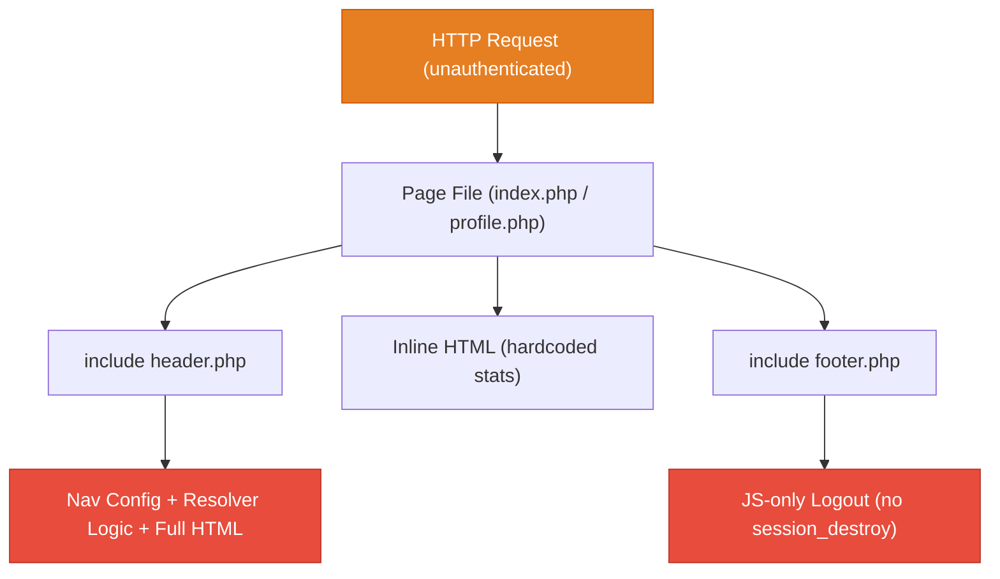
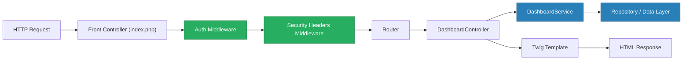
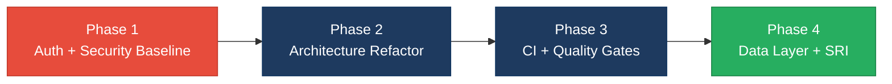

# 4. Backend Discovery & Modernization Analysis

**Objective:** Comprehensive backend discovery covering architecture, modules, controller/service/repository layering, database schema, API governance, middleware, authentication & authorization, security, performance, dependencies, secrets, and code quality.

**Date:** 2026-08-27 11:49:12 IST | **Scope:** `.` — Vanilla PHP (no framework, no Composer), PHP 8.x compatible, served via Apache / Nginx / PHP built-in server

## Executive Summary

> **Executive Summary**
>
> This repository is a minimal PHP admin panel dashboard template consisting of four PHP files (`header.php`, `footer.php`, `index.php`, `profile.php`) with no database, no dependency manager (Composer), and no framework — navigation configuration, breadcrumb resolution logic, and HTML rendering are all co-located inside `header.php`. The overall backend health is **High Risk**: every page is publicly accessible with no authentication or session protection, no security middleware is configured (no rate limiting, no security headers, no CORS policy), multiple unescaped output points establish dangerous patterns for any real-world extension, no linter or CI pipeline is present, and the flat PHP-include architecture has zero separation between presentation and logic layers. No API surface exists, so API governance hotspots (H6–H7) are not applicable. While the codebase's hardcoded-only data limits immediate exploitability, the structural gaps mean any extension toward real admin functionality will immediately inherit critical security and maintainability debt.

<div class="metric-grid">
<div class="metric-card"><div class="metric-number">2</div><div class="metric-label">Controllers / Handlers Scanned</div></div>
<div class="metric-card"><div class="metric-number">0</div><div class="metric-label">Files Using Dynamic-Variable Patterns</div></div>
<div class="metric-card"><div class="metric-number">0</div><div class="metric-label">Service Classes Found</div></div>
<div class="metric-card"><div class="metric-number">N/A</div><div class="metric-label">API Endpoints Found</div></div>
<div class="metric-card"><div class="metric-number">5</div><div class="metric-label">Security Risk Patterns Found</div></div>
<div class="metric-card"><div class="metric-number">0</div><div class="metric-label">Critical / High CVEs Found</div></div>
</div>

<div class="overall-rating overall-rating--high-risk"><div class="overall-rating-label">Overall Codebase Rating — Backend Modernization</div><div class="overall-rating-value">High Risk</div><div class="overall-rating-note">Driven by H8 (no architectural separation of concerns), H11 (no middleware whatsoever), H12 (no authentication on any page), H13 (five unescaped output patterns), H17 (no linter or CI pipeline), and H18 (CDN resources lacking Subresource Integrity hashes).</div></div>

## 4.1 Benchmark Ratings Summary

One row per hotspot. "Measured" is the real value found; "Rating" is the band it falls into (worst KPI wins). This table is the source for the Overall Codebase Rating banner above.

| # | Hotspot | Primary KPI | <span class="rating rating-good">Good</span> | <span class="rating rating-moderate">Moderate</span> | <span class="rating rating-high-risk">High Risk</span> | Measured | Rating |
|---|---|---|---|---|---|---|---|
| H1 | Dynamic Variable Creation | Dynamic-var-from-input occurrences | 0 | 1–10 | >10 | 0 | <span class="rating rating-good">Good</span> |
| H2 | Global Mutable State | Globals / mutable static state | 0 | 1–5 | >5 | 0 (PHP include-scope variables only; no `$GLOBALS` or `static`) | <span class="rating rating-good">Good</span> |
| H3 | Direct SQL Outside Data Layer | Data-layer compliance % | >90% | 60–90% | <60% | N/A — no database | <span class="rating rating-good">Good</span> |
| H4 | Static / Singleton Abuse | Business-logic static/singleton classes | 0 | 1–5 | >5 | 0 | <span class="rating rating-good">Good</span> |
| H5 | Missing Service Layer | Handlers with inline business logic | <10 | 10–20 | >20 | 1 (navigation resolver in `header.php`) | <span class="rating rating-good">Good</span> |
| H6 | API Sprawl | Documented & governed endpoints % | >90% | 80–90% | <80% | N/A — no API surface | <span class="rating rating-good">Good</span> |
| H7 | Missing API Governance | Governance compliance % | 100% | 90–99% | <90% | N/A — no API surface | <span class="rating rating-good">Good</span> |
| H8 | Weak Application Architecture | Modules following declared architecture % | >80% | 50–80% | <50% | 0% — flat PHP include model, no MVC or layered pattern | <span class="rating rating-high-risk">High Risk</span> |
| H9 | Missing Module Inventory | Circular dependency count | 0 | 1–3 | >3 | 0 | <span class="rating rating-good">Good</span> |
| H10 | Database Schema Weakness | FK indexes % + migrations with rollback % | Both >90% | One <90% | Both <90% | N/A — no database | <span class="rating rating-good">Good</span> |
| H11 | Middleware Weakness | Required middleware present + ordered % | 100% | 80–99% | <80% | 0% — no middleware layer of any kind | <span class="rating rating-high-risk">High Risk</span> |
| H12 | Auth & Authorization Weakness | Protected routes guarded % + hashing algo | 100% + bcrypt/argon2 | One gap | Both bad | 0% guarded + no hashing at all | <span class="rating rating-high-risk">High Risk</span> |
| H13 | Backend Security Vulnerabilities | Injection + hardcoded secrets count | 0 each | 1–3 total | >3 total | 5 unescaped output patterns (XSS risk); 0 hardcoded secrets | <span class="rating rating-high-risk">High Risk</span> |
| H14 | Performance & Caching Gaps | N+1 patterns found | 0 | 1–5 | >5 | 0 — no database queries | <span class="rating rating-good">Good</span> |
| H15 | Outdated & Vulnerable Dependencies | Critical/High CVEs found | 0 | 1–3 | >3 | 0 tracked (CDN versions are current; no Composer audit possible) | <span class="rating rating-good">Good</span> |
| H16 | Secrets & Configuration in Source | Hardcoded secrets / .env committed | 0 | 1–2 | >2 | 0 | <span class="rating rating-good">Good</span> |
| H17 | Backend Code Quality | Linter in CI + max cyclomatic complexity | Both good | One gap | Both bad | No linter; no CI pipeline; complexity low but unenforced | <span class="rating rating-high-risk">High Risk</span> |
| H18 | Missing Subresource Integrity — CDN (additional) | CDN resources with `integrity` attribute % (target 100%) | 100% | 1–6 missing SRI | All missing SRI | 0 of 7 external CDN resources have `integrity` hash | <span class="rating rating-high-risk">High Risk</span> |

**Not applicable — no API surface detected** (H6–H7): no REST, GraphQL, or RPC endpoints found in any PHP file.

**No additional hotspots beyond H18** were observed beyond the documented standard set.

## 4.2 Hotspot-by-Hotspot Evidence

**Not observed (rated Good):** H1, H2, H3, H4, H5, H9, H14, H15, H16 — no `extract()`/dynamic-from-input patterns; no `$GLOBALS` or `static` business state; no database queries anywhere; no PHP classes at all; navigation logic is the only inline logic (count = 1, below threshold); no circular dependencies in a 4-file flat structure; no N+1 queries; CDN versions are current; no hardcoded credentials, tokens, or `.env` file committed.

**Not applicable — no API surface detected** (H6–H7).

---

### H8. Weak Application Architecture <span class="sev sev-critical">Critical</span>

**Benchmark:** Architecture-pattern compliance = **0%** → falls in the **High Risk** band (Good >80% · Moderate 50–80% · High Risk <50%).

The entire codebase follows a flat PHP-include model: each page file (`index.php`, `profile.php`) consists of `include './header.php'` and `include './footer.php'` wrappers around HTML fragments. There is no MVC separation, no hexagonal or layered architecture, no controller classes, no service classes, no repository classes, and no module boundaries. Navigation configuration (`$menuItems`), active-page resolution logic, and full HTML rendering are all co-located inside `header.php`.

**Example 1 — Navigation config, resolver logic, and HTML all in `header.php:1–43`:**
```php
<?php
$currentPage = basename($_SERVER['SCRIPT_NAME']);

$menuItems = [             // config — belongs in a config file or database
    ["menuTitle" => "Dashboard", "icon" => "fas fa-tachometer-alt", "pages" => [...]],
    ["menuTitle" => "Settings",  "icon" => "fas fa-cog",            "pages" => [...]]
];

// resolver logic — belongs in a NavigationService
$active_pageInfo = null;
foreach ($menuItems as $menuItem) {
    foreach ($menuItem['pages'] as $page) {
        if ($currentPage === $page['url']) {
            $active_pageInfo = [...];
            break 2;
        }
    }
}
// ... then immediately generates 185 lines of HTML
```

**Example 2 — Page handlers are pure includes with zero logic (`index.php:1,64`, `profile.php:1,5`):**
```php
<?php include './header.php'; ?>
<div class="row">
    <!-- All stat cards are hardcoded numbers — no model, no service, no repository -->
    <h3>150</h3>   <!-- line 8 of index.php: hardcoded "New Orders" count -->
    <h3>53</h3>    <!-- line 22 of index.php: hardcoded "Bounce Rate" -->
</div>
<?php include './footer.php'; ?>
```

**Why it matters here:** Any extension toward real admin functionality (user management, orders, reports) will add business logic directly into page files or `header.php`, creating an unmaintainable spaghetti structure from the first feature. There is no declared architecture to enforce, so every developer will make independent decisions, rapidly creating divergence. Testing any logic requires bootstrapping the entire HTML rendering pipeline.

**Recommended approach:**
1. Introduce a `src/` directory with `Controllers/`, `Services/`, and `Config/` sub-directories.
2. Move `$menuItems` to `src/Config/navigation.php` and load it via a `NavigationService` class.
3. Create a `BaseController` that handles layout inclusion and breadcrumb resolution, freeing page files to call only `$controller->render('dashboard', $data)`.
4. Adopt a minimal front-controller pattern (`index.php` as the single entry point routing to controller classes) — achievable without a full framework.

<!-- affected-files
search: include\s+['"]\.\/header\.php['"]
glob: *.php
issue: No architectural separation — page logic and HTML rendering co-located via bare PHP includes
action: Refactor to controller/service/template pattern; move navigation config to Config layer
-->

---

### H11. Middleware Weakness <span class="sev sev-critical">Critical</span>

**Benchmark:** Required middleware present = **0%** → falls in the **High Risk** band (Good 100% · Moderate 80–99% · High Risk <80%).

The codebase has no middleware pipeline of any kind. There are no PHP session checks, no rate limiting, no security response headers (`X-Frame-Options`, `X-Content-Type-Options`, `Content-Security-Policy`, `Strict-Transport-Security`), no CORS policy, no request logging, and no audit trail. The application is entirely stateless — PHP's `session_start()` is never called in any file.

**Example 1 — `header.php:1–3`: No session check, no auth guard, no security headers at the top of any page:**
```php
<?php
$currentPage = basename($_SERVER['SCRIPT_NAME']);
// No: session_start()
// No: if (!isset($_SESSION['user'])) { header('Location: /login.php'); exit; }
// No: header('X-Frame-Options: DENY');
// No: header('Content-Security-Policy: default-src ...');
```

**Example 2 — `footer.php:15–38`: Logout is client-side JavaScript only, no server-side session destruction:**
```javascript
function logout() {
    Swal.fire({ ... }).then((result) => {
        if (result.isConfirmed) {
            // Redirects to /logout/ but no PHP session_destroy() is ever called server-side
            window.location.href = '/logout/';
        }
    });
}
```

**Why it matters here:** Without `session_start()` and auth guards at the top of every page, the admin panel is publicly accessible to any anonymous HTTP request — a critical access-control failure. The absence of security headers exposes every admin user session to clickjacking (`X-Frame-Options`), MIME sniffing (`X-Content-Type-Options`), and XSS escalation (missing `Content-Security-Policy`). Client-side-only logout means a user's browser session is never truly invalidated server-side; an attacker with a stolen session token retains access indefinitely.

**Recommended approach:**
1. Add `session_start()` plus an auth check at the very beginning of `header.php` (or a front controller that runs before any page).
2. Create a `/logout.php` that calls `session_unset(); session_destroy(); header('Location: /login.php'); exit;`.
3. Emit security headers (`X-Frame-Options: DENY`, `X-Content-Type-Options: nosniff`, `Referrer-Policy: no-referrer`) via PHP `header()` calls in the bootstrap layer.
4. Add a CSP header that restricts `script-src` to known CDN origins and blocks inline script execution except where a per-request nonce is used.

<!-- affected-files
search: include\s+['"]\.\/header\.php['"]
glob: *.php
issue: No session check or auth guard — all pages publicly accessible; no security headers emitted
action: Add session_start() + auth guard in bootstrap; emit security response headers
-->

---

### H12. Auth & Authorization Weakness <span class="sev sev-critical">Critical</span>

**Benchmark:** Protected routes guarded = **0%**, password hashing = **none** → both bad → falls in the **High Risk** band (Good: 100% + bcrypt/argon2 · Moderate: one gap · High Risk: both bad).

No authentication mechanism exists anywhere in the codebase. There is no login page, no `$_SESSION` usage, no JWT validation, no password hashing function, and no object-level authorization. Every page (`index.php`, `profile.php`) is reachable without any credential check. The logout confirmation in `footer.php` is a visual UX element only — it redirects to `/logout/` but there is no server-side session to invalidate because sessions were never started.

**Example 1 — `index.php:1`**: The dashboard page has zero auth guard:
```php
<?php include './header.php'; ?>
// Any unauthenticated HTTP request hitting index.php receives the full admin dashboard.
// No session check, no token validation, no redirect to login.
```

**Example 2 — `header.php:1–3`**: The shared layout has no bootstrap auth check:
```php
<?php
$currentPage = basename($_SERVER['SCRIPT_NAME']);
// $menuItems defined, full HTML rendered — session_start() and auth check are absent
```

**Why it matters here:** The stated purpose of this project is to serve as the foundation of a real admin backend. Shipping any actual functionality (user data, orders, reports) on top of this template without adding authentication means all admin data is publicly exposed. OWASP Broken Access Control (A01:2021) is the top web application risk category; this codebase has zero controls against it.

**Recommended approach:**
1. Create `login.php` and `auth.php` (session check helper) before implementing any other feature.
2. In `header.php` (or a front controller): `session_start(); if (!isset($_SESSION['authenticated'])) { header('Location: /login.php'); exit; }`.
3. Implement login with `password_hash($password, PASSWORD_BCRYPT)` storage and `password_verify($input, $hash)` validation.
4. For multi-role admin panels, add an `$_SESSION['role']` check before rendering role-restricted sections.

<!-- affected-files
search: include\s+['"]\.\/header\.php['"]
glob: *.php
issue: No authentication guard — page accessible to unauthenticated users
action: Add session_start() + $_SESSION auth check before page renders; add login.php
-->

---

### H13. Backend Security Vulnerabilities <span class="sev sev-high">High</span>

**Benchmark:** Unescaped output patterns (XSS risk) = **5**, hardcoded secrets = **0** → total 5 → falls in the **High Risk** band (Good: 0 each · Moderate: 1–3 total · High Risk: >3 total).

`header.php` escapes `$page_title` correctly on line 52 with `htmlspecialchars()` inside the `<title>` tag but then echoes the same variable unescaped on line 111, and echoes navigation data (URLs, titles, menu headings) unescaped across four additional output points. All of these currently pull from a hardcoded `$menuItems` array, so they are not immediately exploitable — but the pattern is inconsistent and dangerous: any future migration of menu items to a database, CMS, or user-editable config would instantly create persistent XSS.

**Example 1 — `header.php:52` (correct) vs `header.php:111` (incorrect), same variable:**
```php
// Line 52 — correct: echoed inside <title> with escaping
<title><?= htmlspecialchars($page_title) ?></title>

// Line 111 — incorrect: same variable echoed inside <h1> without escaping
<h1 class="m-0 text-dark"><?= $page_title ?></h1>
```

**Example 2 — `header.php:117`: Unescaped URL and title in anchor construction:**
```php
<?= $item['url'] === '#'
    ? $item['title']
    : "<a href='{$item['url']}'>{$item['title']}</a>"
    // Both $item['url'] and $item['title'] are interpolated without htmlspecialchars()
?>
```

**Example 3 — `header.php:151,159,162`: Three further unescaped sidebar outputs:**
```php
<?= $menuItem['menuTitle'] ?>        // line 151 — unescaped menu heading
<a href="<?= $page['url'] ?>"        // line 159 — unescaped URL attribute
    class="nav-link ...">
    <p><?= $page['title'] ?></p>     // line 162 — unescaped page title
```

**Why it matters here:** The mismatch between escaped (line 52) and unescaped (line 111) output for the same `$page_title` variable demonstrates inconsistent discipline that will produce real XSS the moment any of these values becomes user-controllable. An attacker who can control the title of a menu item (e.g., via a database-backed admin config) will achieve stored XSS across the entire admin panel via `header.php`, which is included on every page.

**Recommended approach:**
1. Replace every bare `<?= $var ?>` in `header.php` with `<?= htmlspecialchars($var, ENT_QUOTES, 'UTF-8') ?>`.
2. Adopt a template engine (Twig, Blade) or a custom `e()` helper function that auto-escapes, making raw output an explicit opt-in.
3. Add a Content-Security-Policy header to reduce the impact of any XSS that does occur.
4. Introduce PHPStan level 5+ with a rule that flags unescaped output statements.

<!-- affected-files
search: <\?=\s+\$(?!.*htmlspecialchars)
glob: *.php
issue: Unescaped PHP short-echo output — XSS risk when values become user-controlled
action: Wrap all short-echo statements with htmlspecialchars($var, ENT_QUOTES, 'UTF-8')
-->

---

### H17. Backend Code Quality <span class="sev sev-high">High</span>

**Benchmark:** Linter in CI = **No**, cyclomatic complexity enforcement = **No** → both bad → falls in the **High Risk** band (Good: both present · Moderate: one gap · High Risk: both bad).

There is no `composer.json`, no `.phpcs.xml`, no `phpstan.neon`, no GitHub Actions workflow (`.github/` directory is absent), no Makefile, and no other CI configuration file anywhere in the repository. The codebase has zero automated quality gates. Cyclomatic complexity is currently low (the navigation resolver loop at `header.php:22–37` is the only branching logic), but there is no enforcement to prevent complexity growth as features are added. `header.php` is a 185-line mixed-concern file combining PHP configuration, logic, and full HTML rendering in a single file.

**Example 1 — No Composer manifest or any dev tooling config (repository root listing):**
```
favicon.ico  footer.php  header.php  index.php  LICENSE  profile.php  README.md  src/
# Absent: composer.json  composer.lock  .phpcs.xml  phpstan.neon  .github/  Makefile
```

**Example 2 — `header.php:22–42`: Navigation resolver inline in a layout file — not testable in isolation:**
```php
$active_pageInfo = null;
foreach ($menuItems as $menuItem) {
    foreach ($menuItem['pages'] as $page) {
        if ($currentPage === $page['url']) {
            $active_pageInfo = [
                "breadcrumb_Items" => [...],
                "page_title"       => $page['title'],
                "active_menu"      => $menuItem,
                "active_page"      => $page
            ];
            break 2;
        }
    }
}
// This logic cannot be unit-tested without bootstrapping the full HTML rendering pipeline.
```

**Why it matters here:** Without a linter enforced in CI, every developer extending this template will introduce inconsistent style, unescaped outputs, or undefined-variable bugs that only surface at runtime in production. The navigation resolver — the most complex logic in the project — is embedded in a layout file and has no regression protection as the menu grows.

**Recommended approach:**
1. Add `composer.json` and install PHPStan (`phpstan/phpstan`) and PHP_CodeSniffer (`squizlabs/php_codesniffer`) as dev dependencies.
2. Add a GitHub Actions workflow (`.github/workflows/ci.yml`) that runs `composer install && vendor/bin/phpstan analyse --level=5 && vendor/bin/phpcs` on every pull request.
3. Extract the navigation resolver (`header.php:22–42`) into a `NavigationResolver::resolve(string $currentPage, array $menuItems): array` static method so it can be unit-tested independently.
4. Set max function length to 40 LOC and cyclomatic complexity to 10 in the PHPCS ruleset.

<!-- affected-files
search: .*
glob: *.php
issue: No linter, no CI, no automated quality gate; logic untestable in current inline form
action: Add composer.json with PHPStan + PHPCS dev deps; add GitHub Actions CI workflow
-->

---

### H18. Missing Subresource Integrity — CDN Resources <span class="sev sev-high">High</span> (additional)

**Benchmark:** CDN resources with `integrity` attribute = **0 of 7** (0%) → falls in the **High Risk** band; KPI for this additional hotspot: % of external CDN resources with SRI hash — Good: 100% · Moderate: 1–6 missing SRI · High Risk: all missing SRI.

All seven external script and stylesheet tags in `header.php` load resources from public CDNs (jsDelivr, cdnjs, fonts.googleapis.com, code.jquery.com) without an `integrity` attribute. A supply-chain compromise of any CDN origin would allow arbitrary JavaScript or CSS injection into every admin session with no browser-side defence.

**Example 1 — `header.php:54–63`: All seven CDN resources missing `integrity` and `crossorigin` attributes:**
```html
<!-- Stylesheets — all without integrity= -->
<link href="https://cdnjs.cloudflare.com/ajax/libs/font-awesome/6.5.0/css/all.min.css" rel="stylesheet">
<link href="https://cdn.jsdelivr.net/npm/bootstrap@5.3.3/dist/css/bootstrap.min.css" rel="stylesheet">
<link href="https://cdn.jsdelivr.net/npm/admin-lte@3.2/dist/css/adminlte.min.css" rel="stylesheet">
<link href="https://fonts.googleapis.com/css2?family=Source+Sans+Pro:wght@300;400;600;700&display=swap" rel="stylesheet">

<!-- Scripts — all without integrity= -->
<script src="https://code.jquery.com/jquery-3.7.1.min.js"></script>
<script src="https://cdn.jsdelivr.net/npm/bootstrap@5.3.3/dist/js/bootstrap.bundle.min.js"></script>
<script src="https://cdn.jsdelivr.net/npm/sweetalert2@11.10.5/dist/sweetalert2.all.min.js"></script>
<script src="https://cdn.jsdelivr.net/npm/admin-lte@3.2/dist/js/adminlte.min.js"></script>
```
None of these tags include `integrity="sha384-..."` and `crossorigin="anonymous"`.

**Why it matters here:** jsDelivr and cdnjs serve billions of requests and have been demonstrated as CDN compromise targets in industry research. Without SRI, a compromised or BGP-hijacked CDN delivery of jQuery would execute arbitrary code in every admin user's browser, exfiltrate session cookies, modify form submissions, or redirect users — bypassing all server-side security controls.

**Recommended approach:**
1. Generate `sha384` SRI hashes for all pinned versions: `curl -s <url> | openssl dgst -sha384 -binary | openssl base64 -A` and add `integrity="sha384-<hash>" crossorigin="anonymous"` to every tag.
2. Use jsDelivr's built-in SRI endpoint (the `Link` response header) or the [srihash.org](https://www.srihash.org) generator.
3. Move to locally-hosted assets (via `npm install` + bundler or Composer asset manager) to eliminate CDN dependency entirely.
4. Add a CSP `require-sri-for script style` directive to enforce SRI at the browser level.

<!-- affected-files
search: <(script|link)\s[^>]*(cdn\.jsdelivr\.net|cdnjs\.cloudflare\.com|code\.jquery\.com|fonts\.googleapis\.com)
glob: *.php
issue: CDN resource loaded without SRI integrity hash — supply-chain compromise risk
action: Add integrity="sha384-..." crossorigin="anonymous" to every external script/link tag
-->

## 4.3 Diagrams

### Current backend request path



### Modernized service-layer target



### Improvement roadmap



## 4.4 Actions Required

| Hotspot | Action | Rating | Priority |
|---|---|---|---|
| H8 — Weak Application Architecture | Introduce `src/Controllers/`, `src/Services/`, `src/Config/` directories; implement a front-controller entry point; move `$menuItems` to a Config layer and navigation resolver to a `NavigationService` class | <span class="rating rating-high-risk">High Risk</span> | <span class="sev sev-critical">Critical</span> |
| H11 — Middleware Weakness | Add `session_start()` + auth guard in `header.php` bootstrap; emit security headers (`X-Frame-Options`, `X-Content-Type-Options`, CSP); create server-side `/logout.php` with `session_destroy()` | <span class="rating rating-high-risk">High Risk</span> | <span class="sev sev-critical">Critical</span> |
| H12 — Auth & Authorization Weakness | Create `login.php` with `password_hash(PASSWORD_BCRYPT)` login flow; add `$_SESSION['authenticated']` guard to every protected page; implement server-side session destruction on logout | <span class="rating rating-high-risk">High Risk</span> | <span class="sev sev-critical">Critical</span> |
| H13 — Backend Security Vulnerabilities | Replace all bare `<?= $var ?>` in `header.php` with `htmlspecialchars($var, ENT_QUOTES, 'UTF-8')`; adopt a template engine with auto-escaping (Twig) or a custom `e()` helper; add CSP header | <span class="rating rating-high-risk">High Risk</span> | <span class="sev sev-high">High</span> |
| H17 — Backend Code Quality | Add `composer.json` with PHPStan + PHPCS dev deps; add a GitHub Actions CI workflow running static analysis on every pull request; extract navigation resolver into a testable function or class | <span class="rating rating-high-risk">High Risk</span> | <span class="sev sev-high">High</span> |
| H18 — Missing SRI on CDN Resources | Generate `sha384` SRI hashes for all 7 CDN resources and add `integrity="sha384-..." crossorigin="anonymous"` attributes; optionally vendor assets locally via npm to eliminate CDN dependency | <span class="rating rating-high-risk">High Risk</span> | <span class="sev sev-high">High</span> |

## 4.5 Expected Outcomes

- **Eliminated OWASP A01 (Broken Access Control):** Adding session-based authentication guards ensures no admin page is publicly accessible — the single most critical risk reduction for any admin backend extending this template.
- **XSS risk removed at the source:** Consistent `htmlspecialchars()` wrapping (or a Twig auto-escaping layer) prevents any future user-controlled data from becoming a stored or reflected XSS vector across the navigation and breadcrumb outputs in `header.php`.
- **Supply-chain compromise defence:** SRI hashes on all CDN resources allow browsers to reject tampered third-party scripts or stylesheets before execution, providing a browser-native defence against CDN hijacking that requires zero server-side changes.
- **Maintainable, testable architecture:** Separating navigation configuration, business logic, and HTML rendering into Controller / Service / Config layers means features can be added without touching the layout file, and the navigation resolver can be covered by unit tests with no HTML bootstrapping required.
- **Automated quality gate:** A GitHub Actions CI pipeline running PHPStan and PHPCS catches unescaped output, undefined variables, and style violations on every pull request — preventing quality debt from accumulating silently on a codebase that currently has no regression protection.
- **Server-side logout integrity:** Moving session destruction to a PHP endpoint (`session_destroy()`) ensures logout is honoured regardless of JavaScript state, preventing session fixation or re-entry via the browser back button after logout.
- **Foundation ready for a real data layer:** Once the architecture is layered, adding a database-backed repository (PDO with parameterized queries) can be done without touching page files, and the Repository pattern prevents SQL injection by construction — addressing the most common class of backend vulnerability before it can be introduced.
